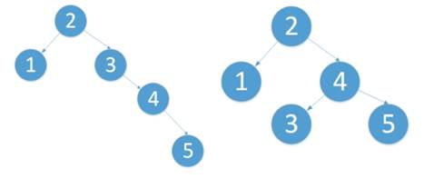
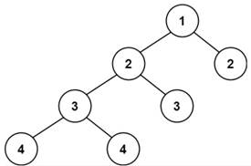
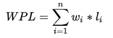
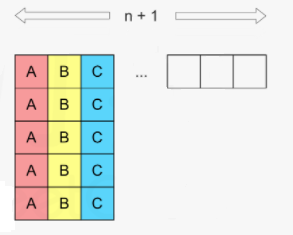
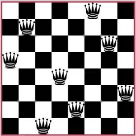
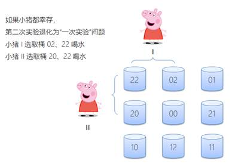

大厂算法和数据结构解析

# 第一章 算法简介

作为程序员，大家对“算法”这个词一定非常熟悉。不论是理论学习、求职面试，还是项目开发，算法往往都是程序员关注的重点之一。那算法到底是什么？想要系统地学习算法，又应该从哪里入手呢？

本课程就将为大家打开算法学习的大门。首先，我们应该了解算法的基本概念。

## 1.1 算法的基本概念

### 1.1.1 什么是算法

算法（Algorithm），就是“计算方法”，指解决一个问题具体的步骤和方法。

对于计算机而言，就是一系列解决问题的清晰指令。也就是说，对于一个问题，我们可以通过算法来描述解决的策略和步骤；对于规范的输入，按照算法描述的步骤，就可以在有限时间内得到对应的输出。

### 1.1.2 为什么要学习算法

首先，算法是计算机程序的核心。在一个计算机程序中，有两个非常重要的部分：数据结构和算法。数据结构决定了程序中数据组织和存储的形式，而算法决定了程序的功能和效率。算法在具体应用时，与数据结构密不可分，是一个程序的灵魂。

其次，算法是程序员的核心竞争力。算法是解决问题的方法和步骤，所以掌握了算法，就可以拥有更强的解决问题的能力。对于一个程序员而言，这往往比学会用一个框架、一个工具更加重要。

再次，算法是IT大厂面试的必考环节。大家可能知道，在IT特别是互联网公司的面试过程中，数据结构和算法是非常重要的一部分，为什么大厂都青睐于考察算法呢？总结起来，考察的原因以下几点：

 

l 看一个程序员的技术功底是否扎实，考算法是最好的方式；

l 看一个程序员的学习能力，和成长潜力，最好就是看他的算法能力；

l 算法能力强，可以在面对新问题时，有更强的分析并解决问题的能力；

l 算法能力，是设计一个高性能系统、性能优化的必备基础。

 

所以，算法是程序员绕不过去的必修课，也是走向架构师的必经之路。

 

### 1.1.3 怎样学习算法

首先，在学习算法之前，应该至少熟练掌握一门编程语言。本课程中的代码实现，都会以java为例来讲解。

其次，算法和数据结构密不可分，在系统学习算法之前，最好能够对基本的数据结构，数组、链表、哈希表、栈、队列、树都有充分的了解。在后续的课程中，我们会以算法讲解为主、穿插复习一些数据结构的基本知识。当然，算法本身是解题方法，有些也是不依赖于数据结构的，所以即使没有系统学过数据结构，同样可以开始算法的学习。 

最后，算法学习的捷径，就是用算法去解决大量的具体问题，也就是通常所说的“刷题”。如果目的在于通过大厂面试，那这一步更是必不可少的准备。最经典的刷题网站，毫无疑问就是leetcode（力扣）。所以我们接下来的学习过程中，就会以leetcode的原题为例，分门别类进行算法的讲解，在具体解题的过程中巩固深化算法的学习。

 

## 1.2 算法的特征

一个算法应该具有以下五个重要的特征：

l 有穷性（Finiteness）

算法的有穷性，是指算法必须能在执行有限个步骤之后终止。

l 确切性（Definiteness）

算法的每一步骤必须有确切的定义。

l 输入项（Input）

一个算法有0个或多个输入，以刻画运算对象的初始情况。所谓0个输入，是指算法本身定出了初始条件。

l 输出项（Output）

一个算法有一个或多个输出，以反映对输入数据加工后的结果。

l 可行性（Effectiveness）

算法中执行的任何计算步骤都是可以被分解为基本的可执行的操作步骤，即每个计算步骤都可以在有限时间内完成（也称之为有效性）。

 

## 1.3 算法复杂度

基于算法的有穷性，我们可以知道算法运行消耗的时间不能是无限的。而对于一个问题的处理，可能有多个不同的算法，它们消耗的时间一般是不同的；运行过程中占用的空间资源也是不同的。

这就涉及到对算法的性能考察。主要有两方面：时间和空间。在计算机算法理论中，用时间复杂度和空间复杂度来分别从这两方面衡量算法的性能。

### 1.3.1 时间复杂度（Time Complexity）

算法的时间复杂度，是指执行算法所需要的计算工作量。

一般来说，计算机算法是问题规模n 的函数f(n)，算法的时间复杂度也因此记做：T(n)=Ο(f(n))。

问题的规模n 越大，算法执行的时间的增长率与f(n) 的增长率正相关，称作渐进时间复杂度（Asymptotic Time Complexity）。

### 1.3.2 空间复杂度

算法的空间复杂度，是指算法需要消耗的内存空间。有时候做递归调用，还需要考虑调用栈所占用的空间。

其计算和表示方法与时间复杂度类似，一般都用复杂度的渐近性来表示。同时间复杂度相比，空间复杂度的分析要简单得多。

所以，我们一般对程序复杂度的分析，重点都会放在时间复杂度上。

### 1.3.3 时间复杂度的计算

要想衡量代码的“工作量”，我们需要将每一行代码，拆解成计算机能执行一条条“基本指令”。这样代码的执行时间，就可以用“基本指令”的数量来表示了。

真实的计算机系统里，基本指令包括：

算术指令（加减乘除、取余、向上向下取整）、数据移动指令（装载、存储、赋值）、控制指令（条件或无条件跳转，子程序调用和返回）。

 

我们来看一些具体的代码，分析一下它们的时间复杂度：

l int a = 1； 

简单赋值操作，运行时间 1（1个单位）

l if (a > 1) {} 

简单判断操作、条件跳转，运行时间 1

l for (int i = 0; i < N; i++) {  System.out.println(i); }

有循环，运行时间 1（i赋初值）+ N+1（判断）+N（打印）+N（i自增）= 3N + 2

### 1.3.4 复杂度的大O表示法

比起代码具体运行的时间，我们更关心的是，当它的输入规模增长的时候，它的执行时间我们是否还能够接受。

不同的算法，运行时间随着输入规模 n 的增长速度是不同的。我们可以把代码执行时间，表示成输入规模n的函数T(n)。


 

在算法分析中，一般用大O符号来表示函数的渐进上界。对于给定的函数g(n)，我们用O(g(n))来表示以下函数的集合：

l O(g(n)) = { f(n): 存在正常量 c 和 n0，使对所有 n≥n0 ，有 0≤f(n) ≤ cg(n) }

 

这表示，当数据量达到一定程度时，g(n) 的增长速度不会超过 O(g(n))限定的范围。也就是说，大O表示了函数的“阶数”，阶数越高，增长趋势越大，后期增长越快。

下图画出了常见的算法复杂度：


## 1.4 算法的分类

可以用两种不同的原则，来对算法做一个分类整理：

l 按照应用的目的来划分

搜索算法、排序算法、字符串算法、图算法、最优化算法、数学（数论）算法

l 按照具体实现的策略划分

暴力法、增量法、分治法、贪心、动态规划、回溯、分支限界法


## 1.5 经典算法

在实际应用中，有一些经典算法和策略，都可以作为解决问题的思路：

l 二分查找

l 快速排序、归并排序

l KMP算法

l 快慢指针（双指针法）

l 普利姆（Prim）和 克鲁斯卡尔（Kruskal）算法

l 迪克斯特拉（Dijkstra）算法

l 其它优化算法：模拟退火、蚁群、遗传算法

接下来，我们就不同的数据结构和算法策略进行分类，用不同的算法在各章节中解决某一类问题。


 

# 第二章 数组问题讲解

在程序设计中，为了处理方便，常常需要把具有相同类型的若干元素按有序的形式组织起来，这种形式就是数组（Array）。

数组是程序中最常见、也是最基本的数据结构。在很多算法问题中，都少不了数组的处理和转换。

对数组进行处理需要注意以下特点：

l 首先，数组会利用 索引 来记录每个元素在数组中的位置，且在大多数编程语言中，索引是从 0 算起的。我们可以根据数组中的索引，快速访问数组中的元素。事实上，这里的索引其实就是内存地址。


l 其次，作为线性表的实现方式之一，数组中的元素在内存中是**连续**存储的，且每个元素占用相同大小的内存。

接下来，我们就以LeetCode上一些数组相关的题目为例，来学习解决数组问题的算法。

## 2.1 两数之和（#1）

### 2.2.1 题目说明

给定一个整数数组 nums 和一个目标值 target，请你在该数组中找出和为目标值的那两个整数，并返回他们的数组下标。

你可以假设每种输入只会对应一个答案。但是，你不能重复利用这个数组中同样的元素。

**示例****:**

给定 nums = [2, 7, 11, 15], target = 9

因为 nums[0] + nums[1] = 2 + 7 = 9

所以返回 [0, 1]

### 2.2.2 方法一：暴力法

看到一道算法题，首先考虑暴力解法，再进行优化。

暴力法其实非常简单：把所有数、两两组合在一起，计算它们的和，如果是target，就输出。

我们可以在代码中实现一下：

 

**public int**[] twoSum(**int**[] nums, **int** target) {

**for**( **int** i = 0; i < nums.**length**; i++ ){

**for**( **int** j = i + 1; j < nums.**length**; j++ ){

**if**( nums[i] + nums[j] == target )

**return new int**[] {i, j};

}

}

**throw new** IllegalArgumentException(**"No two sum solution"**);

}

 

**复杂度分析**

l 时间复杂度：O(n^2)，对于每个元素，我们试图通过遍历数组的其余部分来寻找它所对应的目标元素，这将耗费 O(n)。

l 空间复杂度：O(1)。

### 2.2.3 方法二：两遍哈希表

为了对运行时间复杂度进行优化，我们需要一种更有效的方法来检查数组中是否存在目标元素。如果存在，我们需要找出它的索引。这可以使用哈希表来实现。

具体实现方法，最简单就是使用两次迭代。

在第一次迭代中，我们将每个元素的值和它的索引添加到表中；然后，在第二次迭代中，我们将检查每个元素所对应的目标元素 (target-nums[i]) 是否存在于表中。

代码如下：

 

**public int**[] twoSum(**int** nums[], **int** target) {

Map<Integer, Integer> map = **new** HashMap<>();

 

*//* *遍历数组，全部保存到* *hashmap**中*

**for**(**int** i = 0; i < nums.**length**; i++){

map.put(nums[i], i);

}

 

*//* *遍历数组，挨个查找对应的**“**那个数**”**在不在**map**中*

**for**( **int** i = 0; i < nums.**length**; i++ ){

**int** thatNum = target - nums[i];

**if**( map.containsKey(thatNum) && map.get(thatNum) != i )

**return new int**[] {i, map.get(thatNum)};

}

**throw new** IllegalArgumentException(**"No two sum solution"**);
 }

 

**复杂度分析**

l 时间复杂度：O(N)，我们把包含有 N 个元素的列表遍历两次。由于哈希表将查找时间缩短到 O(1)，所以时间复杂度为 O(N)。

l 空间复杂度：O(N)，所需的额外空间取决于哈希表中存储的元素数量，该表中存储了 N 个元素。

### 2.2.4 方法三：一遍哈希表

在上述算法中，我们对哈希表进行了两次扫描，这其实是不必要的。在进行迭代并将元素插入到表中的同时，我们可以直接检查表中是否已经存在当前元素所对应的目标元素。如果它存在，那我们已经找到了对应解，并立即将其返回。这样，只需要扫描一次哈希表，就可以完成算法了。

代码如下：

 

**public int**[] twoSum(**int** nums[], **int** target) {

Map<Integer, Integer> map = **new** HashMap<>();

 

**for**( **int** i = 0; i < nums.**length**; i++ ){

**int** thatNum = target - nums[i];

**if**( map.containsKey(thatNum) && map.get(thatNum) != i )

**return new int**[] {map.get(thatNum), i};

map.put(nums[i], i);

}

**throw new** IllegalArgumentException(**"No two sum solution"**);
 }

 

**复杂度分析**

l 时间复杂度：O(N)，我们只遍历了包含有 N 个元素的列表一次。在表中进行的每次查找只花费 O(1) 的时间。其实这个过程中，我们也借鉴了动态规划的思想、把子问题解保存起来，后面用到就直接查询。

l 空间复杂度：O(N)，所需的额外空间取决于哈希表中存储的元素数量，该表最多需要存储 N 个元素。

 

## 2.2 三数之和（#15）

### 2.2.1 题目说明

给定一个包含 n 个整数的数组 nums，判断 nums 中是否存在三个元素 a，b，c ，使得 a + b + c = 0 ？找出所有满足条件且不重复的三元组。

注意：答案中不可以包含重复的三元组。

**示例**:

给定数组 nums = [-1, 0, 1, 2, -1, -4]，

满足要求的三元组集合为：

[

 [-1, 0, 1],

 [-1, -1, 2]

]

### 2.2.2 分析

这个问题比起两数之和来，显然要复杂了一些，而且由于结果可能有多种情况，还要考虑去重，整体难度提升了不少。

最后的返回，就不再是一个简单的数组了，而是“数组的数组”，每一组解都是一个数组，最终有多组解都要返回。

### 2.2.3 方法一：暴力法

最简单的办法，当然还是暴力法。基本思路是，每个人都先去找到另一个人，然后再一起逐个去找第三个人。

很容易想到，实现起来就是三重循环：这个时间复杂度是 O(n^3)。

 

代码如下：

 

**public** List<List<Integer>> threeSum(**int**[] nums) {

**int** n = nums.**length**;

List<List<Integer>> resultList = **new** ArrayList<>();

*//* *三重循环，遍历所有的三数组合*

**for**( **int** i = 0; i < n - 2; i++ ){

**for**( **int** j = i + 1; j < n - 1; j++ ){

**for**( **int** k = j + 1; k < n; k++ ){

**if**( nums[i] + nums[j] + nums[k] == 0 ){

resultList.add(

Arrays.*asList*(nums[i], nums[j], nums[k]));

}

}

}

}

**return** resultList;

}

 

运行一下，我们会发现，这个结果其实是不正确的没有去重，同样的三元组在结果中无法排除。比如-1，0，1会出现两次。而且时间复杂度非常高，是N^3。

所以接下来，我们就要做一些改进，试图降低时间复杂度，而且解决去重问题。

### 2.2.4 暴力法的改进：结果去重

要做去重，自然首先想到的，就是把结果保存到一张hash表里。仿照两数之和，直接存到HashMap里查找，代码如下：

 

**public** List<List<Integer>> threeSum(**int**[] nums) {

**int** n = nums.**length**;

List<List<Integer>> result = **new** ArrayList<>();

 

Map<Integer, List<Integer>> hashMap = **new** HashMap<>();
   

*//* *遍历数组，寻找每个元素的**thatNum*
   **for**( **int** i = 0; i < n; i++ ){*
\*     **int** thatNum = 0 - nums[i];

```
        if( hashMap.containsKey(thatNum) ){
            List<Integer> tempList = new ArrayList<>(
hashMap.get(thatNum));
            tempList.add(nums[i]);
            result.add(tempList);
            continue;
        }
        for( int j = 0; j < i; j++ ){
            int newKey = nums[i] + nums[j];
            if( ! hashMap.containsKey(newKey) ){
                List<Integer> tempList = new ArrayList<>();
                tempList.add(nums[j]);
                tempList.add(nums[i]);
                hashMap.put( newKey, tempList );
            }
        }
    }
    return result;
}
```

 

时间复杂度降为N^2，空间复杂度O(N)。

但是，我们加一个输入[0,0,0,0]，会发现 结果不正确。

因为尽管通过HashMap存储可以去掉相同二元组的计算结果的值，但没有去掉重复的输出（三元组）。这就导致，0对应在HashMap中有一个值（0，List（0，0）），第三个0来了会输出一次，第四个0来了又会输出一次。

如果希望解决这个问题，那就需要继续加入其它的判断来做去重，整个代码复杂度会变得更高。

### 2.2.5 方法二：双指针法

暴力法搜索时间复杂度为O(N^3)，要进行优化，可通过双指针动态消去无效解来提高效率。

双指针的思路，又分为左右指针和快慢指针两种。

我们这里用的是左右指针。左右指针，其实借鉴的就是分治的思想，简单来说，就是在数组头尾各放置一个指针，先让头部的指针（左指针）右移，移不动的时候，再让尾部的指针（右指针）左移：最终两个指针相遇，那么搜索就结束了。

 

（1）双指针法铺垫： 先将给定 nums 排序，复杂度为 O(NlogN)。

首先，我们可以想到，数字求和，其实跟每个数的大小是有关系的，如果能先将数组排序，那后面肯定会容易很多。

之前我们搜索数组，时间复杂度至少都为O(N^2)，而如果用快排或者归并，排序的复杂度，是 O(NlogN)，最多也是O(N^2)。所以增加一步排序，不会导致整体时间复杂度上升。


下面我们通过图解，来看一下具体的操作过程。

 

（2）初始状态，定义左右指针L和R，并以指针i遍历数组元素。


固定 3 个指针中最左（最小）数字的指针 i，双指针 L，R 分设在数组索引 (i, len(nums)) 两端，所以初始值，i=0；L=i+1；R=nums.length-1

通过L、R双指针交替向中间移动，记录对于每个固定指针 i 的所有满足 nums[i] + nums[L] + nums[R] == 0 的 L,R 组合。

两个基本原则：

l 当 nums[i] > 0 时直接break跳出：因为 nums[R] >= nums[L] >= nums[i] > 0，即 3 个数字都大于 0 ，在此固定指针 i 之后不可能再找到结果了。

l 当 i > 0且nums[i] == nums[i - 1]时，即遇到重复元素时，跳过此元素nums[i]：因为已经将 nums[i - 1] 的所有组合加入到结果中，本次双指针搜索只会得到重复组合。

 

（3）固定i，判断sum，然后移动左右指针L和R。

L，R 分设在数组索引 (i, len(nums)) 两端，当L < R时循环计算当前三数之和：

sum = nums[i] + nums[L] + nums[R]

并按照以下规则执行双指针移动：

l 当sum < 0时，L ++并跳过所有重复的nums[L]；

 


 


l 由于sum<0，L一直右移，直到跟R重合。如果依然没有结果，那么i++，换下一个数考虑。

 

换下一个数，i++，继续移动双指针：


初始同样还是L=i+1，R=nums.length-1。同样，继续判断sum。

 

l 找到一组解之后，继续移动L和R，判断sum，如果小于0就右移L，如果大于0就左移R：


找到一组解[-1,-1,2]，保存，并继续右移L。判断sum，如果这时sum=-1+0+2>0，（R还没变，还是5），那么就让L停下，开始左移R。

 

l 一直移动，又找到一组解

 

 

 


如果又找到sum=0的一组解，把当前的[-1,0,1]也保存到结果数组。继续右移L。

 

l 如果L和R相遇或者L>R，代表当前i已经排查完毕，i++；如果i指向的数跟i-1一样，那么直接继续i++，考察下一个数；


l 这时i=3，类似地，当sum > 0时，R左移R -= 1，并跳过所有重复的nums[R]；


l L和R相遇，结束当前查找，i++。

 


当 nums[i] > 0 时直接break跳出：过程结束。

所以，最终的结果，就是[-1,-1,2],[-1,0,1]。

 

代码如下：

 

**public** List<List<Integer>> threeSum(**int**[] nums){

**int** n = nums.**length**;

List<List<Integer>> result = **new** ArrayList<>();

 

*//* *先对数组进行排序
\*   Arrays.*sort*(nums);
   *
\*   **for**( **int** i = 0; i < n; i++ ){*
\*     **if**( nums[i] > 0 )
       **break**;*
\*     **if**( i > 0 && nums[i] == nums[i-1] )
       **continue**;
     *//* *定义左右指针（索引位置）
\*     **int** lp = i + 1;
     **int** rp = n - 1;
     *//* *只要左右不重叠，就继续移动指针
\*     **while**( lp < rp ){
       **int** sum = nums[i] + nums[lp] + nums[rp];*
\*       **if**( sum == 0 ){
         result.add(Arrays.*asList*(nums[i], nums[lp], nums[rp]));
         lp ++;
         rp --;*
\*         **while**( lp < rp && nums[lp] == nums[lp - 1] )
           lp ++;
         **while**( lp < rp && nums[rp] == nums[rp + 1] )
           rp --;
       }*
\*       **else if**( sum < 0 )
         lp ++;
       **else
**         rp --;
     }
   }
   **return** result;
 }

 

复杂度分析：

l 时间复杂度 O(N^2)：其中固定指针k循环复杂度 O(N)，双指针 i，j 复杂度 O(N)。比暴力法的O(n^3)，显然有了很大的改善。

l 空间复杂度 O(1)：指针使用常数大小的额外空间。

 

尽管时间复杂度依然为O(n^2)，但是过程中避免了复杂的数据结构，空间复杂度仅为常数级O(1)，可以说，双指针法是一种很巧妙、很优雅的算法设计。

## 2.3 下一个排列（#31）

### 2.3.1 题目说明

实现获取下一个排列的函数，算法需要将给定数字序列重新排列成字典序中下一个更大的排列。

如果不存在下一个更大的排列，则将数字重新排列成最小的排列（即升序排列）。

必须原地修改，只允许使用额外常数空间。

 

以下是一些例子，输入位于左侧列，其相应输出位于右侧列。

1,2,3 → 1,3,2

3,2,1 → 1,2,3

1,1,5 → 1,5,1

 

### 2.3.2 方法一：暴力法

最简单的想法就是暴力枚举，我们找出由给定数组的元素形成的列表的每个可能的排列，并找出比给定的排列更大的排列。

但是这个方法要求我们找出所有可能的排列，这需要很长时间，实施起来也很复杂。因此，这种算法不能满足要求。 我们跳过它的实现，直接采用正确的方法。

 

**复杂度分析**

时间复杂度：O(n!)，可能的排列总计有 n! 个。

空间复杂度：O(n)，因为数组将用于存储排列。

 

### 2.3.3 方法二：一遍扫描

首先，我们观察到对于任何给定序列的**降序排列**，就不会有下一个更大的排列。

例如，以下数组不可能有下一个排列：

[9, 5, 4, 3, 1]

这时应该直接返回升序排列。

 

所以对于一般的情况，如果有一个“升序子序列”，那么就一定可以找到它的下一个排列。具体来说，需要从右边找到第一对两个连续的数字 a[i] 和 a[i-1]，它们满足 a[i]>a[i-1]。

所以一个思路是，找到最后一个的“正序”排列的子序列，把它改成下一个排列就行了。


不过具体操作会发现，如果正序子序列后没数了，那么子序列的“下一个”一定就是整个序列的“下一个”，这样做没问题；但如果后面还有逆序排列的数，这样就不对了。比如

[1,3,8,7,6,2]

最后的正序子序列是[1,3,8]，但显然不能直接换成[1,8,3]就完事了；而是应该考虑把3换成后面比3大、但比8小的数，而且要选最小的那个（6）。接下来，还要让6之后的所有数，做一个升序排列，得到结果：

[1,6,2,3,7,8]

 

代码实现如下：

 

**public void** nextPermutation(**int**[] nums) {
   **int** k = nums.**length** - 2;
   **while**( k >= 0 && nums[k] >= nums[k+1] )
     k--;
   *//* *如果全部降序，以最小序列输出
\*   **if**( k < 0 ){
     Arrays.*sort*(nums);
     **return**;
   }
   

**int** i = k + 2;*
\*   **while**( i < nums.**length** && nums[i] > nums[k] )*
\*     i++;
   

*//* *交换**nums[k]**和找到的**nums[i-1]
\*   **int** temp = nums[k];
   nums[k] = nums[i-1];
   nums[i-1] = temp;
   

*// k**以后剩余的部分反转成升序
\*   **int** start = k + 1, end = nums.**length** - 1;
   **while**( start < end ){
     **int** reTemp = nums[start];
     nums[start] = nums[end];
     nums[end] = reTemp;
     start++;
     end--;
   }
 }

 

**复杂度分析**

时间复杂度：O(N)，其中 NN 为给定序列的长度。我们至多只需要扫描两次序列，以及进行一次反转操作。

空间复杂度：O(1)，只需要常数的空间存放若干变量。

## 2.4 旋转图像（#48）

### 2.4.1 题目说明

给定一个 n × n 的二维矩阵表示一个图像。

将图像顺时针旋转 90 度。

**说明**：

你必须在原地旋转图像，这意味着你需要直接修改输入的二维矩阵。请不要使用另一个矩阵来旋转图像。

示例 1:

给定 matrix = 

[

 [1,2,3],

 [4,5,6],

 [7,8,9]

],

原地旋转输入矩阵，使其变为:

[

 [7,4,1],

 [8,5,2],

 [9,6,3]

]

示例 2:

给定 matrix =

[

 [ 5, 1, 9,11],

 [ 2, 4, 8,10],

 [13, 3, 6, 7],

 [15,14,12,16]

], 

原地旋转输入矩阵，使其变为:

[

 [15,13, 2, 5],

 [14, 3, 4, 1],

 [12, 6, 8, 9],

 [16, 7,10,11]

]

 

### 2.4.2 分析

旋转图像，这个应用在图片处理的过程中，非常常见。我们知道对于计算机而言，图像，其实就是一组像素点的集合（所谓点阵），所以图像旋转的问题，本质上就是一个二维数组的旋转问题。

 

### 2.4.3 方法一：数学方法（转置再翻转）

我们可以利用矩阵的特性。所谓顺时针旋转，其实就是先转置矩阵，然后翻转每一行。 

 

代码如下：

 

```
public void rotate(int[][] matrix) {
    int n = matrix.length;

    // 转置矩阵
    for (int i = 0; i < n; i++)
        for (int j = i; j < n; j++) {
            int tmp = matrix[i][j];
            matrix[i][j] = matrix[j][i];
            matrix[j][i] = tmp;
        }
    // 翻转行
    for( int i = 0; i < n; i++ ){
        for( int j = 0; j < n/2; j++ ){
            int tmp = matrix[i][j];
            matrix[i][j] = matrix[i][n-j-1];
            matrix[i][n-j-1] = tmp;
        }
    }
}
```

 

**复杂度分析**

l 时间复杂度：O(N^2)

这个简单的方法已经能达到最优的时间复杂度O(N^2) ，因为既然是旋转，那么每个点都应该遍历到，N^2的复杂度不可避免。

l 空间复杂度：O(1)。旋转操作是原地完成的，只耗费常数空间。

 

### 2.4.4 方法二：分治（分为四部分旋转）

方法 1 使用了两次矩阵操作，能不能只使用一次操作的方法完成旋转呢？

为了实现这一点，我们来研究每个元素在旋转的过程中如何移动。


这提供给我们了一个思路，可以将给定的矩阵分成四个矩形并且将原问题划归为旋转这些矩形的问题。这其实就是分治的思想。


具体解法也很直接，可以在每一个矩形中遍历元素，并且在长度为 4 的临时列表中移动它们。


 

代码如下：

 

```
public void rotate(int[][] matrix) {
int n = matrix.length;
 
for (int i = 0; i < n / 2 + n % 2; i++) {
for (int j = 0; j < n / 2; j++) {
int[] tmp = new int[4];
int row = i;
int col = j;
for (int k = 0; k < 4; k++) {
tmp[k] = matrix[row][col];
// 定位下一个数
int x = row;
row = col;
col = n - 1 - x;
}
 
for (int k = 0; k < 4; k++) {
matrix[row][col] = tmp[(k + 3) % 4];
int x = row;
row = col;
col = n - 1 - x;
}
}
}
}
```

 

**复杂度分析**

l 时间复杂度：O(N^2) 是两重循环的复杂度。

l 空间复杂度：O(1) 由于我们在一次循环中的操作是“就地”完成的，并且我们只用了长度为 4 的临时列表做辅助。

 

### 2.4.5 方法三：分治法改进（单次循环内完成旋转）

大家可能也发现了，我们其实没有必要分成4个矩阵来旋转。这四个矩阵的对应关系，其实是一目了然的，我们完全可以在一次循环内，把所有元素都旋转到位。

因为旋转的时候，是上下、左右分别对称的，所以我们遍历元素的时候，只要遍历一半行、一半列就可以了（1/4元素）。

 

代码如下：

 

```
public void rotate(int[][] matrix) {
int n = matrix.length;
 
// 不区分子矩阵，直接遍历每一个元素
for( int i = 0; i < (n + 1)/2; i++ ){
for( int j = 0; j < n/2; j++ ){
int temp = matrix[i][j];
matrix[i][j] = matrix[n-j-1][i];
matrix[n-j-1][i] = matrix[n-i-1][n-j-1];
matrix[n-i-1][n-j-1] = matrix[j][n-i-1];
matrix[j][n-i-1] = temp;
}
}
}
```

**复杂度分析**

l 时间复杂度：O(N^2)，是两重循环的复杂度。

l 空间复杂度：O(1)。我们在一次循环中的操作是“就地”完成的。


 

# 第三章 二分查找相关问题讲解

## 3.1 二分查找

二分查找也称折半查找（Binary Search），它是一种效率较高的查找方法，前提是数据结构必须先**排好序**，可以在**对数**时间复杂度内完成查找。

 

二分查找事实上采用的就是一种分治策略，它充分利用了元素间的次序关系，可在最坏的情况下用O(log n)完成搜索任务。

它的基本思想是：假设数组元素呈升序排列，将n个元素分成个数大致相同的两半，取a[n/2]与欲查找的x作比较，如果x=a[n/2]则找到x，算法终止；如 果x<a[n/2]，则我们只要在[数组](https://link.zhihu.com/?target=https%3A//baike.baidu.com/item/%E6%95%B0%E7%BB%84)a的左半部继续搜索x；如果x>a[n/2]，则我们只要在数组a的右 半部继续搜索x。

 


 

二分查找问题也是面试中经常考到的问题，虽然它的思想很简单，但写好二分查找算法并不是一件容易的事情。

 

接下来，我们首先用代码实现一个对int数组的二分查找。

 

**public class** BinarySearch {*
\*   **public static int** binarySearch(**int**[] a, **int** key){*
\*     **int** low = 0;
     **int** high = a.**length** - 1;*
\*     **if** ( key < a[low] || key > a[high] )
       **return** -1;

*
\*     **while** ( low <= high){
       **int** mid = ( low + high ) / 2;
       **if**( a[mid] < key)
         low = mid + 1;
       **else if**( a[mid] > key )
         high = mid - 1;
       **else
         return** mid;  *//* *查找成功
\*     }
     *//* *未能找到**
\*     **return** -1;
   }
 }

 

当然，我们也可以用递归的方式实现：

 

**public static int** binarySearch(**int**[] a, **int** key, **int** fromIndex, **int** toIndex){*
\*   **if** ( key < a[fromIndex] || key > a[toIndex] || fromIndex > toIndex)
     **return** -1;


   **int** mid = ( fromIndex + toIndex ) / 2;
 
   **if** ( a[mid] < key )
     **return** *binarySearch*(a, key, mid + 1, toIndex);
   **else if** ( a[mid] > key )
     **return** *binarySearch*(a, key, fromIndex, mid - 1);
   **else
     return** mid;
 }

 

我们总结一下二分查找：

l 优点是比较次数少，查找速度快，平均性能好；

l 缺点是要求待查表为有序表，且插入删除困难。

因此，二分查找方法适用于不经常变动而查找频繁的有序列表。使用条件：查找序列是顺序结构，有序。

 

## 3.2 搜索二维矩阵（#74）

### 3.2.1 题目说明

编写一个高效的算法来判断 m x n 矩阵中，是否存在一个目标值。该矩阵具有如下特性：

l 每行中的整数从左到右按升序排列。

l 每行的第一个整数大于前一行的最后一个整数。

示例 1：


输入：matrix = [[1,3,5,7],[10,11,16,20],[23,30,34,50]], target = 3

输出：true

示例 2：

输入：matrix = [[1,3,5,7],[10,11,16,20],[23,30,34,50]], target = 13

输出：false

示例 3：

输入：matrix = [], target = 0

输出：false

 

提示：

l m == matrix.length

l n == matrix[i].length

l 0 <= m, n <= 100

l -104 <= matrix[i][j], target <= 104

### 3.2.2 分析

既然这是一个查找元素的问题，并且数组已经排好序，我们自然可以想到用二分查找是一个高效的查找方式。

输入的 m x n 矩阵可以视为长度为 m x n的有序数组：


行列坐标为(row, col)的元素，展开之后索引下标为idx = row * n + col；反过来，对于一维下标为idx的元素，对应二维数组中的坐标就应该是：

row = idx / n; col = idx % n;

 

### 3.2.3 实现：二分查找

代码实现如下：

**public class** SearchMatrix {
   **public boolean** searchMatrix(**int**[][] matrix, **int** target){*
\*     **int** m = matrix.**length**;
     **if** (m == 0) **return false**; *
\*     **int** n = matrix[0].**length**;*
\*     **int** left = 0;
     **int** right = m * n - 1;
 

*//* *二分查找，定义左右指针*
     **while** ( left <= right ){
       **int** midIdx = (left + right) / 2;  *
\*       **int** midElement = matrix[midIdx/n][midIdx%n];*
\*       **if** ( midElement < target )
         left = midIdx + 1; *
\*       **else if** ( midElement > target )
         right = midIdx - 1; *
\*       **else
         return true**;  *//* *找到**target
\*     }
 
     **return false**;
   }
 }

 

**复杂度分析**

l 时间复杂度 : 由于是标准的二分查找，时间复杂度为O(log(m n))。

l 空间复杂度 : 没有用到额外的空间，复杂度为O(1)。

## 3.3 寻找重复数（#287）

### 3.3.1 题目说明

给定一个包含 n + 1 个整数的数组 nums，其数字都在 1 到 n 之间（包括 1 和 n），可知至少存在一个重复的整数。假设只有一个重复的整数，找出这个重复的数。

**示例** **1**:

输入: [1,3,4,2,2]

输出: 2

**示例** **2**:

输入: [3,1,3,4,2]

输出: 3

**说明**：

l 不能更改原数组（假设数组是只读的）。

l 只能使用额外的 O(1) 的空间。

l 时间复杂度小于 O(n2) 。

l 数组中只有一个重复的数字，但它可能不止重复出现一次。

 

### 3.3.2 分析

怎样证明 nums 中存在至少一个重复值？其实很简单，这是“抽屉原理”（或者叫“鸽子洞原理”）的简单应用。

这里，nums 中的每个数字（n+1个）都是一个物品，nums 中可以出现的每个不同的数字（n个）都是一个 “抽屉”。把n+1 个物品放入n个抽屉中，必然至少会有一个抽屉放了2个或者2个以上的物品。所以这意味着nums中至少有一个数是重复的。

### 3.3.3 方法一：保存元素法（存入HashMap）

首先我们想到，最简单的办法就是，遍历整个数组，挨个统计每个数字出现的次数。

用一个HashMap保存每个数字对应的count数量，就可以直观地判断出是否重复了。

 

代码如下：

 

**public int** findDuplicate1(**int**[] nums){
   Map<Integer, Integer> countMap = **new** HashMap<>();
   **for**( Integer num : nums ){*
\*     **if**( countMap.get(num) == **null** )
       countMap.put(num, 1);
     **else
       return** num;
   }
   **return** -1;
 }

 

### 3.3.4 方法二：保存元素法改进（存入Set）

当然我们应该还能想到，其实没必要用HashMap，直接保存到一个Set里，就知道这个元素到底有没有了。

```
public int findDuplicate2(int[] nums){
    Set<Integer> set = new HashSet<>();
    for( Integer num : nums ){
        if( set.contains(num) )
            return num;
        else
            set.add(num);
    }
    return -1;
}
```

 

**复杂度分析**

时间复杂度：O(n)，我们只对数组做了一次遍历，在HashMap和HashSet中查找的复杂度是O(1)。

空间复杂度：O(n)，我们需要一个HashMap或者HashSet来做额外存储，最坏情况下，这需要线性的存储空间。

 

尽管时间复杂度较小，但以上两种保存元素的方法，都用到了额外的存储空间，这个空间复杂度不能让我们满意。

 

### 3.3.5 方法三：二分查找

这道题目中数组其实是很特殊的，我们可以从原始的 [1, N] 的自然数序列开始想。现在增加到了N+1个数，根据抽屉原理，肯定会有重复数。对于增加重复数的方式，整体应该有两种可能：

l 如果重复数（比如叫做target）只出现两次，那么其实就是1~N所有数都出现了一次，然后再加一个target；

l 如果重复数target出现多次，那在情况1的基础上，它每多出现一次，就会导致1~N中的其它数少一个。

 

例如：1~9之间的10个数的数组，重复数是6：

1，2，5，6，6，6，6，6，7，9

本来最简单（重复数出现两次，其它1~9的数都出现一次）的是

1，2，3，4，5，6，6，7，8，9

现在没有3、4和8，所以6会多出现3次。

 

我们可以发现一个规律： 

l 以target为界，对于比target小的数i，数组中所有小于等于它的数，最多出现一次（有可能被多出现的target占用了），所以总个数不会超过i。

l 对于比target大的数j，如果每个元素都只出现一次，那么所有小于等于它的元素是j个；而现在target会重复出现，所以总数一定会大于j。

用数学化的语言描述就是：

我们把对于1~N内的某个数i，在数组中小于等于它的所有元素的个数，记为count[i]。

则：当i属于[1, target-1]范围内，count[i] <= i；当i属于[target, N]范围内，count[i] > i。

 

所以要找target，其实就是要找1~N中这个分界的数。所以我们可以对1~N的N个自然数进行二分查找，它们可以看作一个排好序的数组，但不占用额外的空间。

 

代码实现如下：

 

**public int** findDuplicate3(**int**[] nums){
   **int** l = 1;
   **int** r = nums.**length** - 1;
   *//* *二分查找*
   **while** (l <= r){
     **int** i = (l + r) / 2; *
     //* *对当前**i**计算**count[i]
\*     **int** count = 0;
     **for**( **int** j = 0; j < nums.**length**; j++ ){
       **if** (nums[j] <= i)
         count ++;
     }
     *//* *判断**count[i]**和**i**的大小关系
\*     **if** ( count <= i )
       l = i + 1; *
\*     **else
**       r = i; *
\*     *//* *找到**target
\*     **if** (l == r)
       **return** l;
   }
   **return** -1;
 }

 

**复杂度分析**

l 时间复杂度：O(nlog n)，其中 n 为nums[] 数组的长度。二分查找最多需要O(logn) 次，而每次判断count的时候需要O(n) 遍历 nums[] 数组求解小于等于 i 的数的个数，因此总时间复杂度为O(nlogn)。

l 空间复杂度：O(1)。我们只需要常数空间存放若干变量。

 

### 3.3.6 方法四：排序法

另一个想法是，我们可以先在原数组上排序。

排序之后，所有重复的数会排在一起；这样，只要我们遍历的时候发现连续两个元素相等，就可以输出结果了。

 

代码如下：

 

```
public int findDuplicate3(int[] nums){
    Arrays.sort(nums);
    for( int i = 1; i < nums.length; i++ ){
        if( nums[i] == nums[i-1] )
            return nums[i];
    }
    return -1;
}
```

 

**复杂度分析**

l 时间复杂度： O(nlgn)。对数组排序，在Java 中要花费 O(nlgn) 时间，后续是一个线性扫描，所以总的时间复杂度是O(nlgn)。

l 空间复杂度： O(1) (or O(n))，在这里，我们对 nums 进行了排序，因此内存大小是固定的。当然，这里的前提是我们可以用常数的空间，在原数组上直接排序。如果我们不能修改输入数组，那么我们必须把 nums 拷贝出来，并进行排序，这需要分配线性的额外空间。

 

### 3.3.7 方法五：快慢指针法（循环检测）

这是一种比较特殊的思路。把nums看成是顺序存储的链表，nums中每个元素的值是下一个链表节点的地址。

那么如果nums有重复值，说明链表**存在环**，本问题就转化为了找链表中环的入口节点，因此可以用**快慢指针**解决。

比如数组

[3，6，1，4，6，6，2]

保存为：


整体思路如下：

l 第一阶段，寻找环中的节点

a)   初始时，都指向链表第一个节点nums[0]；

b)   慢指针每次走一步，快指针走两步；

c)   如果有环，那么快指针一定会再次追上慢指针；相遇时，相遇节点必在环中

l 第二阶段，寻找环的入口节点（重复的地址值）

d)   重新定义两个指针，让before，after分别指向链表开始节点，相遇节点

e)   before与after相遇时，相遇点就是环的入口节点

第二次相遇时，应该有：

慢指针总路程 = 环外0到入口 + 环内入口到相遇点 (可能还有 + 环内m圈)

快指针总路程 = 环外0到入口 + 环内入口到相遇点 + 环内n圈

并且，快指针总路程是慢指针的2倍。所以：

环内n-m圈 = 环外0到入口 + 环内入口到相遇点。

把环内项移到同一边，就有：

**环内相遇点到入口** **+** **环内****n-m-1****圈** **=** **环外****0****到入口**

 

这就很清楚了：从环外0开始，和从相遇点开始，走同样多的步数之后，一定可以在入口处相遇。所以第二阶段的相遇点，就是环的入口，也就是重复的元素。

 

代码如下：

 

```
public int findDuplicate(int[] nums){
    // 定义快慢指针
    int fast = 0, low = 0;
    // 第一阶段：寻找链表中的环
    do {
        // 快指针一次走两步，慢指针一次走一步
        low = nums[low];
        fast = nums[nums[fast]];
    } while( fast != low); 

    // 第二阶段：寻找环在链上的入口节点
    int ptr1 = 0, ptr2 = low;
    while( ptr1 != ptr2 ){
        ptr1 = nums[ptr1];
        ptr2 = nums[ptr2];
    }
    return ptr1;
}
```

 

**复杂度分析**

l 时间复杂度：O(n)，不管是寻找环上的相遇点，还是环的入口，访问次数都不会超过数组长度。

l 空间复杂度：O(1)，我们只需要定义几个指针就可以了。

 

通过快慢指针循环检测这样的巧妙方法，实现了在不额外使用内存空间的前提下，满足线性时间复杂度O(n)。


 

# 第四章 字符串问题讲解

字符串（String）是由零个或多个字符组成的有限序列，它是编程语言中表示文本的数据类型。

字符串与数组有很多相似之处，比如可以使用索引（下标）来得到一个字符。字符串，一般可以认为就是一个字符数组（char array）。不过字符串有其鲜明的特点，它的结构相对简单，但规模可能是非常庞大的。

在编程语言中，字符串往往由特定字符集内有限的字符组合而成。在 Java 中字符串属于对象，Java 提供了 String 类来创建和操作字符串。

## 4.1 字符串相加（#415）

### 4.1.1 题目说明

给定两个字符串形式的非负整数 num1 和num2 ，计算它们的和。

 

提示：

 

\1.     num1 和num2 的长度都小于 5100

\2.     num1 和num2 都只包含数字 0-9

\3.     num1 和num2 都不包含任何前导零

\4.     你不能使用任何內建 BigInteger 库， 也不能直接将输入的字符串转换为整数形式

 

### 4.1.2 分析

这里不允许直接将输入字符串转为整数，那自然想到应该把字符串按每个字符char一一拆开，相当于遍历整数上的每一个数位，然后通过“乘10叠加”的方式，就可以整合起来了。这相当于算术中的“竖式加法”。

另外题目要求不能使用BigInteger的内建库，这其实就是让我们自己实现一个大整数相加的功能。

### 4.1.3 代码实现

**public class** AddStrings {
   **public** String addStrings(String num1, String num2) {*
\*     StringBuffer result = **new** StringBuffer();*
\*     **int** i = num1.length() - 1;
     **int** j = num2.length() - 1;
     **int** carry = 0;*
\*     **while** ( i >= 0 || j >= 0 || carry != 0 ){*
\*       **int** x = i >= 0 ? num1.charAt(i) - **'0'** : 0;*
\*       **int** y = j >= 0 ? num2.charAt(j) - **'0'** : 0;
       **int** sum = x + y + carry; *
\*       result.append(sum % 10); *
\*       carry = sum / 10; *
 
\*       i--;
       j--;
     }*
\*     **return** result.reverse().toString();
   }
 }

### 4.1.4 复杂度分析

时间复杂度：O(max(len1,len2))，其中len1 =num1.length，len2 =num2.length。竖式加法的次数取决于较大数的位数。

空间复杂度：O(n)。解法中使用到了 StringBuffer，所以空间复杂度为 O(n)。

## 4.2 字符串相乘（#43）

### 4.2.1 题目说明

给定两个以字符串形式表示的非负整数 num1 和 num2，返回 num1 和 num2 的乘积，它们的乘积也表示为字符串形式。

 

示例 1:

输入: num1 = "2", num2 = "3"

输出: "6"

示例 2:

输入: num1 = "123", num2 = "456"

输出: "56088"

说明：

\1.     num1 和 num2 的长度小于110。

\2.     num1 和 num2 只包含数字 0-9。

\3.     num1 和 num2 均不以零开头，除非是数字 0 本身。

\4.     不能使用任何标准库的大数类型（比如 BigInteger）或直接将输入转换为整数来处理。

### 4.2.2 分析

跟“字符串相加”类似，这里我们要处理的，也是大整数的相乘问题。

思路也可以非常类似：我们借鉴数学中“竖式乘法”的规则，用num1分别去乘num2的每一位数字，最后再用AddStrings将乘出的结果全部叠加起来就可以了。


### 4.2.3 具体代码实现

**public class** MultiplyStrings {
   **public** String multiply(String num1, String num2) {*
\*     **if** ( num1.equals(**"0"**) || num2.equals(**"0"**) ) **return** **"0"**;*
\*     String result = **"0"**;
 
     *//* *遍历**num2**的每个数位，逐个与**num1**相乘
\*     **for** ( **int** i = num2.length() - 1; i >= 0; i-- ){*
\*       **int** carry = 0;*
\*       StringBuffer curRes = **new** StringBuffer();*
\*       **for** ( **int** j = 0; j < num2.length() - 1 - i; j++ ){
         curRes.append(**"0"**);
       }
 
       **int** y = num2.charAt(i) - **'0'**;*
 
       //* *遍历**num1**的每一位数，跟**y**相乘
\*       **for** ( **int** j = num1.length() - 1; j >= 0; j-- ){
         **int** x = num1.charAt(j) - **'0'**;*
\*         **int** product = x * y + carry; *
\*         curRes.append(product % 10);
         carry = product / 10;
       }*
\*       **if** (carry != 0) curRes.append(carry);*
\*       AddStrings addStrs = **new** AddStrings();
       result = addStrs.addStrings(result, curRes.reverse().toString());
     }
     **return** result;
   }
 }

### 4.2.4 复杂度分析

时间复杂度：O(mn+n^2)，其中 m 和 n 分别是 num1 和 num2的长度。

做计算的时候，外层需要从右往左遍历num2，而对于num2的每一位，都需要和 num1的每一位计算乘积，因此计算乘积的总次数是 mn。字符串相加操作共有 n次，每次相加的字符串长度最长为 m+n，因此字符串相加的时间复杂度是 O(mn+n^2)。总时间复杂度是 O(mn+n^2)。 

 

空间复杂度：O(m+n)。空间复杂度取决于存储中间状态的字符串，由于乘积的最大长度为 m+n，因此存储中间状态的字符串的长度不会超过 m+n。

 

### 4.2.5 算法优化

我们看到计算过程中，用到了太多的字符串相加操作，调用addStrings方法时又需要遍历字符串的每一位，这个过程显得有些繁琐。能不能用其它的方法进行简化呢？

 

我们发现，m位数乘以n位数，结果最多就是m+n位；所以我们可以用一个m+n长度的数组来保存计算结果。

而且，某两个数位相乘，num1[i] x num2[j] 的结果(定义为两位数，一位数的话前面补0)，其第一位位于 result[i+j]，第二位位于 result[i+j+1]。


 

根据上面的思路，我们可以遍历num1和num2中的每一位数，相乘后叠加到result的对应位上就可以了。

 

代码实现如下：

 

```
public String multiply(String num1, String num2) {
    if ( num1.equals("0") || num2.equals("0") ) return "0";
    int[] resultArr = new int[num1.length() + num2.length()];

    // 遍历num1和num2，逐位计算乘积，填入结果数组中
    for ( int i = num1.length() - 1; i >= 0; i-- ){
        int x = num1.charAt(i) - '0';
        for ( int j = num2.length() - 1; j >= 0; j-- ){
            int y = num2.charAt(j) - '0';
            int product = x * y;
            int temp = resultArr[i+j+1] + product;
            resultArr[i+j+1] = temp % 10;
            resultArr[i+j] += temp / 10;
        }
    }
    StringBuffer result = new StringBuffer();
    int start = resultArr[0] == 0 ? 1 : 0; 
    for ( int i = start; i < resultArr.length; i++ ){
        result.append(resultArr[i]);
    }
    return result.toString();
}
```

 

**复杂度分析**

时间复杂度：O(mn)，其中 m 和 n 分别是 num1 和 num2的长度。需要计算num1 的每一位和 num2的每一位的乘积。

空间复杂度：O(m+n)，需要创建一个长度为 m+n 的数组存储乘积。

## 4.3 去除重复字母（#316）

### 4.3.1 题目说明

给你一个字符串 s ，请你去除字符串中重复的字母，使得每个字母只出现一次。需保证 返回结果的字典序最小（要求不能打乱其他字符的相对位置）。

 

示例 1：

输入：s = "bcabc"

输出："abc"

示例 2：

输入：s = "cbacdcbc"

输出："acdb"

提示：

l 1 <= s.length <= 104

l s 由小写英文字母组成

### 4.3.2 分析

首先要知道什么叫 “字典序”。

字符串之间比较跟数字之间比较是不太一样的：字符串比较，是从头往后一个字符一个字符比较的，哪个字符串大取决于两个字符串中**第一个对应不相等**的字符。

所以，任意一个以 a 开头的字符串都大于任意一个以 b 开头的字符串。

为了得到最小字典序的结果，解题过程中，我们可以将最小的字符尽可能的放在前面，把前面出现的重复字母全部删除。这其实就是一个**贪心策略**。

### 4.3.3 方法一：贪心策略（逐个字符处理）

这种想法就是典型的贪心策略了：我们每次都找到当前能够移到最左边的、最小的字母。这就是我们得到结果的第一个字母，它之前的所有重复字母会被删掉；然后我们从它以后的字符串中，使用相同的逻辑，继续寻找第二个最小的字母。

所以，我们在代码实现上，可以使用递归。

 

代码如下：

**public class** RemoveDuplicateLetters {*
\*   **public** String removeDuplicateLetters(String s) {*
\*     **if** (s.length() == 0) **return** **""**;*
\*     **int** position = 0;*
\*     **for** (**int** i = 0; i < s.length(); i++){*
\*       **if** (s.charAt(i) < s.charAt(position)){*
\*         **boolean** isReplaceable = **true**;*
\*         **for** (**int** j = position; j < i; j++){
           **boolean** isDuplicated = **false**;
           **for** (**int** k = i; k < s.length(); k++){
             **if** (s.charAt(k) == s.charAt(j)){
               isDuplicated = **true**;
               **break**;
             }
           }
           isReplaceable = isReplaceable && isDuplicated;
         }
 
         **if** (isReplaceable){
           position = i;
         }
       }
     }*
\*     **return** s.charAt(position) 

\+ removeDuplicateLetters0(

s.substring(position+1)

.replaceAll(**""** + s.charAt(position), **""**));
   }
 }

 

复杂度分析

l 时间复杂度：O(N^3)，因为用到了三重循环，最坏情况下时间复杂度达到了N^3。（超出运行时间限制）

l 空间复杂度：O(N)，每次给字符串切片都会创建一个新的字符串（字符串不可变），切片的数量受常数限制，最终复杂度为 O(N) * C = O(N)。

### 4.4.4 方法二：贪心策略改进

我们发现，对于“是否重复出现”的判断，每次都要偏离当前字母之后的所有字符，这显然做了很多重复工作。

优化的方法，我们可以用一个count数组，保存所有26个字母在s中出现的频次。当我们遍历字符串时，每遇到一个字母，就让它对应的count减一；当当前字母对应的count减为0时，说明之后不会再重复出现了，因此即使有更小的字母也不能替代它，我们直接就可以把它作为最左侧字母输出了。

 

代码实现：

 

**public** String removeDuplicateLetters(String s) {*
\*     **if** (s.length() == 0) **return** **""**;
     **int** position = 0;
     *//* *定义一个**count**数组，用来保存**26**个字母在**s**中出现的频次
\*     **int**[] count = **new int**[26];
     **for** (**int** i = 0; i < s.length(); i++){
       count[s.charAt(i) - **'a'**] ++; *
\*     }*
\*     **for** (**int** i = 0; i < s.length(); i++){
       **if** (s.charAt(i) < s.charAt(position)) {
         position = i; *
\*       }*
\*       **if** (--count[s.charAt(i) - **'a'**] == 0){
         **break**; *
\*       }
     }*
\*     **return** s.charAt(position) + 

removeDuplicateLetters(s.substring(position+1)

.replaceAll(**""** + s.charAt(position), **""**));
 }
 

 

**复杂度分析**

l 时间复杂度：O(N)。 每次递归调用占用 O(N) 时间。递归调用的次数受常数限制(只有26个字母)，最终复杂度为 O(N) * C = O(N)。

 

l 空间复杂度：O(N)，每次给字符串切片都会创建一个新的字符串（字符串不可变），切片的数量受常数限制，最终复杂度为 O(N) * C = O(N)。

 

### 4.4.5 方法三：贪心策略（用栈实现）

上面的方法由于递归的时候，用到了字符串切片的方法，导致必须要有线性的空间复杂度，而且运行时间也并不短。那还没有别的优化方法呢？

这就需要结合其它的数据结构了。我们可以用栈来存储最终返回的字符串。

 

代码实现如下：

 

**public** String removeDuplicateLetters(String s) {*
\*   Stack<Character> stack = **new** Stack<>();*
\*   HashSet<Character> seen = **new** HashSet<>();*
\*   HashMap<Character, Integer> last_occur = **new** HashMap<>();
   **for** (**int** i = 0; i < s.length(); i++){
     last_occur.put(s.charAt(i), i); *
\*   }
   *//* *遍历字符串，判断是否入栈
\*   **for** (**int** i = 0; i < s.length(); i++){
     **char** c = s.charAt(i);*
\*     **if** (!seen.contains(c)){*
\*       **while** (!stack.isEmpty() &&
           c < stack.peek() &&
           last_occur.get(stack.peek()) > i){
         seen.remove(stack.pop());*
\*       }*
\*       seen.add(c);
       stack.push(c);
     }
   }
   *//* *将栈中元素保存成字符串输出
\*   StringBuilder sb = **new** StringBuilder(stack.size());
   **for** (Character c: stack){
     sb.append(c.charValue());*
\*   }
   **return** sb.toString();
 }

 

**复杂度分析**

时间复杂度：O(N)。虽然看起来是双重循环，但内循环的次数受栈中剩余字符总数的限制，因为栈中的元素不重复，不会超出字母表大小，因此最终复杂度仍为 O(N)。

空间复杂度：O(1)。看上去空间复杂度像是 O(N)，但实际上并不是。首先，seen 中字符不重复，其大小会受字母表大小的限制，所以是O(1)。其次，只有 stack 中不存在的元素才会被压入，因此 stack 中的元素也唯一。所以最终空间复杂度为 O(1)。


 

# 第五章 滑动窗口相关问题讲解

滑动窗口算法是在给定特定窗口大小的数组或字符串上执行要求的操作，它的原理与网络传输TCP协议中的滑动窗口协议（Sliding Window Protocol）基本一致。

这种技术可以将一部分问题中的嵌套循环转变为一个单循环，因此它可以减少时间复杂度。**滑动窗口主要应用在数组和字符串上。**

例如，设定滑动窗口（window）大小为 3，当滑动窗口每次划过数组时，计算当前滑动窗口中元素的和，可以得到一组结果 res。


因为滑动窗口是靠窗口起始、结束两个位置来表示的，所以滑动窗口也可以看作特殊的“双指针”。

## 5.1 滑动窗口最大值（#239）

### 5.1.1 题目说明

给定一个数组 nums，有一个大小为 k 的滑动窗口从数组的最左侧移动到数组的最右侧。你只可以看到在滑动窗口内的 k 个数字。滑动窗口每次只向右移动一位。

 

返回滑动窗口中的最大值。

 

进阶：

 

你能在线性时间复杂度内解决此题吗？

 

示例1:

输入: nums = [1,3,-1,-3,5,3,6,7], 和 k = 3

输出: [3,3,5,5,6,7] 

解释: 

 

 滑动窗口的位置        最大值

---------------        -----

[1 3 -1] -3 5 3 6 7    3

 1 [3 -1 -3] 5 3 6 7    3

 1 3 [-1 -3 5] 3 6 7    5

 1 3 -1 [-3 5 3] 6 7    5

 1 3 -1 -3 [5 3 6] 7    6

 1 3 -1 -3 5 [3 6 7]   7

 示例 2：

输入：nums = [1], k = 1

输出：[1]

示例 3：

输入：nums = [1,-1], k = 1

输出：[1,-1]

示例 4：

输入：nums = [9,11], k = 2

输出：[11]

示例 5：

输入：nums = [4,-2], k = 2

输出：[4]

 

提示：

l 1 <= nums.length <= 10^5

l -10^4 <= nums[i] <= 10^4

l 1 <= k <= nums.length

### 5.1.2 分析

这是一个典型的滑动窗口的问题。由于滑动窗口的大小k被限定在[1, nums.length]，所以我们可以直接推出窗口的个数为nums.length - k + 1。

 

### 5.1.3 方法一：暴力法

最简单直接的方法，就是遍历每个滑动窗口，找到每个窗口的最大值。

 

代码如下：

 

**public class** SlidingWindowMaximum {
   **public int**[] maxSlidingWindow(**int**[] nums, **int** k) {*
\*     **int**[] result = **new int**[nums.**length** - k + 1];
     *//* *遍历数组
\*     **for**(**int** i = 0; i <= nums.**length** - k; i++){*
\*       **int** max = nums[i];*
\*       **for**(**int** j = i; j < i + k; j++){
         **if**( nums[j] > max ){
           max = nums[j];
         }
       }
       result[i] = max;
     }
     **return** result;
   }
 }

 

**复杂度分析**

 

时间复杂度： O(Nk)，双重循环，外层遍历数组循环N次，内层遍历窗口循环k次，所以整体就是O(N) * O(k) = O(Nk)，表现较差。在leetcode上提交，会发现超出了题目要求的运行时间限制。

空间复杂度：O(N-k)，输出数组用到了N-k+1的空间。

 

### 5.1.4 方法二：使用堆

 

如何优化时间复杂度呢？可以使用堆。

构建一个大顶堆（Max Heap），那么堆顶元素 heap[0] 永远是最大的。每次移动窗口的时候，我们只要维护这个堆、在里面插入删除元素，然后返回堆顶元素heap[0]就可以了。

在代码中，我们可以用一个优先队列（Priority Queue）来实现大顶堆。

 

代码如下：

 

**public int**[] maxSlidingWindow(**int**[] nums, **int** k) {
   **int**[] result = **new int**[nums.**length** - k + 1];
   *//* *用优先队列定义一个大顶堆
\*   PriorityQueue<Integer> maxHeap = **new** PriorityQueue<>(k, **new** Comparator<Integer>() {
     **@Override
**     **public int** compare(Integer o1, Integer o2) {
       **return** o2 - o1; *
\*     }
   });*
\*   **for** (**int** i = 0; i < k; i++) {
     maxHeap.add(nums[i]);
   }
   result[0] = maxHeap.peek();*
\*   *//* *遍历数组
\*   **for**(**int** i = 1; i <= nums.**length** - k; i++){
     maxHeap.remove(nums[i - 1]); *
\*     maxHeap.add(nums[i + k - 1]); *
\*     result[i] = maxHeap.peek();*
\*   }
   **return** result;
 }

 

**复杂度分析**

 

时间复杂度： O(Nlog(k))，在大小为 k 的堆中插入一个元素只需要消耗 log(k) 时间，因此这样改进后，算法的时间复杂度为O(Nlog(k))。但提交依然会超出时间限制。

空间复杂度：O(N)，输出数组用到了O(N-k+1)的空间，大顶堆用了O(k)。

 

### 5.1.5 方法三：使用双向队列

 

使用堆看起来不错，但离题目要求还有差距。能否得到O(N) 的算法呢？

 

我们发现，窗口在滑动过程中，其实数据发生的变化很小：只有第一个元素被删除、后面又新增一个元素，中间的大量元素是不变的。也就是说，前后两个窗口中，有大量数据是 **重叠** 的。

 

[1, 3, -1,] -3, 5, 3, 6, 7

1, [3, -1, -3,] 5, 3, 6, 7

1, 3, [-1, -3, 5,] 3, 6, 7

 

自然想到，其实可以使用一个 **队列** 来保存窗口数据：窗口每次滑动，我们就让后面的一个元素（-3）进队，并且让第一个元素（1）出队。进出队列的操作，只要耗费常数时间。

 

这种场景，可以使用 **双向队列**（也叫双端队列Dequeue），该数据结构可以从两端以常数时间压入/弹出元素。

在构建双向队列的时候，可以采用删除队尾更小元素的策略，所以，得到的其实就是一个 **从大到小排序** 的队列。

这样存储的元素，可以认为是遵循“更新更大”原则的。

 

具体代码如下：

 

**public int**[] maxSlidingWindow(**int**[] nums, **int** k) {*
\*   **if** (k == 1) **return** nums;*
\*   **int**[] result = **new int**[nums.**length** - k + 1];*
\*   ArrayDeque<Integer> deque = **new** ArrayDeque<>();
   *//* *初始化双向队列
\*   **for** (**int** i = 0; i < k; i++){*
\*     **while** (!deque.isEmpty() && nums[i] > nums[deque.getLast()]){
       deque.removeLast();
     }*
\*     deque.addLast(i);
   }
 
   result[0] = nums[deque.getFirst()];*
 
\*   *//* *遍历数组
\*   **for**(**int** i = k; i < nums.**length**; i++){*
\*     **if** (!deque.isEmpty() && deque.getFirst() == i - k){
       deque.removeFirst();
     }*
\*     **while** (!deque.isEmpty() && nums[i] > nums[deque.getLast()]){
       deque.removeLast();
     }
     deque.addLast(i); *
\*     result[i - k + 1] = nums[deque.getFirst()];*
\*   }
 
   **return** result;
 }

 

**复杂度分析**

时间复杂度：O(N)，每个元素被处理两次：其索引被添加到双向队列中，以及被双向队列删除。

空间复杂度： O(N)，输出数组使用了 O(N−k+1) 空间，双向队列使用了O(k)。

 

### 5.1.6 方法四：左右扫描

上面的算法，时间复杂度已经可以满足要求了，空间复杂度也不高；但是用到了双向队列这样的高级数据结构，具体算法也有些繁琐。

这里再介绍另一种巧妙的算法：

算法的主要思想，是将输入数组分割成有 k 个元素的块，然后分别从左右两个方向进行扫描统计块内的最大值，最后进行合并。这里有一些借鉴了分治和动态规划的思想。

 

分块的时候，如果 n % k != 0，则最后一块的元素个数可能更少。


 

开头元素为 `i` ，结尾元素为 `j` 的当前滑动窗口可能在一个块内，也可能在两个块中。

 


 

 

情况 `1` 比较简单。 建立数组 `left`， 其中 `left[j]` 是从块的开始到下标 `j` 最大的元素，方向 `左``->``右`。


 

为了处理更复杂的情况 2，我们需要数组 right，其中 right[j] 是从块的结尾到下标 j 最大的元素，方向 右->左。right 数组和 left 除了方向不同以外基本一致。


 

两数组合在一起，就可以提供相邻两个块内元素的全部信息。

现在我们考虑从下标 i 到下标 j的滑动窗口。 可以发现，这个窗口其实可以堪称两部分：以两块的边界（比如叫做m）为界，从i到m属于第一个块，这部分的最大值，应该从右往左，看right[i]；而从m到j属于第二个块，这部分的最大值应该从左往右，看left[j]。因此合并起来，整个滑动窗口中的最大元素为 max(right[i], left[j])。


 

同样，如果是第一种情形，都在一个块内，用上面的公式也是正确的（这时right[i] = left[j]，都是块内最大值）。


 

这个算法时间复杂度同样是O(N)，优点是不需要使用除数组之外的任何数据结构。

 

代码如下：

 

**public int**[] maxSlidingWindow(**int**[] nums, **int** k) {
   **int** n = nums.**length**; *
\*   **int**[] result = **new int**[n - k + 1];
   *//* *定义存放块内最大值的数组**left**、**right
\*   **int**[] left = **new int**[n];
   **int**[] right = **new int**[n];
   *//* *遍历数组，左右双扫描
\*   **for** (**int** i = 0; i < n; i++){
     **if** (i % k == 0){
       left[i] = nums[i]; *
\*     } **else** {
       left[i] = Math.*max*(left[i-1], nums[i]); *
\*     }
     **int** j = n - i - 1;
     **if** (j % k == k - 1 || j == n-1){ *
\*       right[j] = nums[j]; *
\*     } **else** {
       right[j] = Math.*max*(right[j+1], nums[j]); *
\*     }
   }
   **for** (**int** i = 0; i < n - k + 1; i++){
     result[i] = Math.*max*(right[i], left[i + k - 1]);
   }
   **return** result;
 }

 

**复杂度分析**

 

时间复杂度：O(N)，我们对长度为 N 的数组处理了 3次（实际代码中只有两个循环，左右扫描是对称的，我们在一次遍历中同时处理了）。因为避免了出队入队的操作，所以这个算法在实际运行中，耗费时间要明显少于之前的算法。

空间复杂度：O(N)，用于存储长度为 N 的 left 和 right 数组，以及长度为 N - k + 1的输出数组。

## 5.2 最小覆盖子串（#76）

### 5.2.1 题目说明

给你一个字符串 s 、一个字符串 t 。返回 s 中涵盖 t 所有字符的最小子串。如果 s 中不存在涵盖 t 所有字符的子串，则返回空字符串 "" 。

 

注意：如果 s 中存在这样的子串，我们保证它是唯一的答案。

 

示例 1：

输入：s = "ADOBECODEBANC", t = "ABC"

输出："BANC"

示例 2：

输入：s = "a", t = "a"

输出："a" 

 

提示：

 

l 1 <= s.length, t.length <= 105

l s 和 t 由英文字母组成

 

进阶：你能设计一个在 o(n) 时间内解决此问题的算法吗？

### 5.2.2 分析

所谓“子串”，指的是字符串中连续的一部分字符集合。这就要求我们考察的所有字符，应该在同一个“窗口”内，这样的问题非常适合用滑动窗口的思路来解决。

而所谓的“最小子串”，当然就是符合要求的、长度最小的子串了。

另外还有一个小细节：需要找出“包含T所有字符的最小子串”，那T中的字符会不会有重复呢？给出的示例“ABC”没有重复，但提交代码之后会发现，测试用例是包含有重复字符的T的，比如“ABBC”在这种情况下，重复出现的字符“B”在子串中也要重复出现才可以。

### 5.2.3 方法一：暴力法

最简单直接的方法，就是直接枚举出当前字符串所有的子串，然后一一进行比对，选出覆盖T中所有字符的最小的那个。进一步我们发现，其实只需要枚举长度大于等于T的子串就可以了。

 

这里的核心问题是，怎样判断一个子串中包含了T中的所有字符？

如果T中没有重复，那这个非常简单，只要再遍历一遍T，依次检查每个字符是否包含就可以了；但现在T中字符可能重复，如果一个字符“A”重复出现3次，那我们寻找的子串中也必须有3个“A”。

所以我们发现，只要统计出T每个字符出现的次数，然后在子串中进行比对就可以。这可以用一个HashMap来进行存储，当然也可以更简单的只用一个数组来存。


子串S符合要求的条件是：统计T中每个字符出现的次数，全部小于等于在S中出现次数。

 

代码如下：

 

**public class** MinimumWindowSubstring {*
\*   **public** String minWindow(String s, String t) {*
\*     String minSubString = **""**;*
\*     HashMap<Character, Integer> tCharFrequency = **new** HashMap<>();
     *//* *统计**t**中的字符频次
\*     **for** (**int** i = 0; i < t.length(); i++){
       **char** c = t.charAt(i);
       **int** count = tCharFrequency.getOrDefault(c, 0);
       tCharFrequency.put(c, count + 1);
     }
     *//* *遍历每个字符
\*     **for** (**int** i = 0; i < s.length(); i++){*
\*       **for** (**int** j = i + t.length(); j <= s.length(); j++){*
\*         HashMap<Character, Integer> subStrCharFrequency = **new** HashMap<>();*
\*         **for** (**int** k = i; k < j; k++){
           **char** c = s.charAt(k);
           **int** count = subStrCharFrequency.getOrDefault(c, 0);
           subStrCharFrequency.put(c, count + 1);
         }*
\*         **if** (check(tCharFrequency, subStrCharFrequency) && (j - i < minSubString.length() || minSubString.equals(**""**) )){
           minSubString = s.substring(i, j); *
\*         }
       }
     }
     **return** minSubString;
   }
   *//* *定义一个方法，用来检查子串是否符合要求
\*   **public boolean** check( HashMap<Character, Integer> tFreq, HashMap<Character, Integer> subStrFreq ){*
\*     **for** (**char** c: tFreq.keySet()) {
       **if** (subStrFreq.getOrDefault(c, 0) < tFreq.get(c)){
         **return false**;
       }
     }
     **return true**;
   }
 }

 

**复杂度分析**

 

时间复杂度：O(|s|^3)，事实上，应该写作O(|s|^3+|t|)，这里|s|表示字符串s的长度，|t|表示t的长度。我们枚举s所有的子串，之后又要对每一个子串统计字符频次，所以是三重循环，耗费O(|s|^3)。另外还需要遍历t统计字符频次，耗费O(|t|)。t的长度本身要小于s，而且本题的应用场景一般情况是关键字的全文搜索，t相当于关键字，长度应该远小于s，所以可以忽略不计。

空间复杂度：O(C)，这里C表示字符集的大小。我们用到了HashMap来存储S和T的字符频次，而每张哈希表中存储的键值对不会超过字符集的大小。

### 5.2.4 方法二：滑动窗口

暴力法的缺点是显而易见的：时间复杂度过大，超出了运行时间限制。在哪些方面可以优化呢？

仔细观察可以发现，我们在暴力求解的时候，做了很多无用的比对：对于字符串“ADOBECODEBANC”，当找到一个符合条件的子串“ADOBEC”后，我们会继续仍以“A”作为起点扩展这个子串，得到一个符合条件的“ADOBECO”——它肯定符合条件，也肯定比之前的子串长，这其实是完全不必要的。

 

代码实现上，我们可以定义两个指针：指向子串“起始点”的左指针，和指向子串“结束点”的右指针。它们一个固定、另一个移动，彼此交替向右移动，就好像开了一个大小可变的窗口、在不停向右滑动一样，所以这就是非常经典的滑动窗口解决问题的应用场景。所以有时候，滑动窗口也可以归类到双指针法。

 

代码如下：

 

**public** String minWindow(String s, String t) {
   String minSubString = **""**;
   HashMap<Character, Integer> tCharFrequency = **new** HashMap<>();*
\*   **for** (**int** i = 0; i < t.length(); i++){
     **char** c = t.charAt(i);
     **int** count = tCharFrequency.getOrDefault(c, 0);
     tCharFrequency.put(c, count + 1);
   }
   *//* *设置左右指针
\*   **int** lp = 0, rp = t.length();
   **while** ( rp <= s.length() ){*
\*     HashMap<Character, Integer> subStrCharFrequency = **new** HashMap<>();*
\*     **for** (**int** k = lp; k < rp; k++){
       **char** c = s.charAt(k);
       **int** count = subStrCharFrequency.getOrDefault(c, 0);
       subStrCharFrequency.put(c, count + 1);
     }*
\*     **if** ( check(tCharFrequency, subStrCharFrequency) ) {*
\*       **if** ( minSubString.equals(**""**) || rp - lp < minSubString.length() ){
         minSubString = s.substring(lp, rp);
       }
       lp++;
     }
     **else
**       rp++;
   }
   **return** minSubString;
 }

 

**复杂度分析**

时间复杂度：O(|s|^2)，尽管运用双指针遍历字符串，可以做到线性时间O(|s|)，但内部仍需要循环遍历子串，总共消耗O(|s|)*O(|s|)=O(|s|^2)。

空间复杂度：O(C)，这里C表示字符集的大小。同样用到了HashMap来存储S和T的字符频次，而每张哈希表中存储的键值对不会超过字符集的大小。

### 5.2.5 方法三：滑动窗口优化

这里考虑进一步优化：

我们计算子串S的字符频次时，每次都要遍历当前子串，这做了很多重复工作。

其实，每次都只是左指针或右指针做了一次右移，只涉及到**一个字符的增减**。我们不需要重新遍历子串，只要找到移动指针之前的S中，这个字符的频次，然后再加一或者减一就可以了。

具体应该分左指针右移和右指针右移两种情况讨论。

l 左指针i右移（i –> i+1）。这时子串长度减小，减少的一个字符就是s[i]，对应频次应该减一。

l 右指针j右移（j -> j+1）。这时子串长度增加，增加的一个字符就是s[j]，对应频次加1。

 

代码如下：

 

**public** String minWindow(String s, String t) {
   String minSubString = **""**;*
\*   HashMap<Character, Integer> tCharFrequency = **new** HashMap<>();*
\*   **for** (**int** i = 0; i < t.length(); i++){
     **char** c = t.charAt(i);
     **int** count = tCharFrequency.getOrDefault(c, 0);
     tCharFrequency.put(c, count + 1);
   }*
\*   HashMap<Character, Integer> subStrCharFrequency = **new** HashMap<>();*
\*   **int** lp = 0, rp = 1;*
\*   **while** ( rp <= s.length() ){*
\*     **char** newChar = s.charAt(rp - 1);
     **if** ( tCharFrequency.containsKey(newChar) ){
       subStrCharFrequency.put(newChar, subStrCharFrequency.getOrDefault(newChar, 0) + 1);
     }*
\*     **while** ( check(tCharFrequency, subStrCharFrequency) && lp < rp ){*
\*       **if** ( minSubString.equals(**""**) || rp - lp < minSubString.length() ){
         minSubString = s.substring(lp, rp);
       }*
\*       **char** removedChar = s.charAt(lp);
       **if** ( tCharFrequency.containsKey(removedChar) ){
         subStrCharFrequency.put(removedChar, subStrCharFrequency.getOrDefault(removedChar, 0) - 1);
       }
       lp++;*
\*     }
     rp++; *
\*   }
   **return** minSubString;
 }

 

**复杂度分析**

时间复杂度：O(|s|)。尽管有双重循环，但我们可以发现，内外两重循环其实做的只是分别移动左右指针。最坏情况下左右指针对 s 的每个元素各遍历一遍，哈希表中对 s 中的每个元素各插入、删除一次，对 t 中的元素各插入一次。另外，每次调用check方法检查是否可行，会遍历整个 t 的哈希表。

哈希表的大小与字符集的大小有关，设字符集大小为 C，则渐进时间复杂度为 O(C⋅∣s∣+∣t∣)。如果认为t的长度远小于s，可以近似为O(|s|)。

这种解法实现了线性时间运行。

 

空间复杂度：O(C)，这里C表示字符集的大小。同样用到了HashMap来存储S和T的字符频次，而每张哈希表中存储的键值对不会超过字符集的大小。

### 5.2.6 方法四：滑动窗口进一步优化

我们判断S是否满足包含T中所有字符的时候，调用的方法check其实又是一个暴力法：遍历T中所有字符频次，一一比对。上面的复杂度分析也可以看出，遍历s只用了线性时间，但每次都要遍历一遍T的频次哈希表，这就耗费了大量时间。

我们已经知道，每次指针的移动，只涉及到**一个字符的增减**。所以我们其实不需要知道完整的频次HashMap，只要获取改变的这个字符的频次，然后再和T中的频次比较，就可以知道新子串是否符合要求了。

 

代码如下：

 

**public** String minWindow(String s, String t) {*
\*   String minSubString = **""**;*
\*   HashMap<Character, Integer> tCharFrequency = **new** HashMap<>();*
\*   **for** (**int** i = 0; i < t.length(); i++){
     **char** c = t.charAt(i);
     **int** count = tCharFrequency.getOrDefault(c, 0);
     tCharFrequency.put(c, count + 1);
   }*
\*   HashMap<Character, Integer> subStrCharFrequency = **new** HashMap<>();*
\*   **int** lp = 0, rp = 1;*
 
\*   **int** charCount = 0;
 *
\*   **while** ( rp <= s.length() ){*
\*     **char** newChar = s.charAt(rp - 1);
     **if** ( tCharFrequency.containsKey(newChar) ){
       subStrCharFrequency.put(newChar, subStrCharFrequency.getOrDefault(newChar, 0) + 1);*
\*       **if** ( subStrCharFrequency.get(newChar) <= tCharFrequency.get(newChar) )
         charCount ++;
     }*
\*     **while** ( charCount == t.length() && lp < rp ){*
\*       **if** ( minSubString.equals(**""**) || rp - lp < minSubString.length() ){
         minSubString = s.substring(lp, rp);
       }*
\*       **char** removedChar = s.charAt(lp);
       **if** ( tCharFrequency.containsKey(removedChar) ){
         subStrCharFrequency.put(removedChar, subStrCharFrequency.getOrDefault(removedChar, 0) - 1);*
\*         **if** ( subStrCharFrequency.get(removedChar) < tCharFrequency.get(removedChar) )
           charCount --;
       }
       lp++; *
\*     }
 
     rp++; *
\*   }
   **return** minSubString;
 }

 

**复杂度分析**

时间复杂度：O(|s|)。同样，内外双重循环只是移动左右指针遍历了两遍s；而且由于引入了charCount，对子串是否符合条件的判断可以在常数时间内完成，所以整体时间复杂度为O(|s|+|t|)，近似为O(|s|)。

空间复杂度：O(C)，这里C表示字符集的大小。同样用到了HashMap来存储S和T的字符频次，而每张哈希表中存储的键值对不会超过字符集的大小。

 

## 5.3 找到字符串中所有字母异位词（#438）

### 5.3.1 题目说明

给定一个字符串 s 和一个非空字符串 p，找到 s 中所有是 p 的字母异位词的子串，返回这些子串的起始索引。

字符串只包含小写英文字母，并且字符串 s 和 p 的长度都不超过 20100。

 

说明：

l 字母异位词指字母相同，但排列不同的字符串。

l 不考虑答案输出的顺序。

 

示例 1:

输入:

s: "cbaebabacd" p: "abc"

输出:

[0, 6]

解释:

起始索引等于 0 的子串是 "cba", 它是 "abc" 的字母异位词。

起始索引等于 6 的子串是 "bac", 它是 "abc" 的字母异位词。

 示例 2:

输入:

s: "abab" p: "ab"

输出:

[0, 1, 2]

解释:

起始索引等于 0 的子串是 "ab", 它是 "ab" 的字母异位词。

起始索引等于 1 的子串是 "ba", 它是 "ab" 的字母异位词。

起始索引等于 2 的子串是 "ab", 它是 "ab" 的字母异位词。

### 5.3.2 分析

“字母异位词”，指“字母相同，但排列不同的字符串”。注意这里所说的“排列不同”，是所有字母异位词彼此之间而言的，并不是说要和目标字符串p不同。

另外，我们同样应该考虑，p中可能有重复字母。

### 5.3.3 方法一：暴力法

最简单的想法，自然还是暴力法。就是直接遍历s中每一个字符，把它当作子串的起始，判断长度为p.length()的子串是否是p的字母异位词就可以了。

考虑到子串和p中都可能有重复字母，我们还是用一个额外的数据结构，来保存每个字母的出现频次。由于本题的字符串限定只包含小写字母，所以我们可以简单地用一个长度为26的int类型数组来表示，每个位置存放的分别是字母a~z的出现个数。

 

代码如下：

 

**public class** FindAllAnagrams {*
\*   **public** List<Integer> findAnagrams(String s, String p) {*
\*     **int**[] pCharCounts = **new int**[26]; *
\*     **for** ( **int** i = 0; i < p.length(); i++ ){
       pCharCounts[p.charAt(i) - **'a'**] ++; *
\*     }*
\*     ArrayList<Integer> result = **new** ArrayList<>();
     *//* *遍历**s* *
\*     **for** ( **int** i = 0; i <= s.length() - p.length(); i++ ){*
\*       **boolean** isMatch = **true**;*
\*       **int**[] subStrCharCounts = **new int**[26];*
\*       **for** ( **int** j = i; j < i + p.length(); j++ ){
         subStrCharCounts[s.charAt(j) - **'a'**] ++;*
\*         **if** ( subStrCharCounts[s.charAt(j) - **'a'**] > pCharCounts[s.charAt(j) - **'a'**] ) {
           isMatch = **false**;
           **break**;
         }
       }*
\*       **if** ( isMatch )
         result.add(i);
     }
     **return** result;
   }
 }

 

**复杂度分析**

时间复杂度：O(|s| * |p|)，其中|s|表示s的长度，|p|表示p的长度。时间开销主要来自双层循环，循环的迭代次数分别是(s.length-p.length+1)和 p.length, 所以时间复杂度为O((|s|-|p|+1) * |p|), 去除低阶复杂度，最终的算法复杂度为 O(|s| * |p|)。

空间复杂度：O(1)。需要两个大小为 26 的计数数组，分别保存p和当前子串的字母个数。尽管循环迭代过程中在不断申请新的空间，但是上一次申请的数组空间应该可以得到复用，所以实际上一共花费了2个数组的空间，因为数组大小是常数，所以空间复杂度为O(1)。

### 5.3.4 方法二：滑动窗口（双指针）

暴力法的缺点是显而易见的：时间复杂度较大，运行耗时较长。

我们在暴力求解的时候，其实对于很多字母是做了多次统计的。子串可以看作字符串上开窗截取的结果，自然想到，可以定义左右指针向右移动，实现滑动窗口的作用。在指针移动的过程中，字符只会被遍历一次，时间复杂度就可以大大降低。

 

代码如下：

 

**public** List<Integer> findAnagrams(String s, String p) {*
\*     **int**[] pCharCounts = **new int**[26]; *
\*     **for** ( **int** i = 0; i < p.length(); i++ ){
       pCharCounts[p.charAt(i) - **'a'**] ++; *
\*     }*
\*     ArrayList<Integer> result = **new** ArrayList<>();*
     //* *定义左右指针
\*     **int** lp = 0, rp = 1;*
\*     **int**[] subStrCharCounts = **new int**[26];*
\*     **while** ( rp <= s.length() ){*
\*       **char** newChar = s.charAt(rp - 1);
       subStrCharCounts[newChar - **'a'**] ++;*
\*       **while** ( subStrCharCounts[newChar - **'a'**] > pCharCounts[newChar - **'a'**] && lp < rp ){*
\*         **char** removedChar = s.charAt(lp);
         subStrCharCounts[removedChar - **'a'**] --;
         lp ++;
       }*
\*       **if** ( rp - lp == p.length() )
         result.add(lp);
       rp ++; *
\*     }
     **return** result;
 }

 

**复杂度分析**

时间复杂度：O(|s|)。 窗口的左右指针最多都到达 s 串结尾，s 串每个字符最多被左右指针都经过一次，所以时间复杂度为O(|s|)。

空间复杂度：O(1)。只需要两个大小为 26 的计数数组，大小均是确定的常量，所以空间复杂度为O(1)。

# 第六章 链表问题讲解

链表（Linked List）是一种常见的基础数据结构，是一种线性表，但是并不会按线性的顺序存储数据，而是在每一个节点里存到下一个节点的指针（Pointer）。


 

由于不必须按顺序存储，链表在插入的时候可以达到 O(1)的复杂度，比另一种线性表 —— 顺序表快得多，但是查找一个节点或者访问特定编号的节点则需要 O(n) 的时间，而顺序表相应的时间复杂度分别是 O(n) 和 O(1)。

链表允许插入和移除表上任意位置上的节点，但是不允许随机存取。链表有很多种不同的类型：单向链表，双向链表以及循环链表。

## 6.1 反转链表（#206）

### 6.1.1 题目说明

反转一个单链表。

 

示例:

输入: 1->2->3->4->5->NULL

输出: 5->4->3->2->1->NULL

进阶:

你可以迭代或递归地反转链表。你能否用两种方法解决这道题？

 

### 6.1.2 分析

链表的节点结构ListNode已经定义好，我们发现，反转链表的过程，其实跟val没有关系，只要把每个节点的next指向之前的节点就可以了。

从代码实现上看，可以有迭代和递归两种形式。

### 6.1.3 方法一：迭代

假设存在链表 1→2→3→null，我们想要把它改成null←1←2←3。

我们只需要依次迭代节点遍历链表，在迭代过程中，将当前节点的 next 指针改为指向前一个元素就可以了。

 

代码如下：

**public class** ReverseLinkedList {*
\*   **public** ListNode reverseList(ListNode head) {*
\*     ListNode curr = head;
     ListNode prev = **null**; *
\*     *//* *依次迭代遍历链表
\*     **while** (curr != **null**){*
\*       ListNode tempNext = curr.**next**; *
\*       curr.**next** = prev; *
\*       prev = curr; *
\*       curr = tempNext; *
\*     }*
\*     **return** prev;
   }
 }

 

**复杂度分析**

时间复杂度：O(n)，假设 n 是链表的长度，时间复杂度是 O(n)。

空间复杂度：O(1)。

### 6.1.4 方法二：递归

递归的核心，在于当前只考虑一个节点。剩下部分可以递归调用，直接返回一个反转好的链表，然后只要把当前节点再接上去就可以了。

假设链表为（长度为m）：

n1 → n2 → …→nk−1 →nk →nk+1 →…→nm → null

若我们遍历到了nk，那么认为剩余节点nk+1到nm 已经被反转。

n1 → n2 → …→nk−1 →nk → nk+1 ←…← nm    

我们现在希望 nk+1 的下一个节点指向 nk，所以，应该有

nk+1.next = nk 

 

代码如下：

**public** ListNode reverseList(ListNode head) {*
\*   **if** (head == **null** || head.**next** == **null**){
     **return** head; *
\*   }*
\*   ListNode restHead = head.**next**; *
\*   ListNode reversedRest = reverseList(restHead);  *//* *递归反转* *
\*   restHead.**next** = head; *
\*   head.**next** = **null**; *
\*   **return** reversedRest; *
\* }

 

**复杂度分析**

时间复杂度：时间复杂度：O(n)，假设 n 是链表的长度，那么时间复杂度为 O(n)。

空间复杂度：O(n)，由于使用递归，将会使用隐式栈空间。递归深度可能会达到 n 层。

## 6.2 合并两个有序链表（#21）

### 6.2.1 题目说明

将两个升序链表合并为一个新的**升序**链表并返回。新链表是通过拼接给定的两个链表的所有节点组成的。 

示例：

输入：1->2->4, 1->3->4

输出：1->1->2->3->4->4

### 6.2.2 分析

链表节点结构已经定义好，而且已经做了升序排列。现在我们需要分别遍历两个链表，然后依次比较，按从小到大的顺序生成新的链表就可以了。这其实就是“归并排序”的思路。

### 6.2.3 方法一：迭代

最简单的想法，就是逐个遍历两个链表中的节点，依次比对。

我们假设原链表为list1和list2。只要它们都不为空，就取出当前它们各自的头节点就行比较。值较小的那个结点选取出来，加入到结果链表中，并将对应原链表的头（head）指向下一个结点；而值较大的那个结点则保留，接下来继续做比对。

另外，为了让代码更加简洁，我们可以引入一个哨兵节点（sentinel），它的next指向结果链表的头结点，它的值设定为-1。

 

代码如下：

**public class** MergeTwoSortedLists {*
\*   **public** ListNode mergeTwoLists(ListNode l1, ListNode l2) {
     *//**定义一个哨兵节点
\*     ListNode resultPrev = **new** ListNode(-1);*
\*     ListNode prev = resultPrev;
     *//* *遍历两个链表**
\*     **while** ( l1 != **null** && l2 != **null** ){*
\*       **if** ( l1.**val** <= l2.**val** ){
         prev.**next** = l1;
         prev = l1; *
\*         l1 = l1.**next**; *
\*       } **else** {
         prev.**next** = l2;
         prev = l2;
         l2 = l2.**next**;
       }
     }*
\*     prev.**next** = (l1 == **null**) ? l2 : l1;
     **return** resultPrev.**next**;
   }
 }

 

**复杂度分析**

时间复杂度：O(n + m) ，其中 n 和 m 分别为两个链表的长度。因为每次循环迭代中，l1 和 l2 只有一个元素会被放进合并链表中， 因此 while 循环的次数不会超过两个链表的长度之和。所有其他操作的时间复杂度都是常数级别的，因此总的时间复杂度为 O(n+m)。

空间复杂度：O(1)。我们只需要常数的空间存放若干变量。

### 6.2.4 方法二：递归

用递归的方式同样可以实现上面的过程。

当两个链表都不为空时，我们需要比对当前两条链的头节点。取出较小的那个节点；而两条链其余的部分，可以递归调用，认为它们已经排好序。所以我们需要做的，就是把前面取出的那个节点，接到剩余排好序的链表头节点前。

 

代码如下：

**public** ListNode mergeTwoLists(ListNode l1, ListNode l2) {*
\*   **if** ( l1 == **null** )
     **return** l2;
   **else if** ( l2 == **null** )
     **return** l1;*
\*   **if** ( l1.**val** <= l2.**val** ){*
\*     l1.**next** = mergeTwoLists(l1.**next**, l2);
     **return** l1; *
\*   } **else** {
     l2.**next** = mergeTwoLists(l1, l2.**next**);
     **return** l2;
   }
 }

 

**复杂度分析**

时间复杂度：O(n + m)，其中 nn 和 m 分别为两个链表的长度。因为每次调用递归都会去掉 l1 或者 l2 的头节点（直到至少有一个链表为空），函数 mergeTwoList 至多只会递归调用每个节点一次。因此，时间复杂度取决于合并后的链表长度，即 O(n+m)。

空间复杂度：O(n + m)，其中 n 和 m 分别为两个链表的长度。递归调用 mergeTwoLists 函数时需要消耗栈空间，栈空间的大小取决于递归调用的深度。结束递归调用时 mergeTwoLists 函数最多调用 n+m 次，因此空间复杂度为 O(n+m)。

## 6.3 删除链表的倒数第N个节点（#19）

### 6.3.1 题目说明

给定一个链表，删除链表的倒数第 n 个节点，并且返回链表的头结点。

 

示例：

给定一个链表: 1->2->3->4->5, 和 n = 2.

当删除了倒数第二个节点后，链表变为 1->2->3->5.

说明：

给定的 n 保证是有效的。

进阶：

你能尝试使用一趟扫描实现吗？

### 6.3.2 分析

在链表中删除某个节点，其实就是将之前一个节点next，直接指向当前节点的后一个节点，相当于“跳过”了这个节点。

当然，真正意义上的删除，还应该回收节点本身占用的空间，进行内存管理。这一点在java中我们可以不考虑，直接由JVM的GC帮我们实现。

### 6.3.3 方法一：计算链表长度（二次遍历）

最简单的想法是，我们首先从头节点开始对链表进行一次遍历，得到链表的长度 L。

然后，我们再从头节点开始对链表进行一次遍历，当遍历到第 L-N+1 个节点时，它就是我们需要删除的倒数第N个节点。

这样，总共做两次遍历，我们就可以得到结果。

 

代码如下：

**public class** RemoveNthNodeFromEnd {*
\*   **public** ListNode removeNthFromEnd(ListNode head, **int** n) {*
\*     *//* *遍历链表，获取长度*

**int** l = *getLength*(head);
     *//* *定义哑节点（哨兵）**
\*     ListNode sentinel = **new** ListNode(-1);
     sentinel.**next** = head;
     *//* *再次遍历，找到倒数第**N**个
\*     ListNode curr = sentinel;
     **for** ( **int** i = 0; i < l - n; i++ ){
       curr = curr.**next**;
     }*
\*     curr.**next** = curr.**next**.**next**;
     **return** sentinel.**next**; *
\*   }
   *//* *定义一个获取链表长度的方法
\*   **public static int** getLength(ListNode head){
     **int** length = 0;
     **while** ( head != **null** ){
       length ++;
       head = head.**next**;
     }
     **return** length;
   }

}

 

**复杂度分析**

时间复杂度：O(L)，其中 L 是链表的长度。只用了两次遍历，是线性时间复杂度。

空间复杂度：O(1)。

### 6.3.4 方法二：利用栈

另一个思路是利用栈数据结构。因为栈是“先进后出”的，所以我们可以在遍历链表的同时将所有节点依次入栈，然后再依次弹出。

这样，弹出栈的第 n 个节点就是需要删除的节点，并且目前栈顶的节点就是待删除节点的前驱节点。这样一来，删除操作就变得十分方便了。

 

代码如下：

**public** ListNode removeNthFromEnd(ListNode head, **int** n) {*
\*   ListNode sentinel = **new** ListNode(-1);
   sentinel.**next** = head;
   *//* *定义栈
\*   Stack<ListNode> stack = **new** Stack<>();*
\*   ListNode curr = sentinel;
   *//* *遍历链表，所有节点入栈
\*   **while** ( curr != **null** ){
     stack.push(curr);
     curr = curr.**next**;
   }
   *//* *依次弹栈，弹出**N**个
\*   **for** ( **int** i = 0; i < n; i++ ){
     stack.pop();
   }*
\*   stack.peek().**next** = stack.peek().**next**.**next**;
   **return** sentinel.**next**;
 }

 

**复杂度分析**

时间复杂度：O(L)，其中 L是链表的长度。我们压栈遍历了一次链表，弹栈遍历了N个节点，所以应该耗费O(L+N)时间。N <= L，所以时间复杂度依然是O(L)，而且我们可以看出，遍历次数比两次要少，但依然没有达到“一次遍历”的要求。

空间复杂度：O(L)，其中 L 是链表的长度。主要为栈的开销。

### 6.3.5 方法三：双指针（一次遍历）

我们可以使用两个指针 first 和 second 同时对链表进行遍历，要求 first 比 second 超前 N 个节点。

这样，它们总是保持着N的距离，当 first 遍历到链表的末尾（null）时，second 就恰好处于第L-N+1，也就是倒数第 N 个节点了。

 

代码如下：

**public** ListNode removeNthFromEnd(ListNode head, **int** n) {*
\*   ListNode sentinel = **new** ListNode(-1);
   sentinel.**next** = head;*
\*   ListNode first = sentinel, second = sentinel;*
\*   **for** ( **int** i = 0; i < n + 1; i++ ){
     first = first.**next**;
   }*
\*   **while** ( first != **null** ){
     first = first.**next**;
     second = second.**next**;
   }*
\*   second.**next** = second.**next**.**next**;
   **return** sentinel.**next**;
 }

 

**复杂度分析**

时间复杂度：O(L)，其中 L是链表的长度。这次真正实现了一次遍历。

空间复杂度：O(1)。

# 第七章 哈希表相关问题讲解

## 7.1 哈希表数据结构复习

### 7.1.1 基本概念

哈希表（Hash Table）也叫散列表，是可以根据关键字值(Key value)而直接进行访问的数据结构。也就是说，它通过把关键字值映射到表中一个位置来访问记录，以加快查找的速度。这个映射函数叫做散列函数（哈希函数），存放记录的数组就叫做散列表。

哈希表里保存的数据元素是一组键-值对（key-value pair），它的特性就是可以根据给出的 key 快速访问 value。

哈希表在不考虑冲突的情况下，插入、删除和访问操作时间复杂度均为O(1)。

### 7.1.2 核心问题

设计一个哈希表，有两个核心问题需要去解决：

\1)    如何设计哈希方法（哈希函数） 

\2)    如何避免哈希碰撞

 

哈希方法（hash method，也叫哈希函数）会将键值映射到某块存储空间。

一个好的哈希方法，应该将不同的键值，均匀地分布在存储空间中。理想情况下，每个值都应该有一个对应唯一的散列值。

哈希方法要将大量的键值，映射到一个有限的空间里。这样就有可能会将不同的键值，映射到同一个存储空间，这种情况称为 “哈希碰撞” （Hash Collision，也叫“哈希冲突”）。哈希碰撞是不可避免的，但可以用策略来解决哈希碰撞。

为了解决 哈希碰撞 ，我们利用 **桶** 来存储所有对应的数值。桶可以用 数组 或 链表 来实现（Java中就是用链表来实现的）。


## 7.2 只出现一次的数字（#136）

### 7.2.1 题目说明

给定一个非空整数数组，除了某个元素只出现一次以外，其余每个元素均出现两次。找出那个只出现了一次的元素。

说明：

你的算法应该具有线性时间复杂度。你可以不使用额外空间来实现吗？

示例 1:

输入: [2,2,1]

输出: 1

示例 2:

输入: [4,1,2,1,2]

输出: 4

### 7.2.2 分析

这是基于数组的一道题目。

题目中除了一个元素之外，其它都出现两次。所以我们可以想到，只要把元素是否出现过记录下来，遍历完数组就可以判断出单独的那个数了。

### 7.2.3 方法一：暴力法

基本想法是，遍历数组，把当前所有出现的单独元素都另外保存下来。遇到重复的就删除。

代码如下：

**public int** singleNumber(**int**[] nums) {
   List<Integer> singleList = **new** ArrayList<>();
   **for** (Integer num : nums) {
     **if** (singleList.contains(num))
       singleList.remove(num);
     **else
**       singleList.add(num);
   }
   **return** singleList.get(0);
 }

 

**复杂度分析**

时间复杂度：O(n^2)。我们遍历nums 花费O(n) 的时间；另外我们还要在列表中遍历，判断是否存在这个数字，再花费 O(n) 的时间，所以总循环时间为 O(n^2)。

空间复杂度：O(n)。我们需要一个大小为 n 的列表保存所有的 nums 中元素。

### 7.2.4 方法二：保存到HashMap

由于在列表中查询需要耗费线性时间，所以可以想到，可以把数不保存到列表，而是保存到HashMap中，这样查询的时候不就不用再遍历一次了。

 

代码如下：

```
public int singleNumber(int[] nums) {
    Map<Integer, Integer> singleMap = new HashMap<>();
    for (Integer num : nums) {
        if (singleMap.get(num) != null)
            singleMap.remove(num);
        else
            singleMap.put(num, 1);
    }
    return singleMap.keySet().iterator().next();
}
```

 

**复杂度分析**

时间复杂度：O(n) 。for 循环的时间复杂度是 O(n)。而HashMap的 get 操作时间复杂度为O(1) 。

空间复杂度：O(n) 。HashMap需要的空间与nums中元素个数相等。

### 7.2.5 方法三：保存到set

我们可以也利用set来进行去重，然后计算set中所有元素的总和。得到的总和乘以2，就是所有元素加了两遍；对比原数组，只多了一个那个落单的数。所以减去原数组的总和，就是要找的那个数。

 

代码如下：

```
public int singleNumber3(int[] nums){
    Set<Integer> set = new HashSet<>();
    int arraySum = 0;
    Integer setSum = 0;
    for( int num: nums) {
        set.add(num);
        arraySum += num;
    }
    for( Integer num: set )
        setSum += num;
    return setSum * 2 - arraySum;
}
```

 

时间复杂度：O(n) 。计算sum和，会将nums中的元素遍历一遍，再将set中的元素遍历一遍。我们可以认为是遍历了两遍。

空间复杂度：O(n) 。HashSet 需要的空间跟 nums 中元素个数一致。

### 7.2.6 方法四：位运算

我们回忆一下数学上异或运算的概念：

l 如果对 0 和二进制位做 XOR 运算，得到的仍然是这个二进制位

a⊕0=a

l 如果对相同的二进制位做 XOR 运算，返回的结果是 0

a⊕a=0

l XOR 满足交换律和结合律

a⊕b⊕a=(a⊕a)⊕b=0⊕b=b

 

所以我们只需要将所有的数进行 XOR 操作，就能得到那个唯一的数字。

 

代码如下：

```
public int singleNumber(int[] nums) {
    int result = 0;
    for (int num : nums)
        result ^= num;
    return result;
}
```

 

**复杂度分析**

时间复杂度：O(n)，其中 n 是数组长度。只需要对数组遍历一次。

空间复杂度：O(1)。

## 7.3 最长连续序列（#128）

### 7.3.1 题目说明

给定一个未排序的整数数组 nums ，找出数字连续的最长序列（不要求序列元素在原数组中连续）的长度。

进阶：你可以设计并实现时间复杂度为 O(n) 的解决方案吗？

 

示例 1：

输入：nums = [100,4,200,1,3,2]

输出：4

解释：最长数字连续序列是 [1, 2, 3, 4]。它的长度为 4。

示例 2：

输入：nums = [0,3,7,2,5,8,4,6,0,1]

输出：9

提示：

l 0 <= nums.length <= 104

l -109 <= nums[i] <= 109

### 7.3.2 分析

要寻找连续序列，关键在于找到当前数的“下一个数”（或者叫“后继”）。

如果有后继，就在数组中继续找，每找到一个后继，当前序列长度就加1；直到找不到时，就得到了以当前数开始的、最长的连续序列长度。

 

### 7.3.3 方法一：暴力法

最简单的实现，就是遍历所有数据，对每一数据都找从它开始的最长连续序列。

寻找连续序列，就是要不停寻找后继。而判断后继是否存在，又要在数组中进行遍历寻找。

 

代码实现如下：

```
public class LongestConsecutiveSequence {
    public int longestConsecutive(int[] nums) {
        int maxLength = 0;
        for (int i = 0; i < nums.length; i++){
            int currNum = nums[i]; 
            int currLength = 1; 
            // 判断后继是否存在，寻找连续序列
            while ( contains(nums, currNum + 1) ){
                currLength ++;
                currNum ++;
            }
            if ( currLength > maxLength )
                maxLength = currLength;
        }
        return maxLength;
    }
    // 定义一个方法，判断元素x是否在数组nums中
    public static boolean contains(int[] nums, int x){
        for ( int num: nums ){
            if ( num == x )
                return true;
        }
        return false;
    }
}
```

 

**复杂度分析**

时间复杂度：O(N^3)。我们定义了外层循环遍历数组，内层循环不停寻找后继；另外，在内层循环中每次要判断后继是否存在，还需要遍历数组查找。所以总计是O(N^3)。

空间复杂度：O(1)。过程中只用到了一些辅助的临时变量。

### 7.3.4 方法二：哈希表改进

用哈希表（Hash Set）来保存数组中的元素，可以快速判断元素是否存在。这样contains可以优化为常数时间复杂度。

 

代码实现如下：

```
public int longestConsecutive(int[] nums) {
    int maxLength = 0;
    HashSet<Integer> hashSet = new HashSet<>();
    for (int num: nums)
        hashSet.add(num);
    // 遍历数组
    for (int i = 0; i < nums.length; i++){
        int currNum = nums[i]; 
        int currLength = 1; 
        // 寻找连续序列
        while ( hashSet.contains(currNum + 1) ){
            currLength ++;
            currNum ++;
        }
        if ( currLength > maxLength )
            maxLength = currLength;
    }
    return maxLength;
}
```

 

**复杂度分析**

时间复杂度：O(N^2)。将数组元素保存入Hash Set需要。后面由于简化了内层循环中判断后继的过程，只耗费O(1)时间，所以最终是内外两重循环，最坏情况下时间复杂度为O(N^2)。

空间复杂度：O(N)。我们用到了一个Hash Set来保存数组元素，排除部分重复数据，这仍然需要耗费O(N)的内存空间。

### 7.3.5 方法三：哈希表进一步优化

仔细分析上面的算法过程，我们会发现其中执行了很多不必要的枚举。

例如，我们已经寻找过x开始的连续序列，已知有一个 x,x+1,x+2,⋯,x+y 的连续序列。现在要继续寻找x+1开始的连续序列，算法会重新寻找它的后继x+2，而这个过程我们已经做过了。

并且，我们可以确定，这种情况得到的结果（连续序列的长度），肯定不会优于以x 为起点的答案。因此这部分处理完全没有必要，我们在外层循环的时候碰到这种情况，直接跳过即可。

 

代码如下：

```
public int longestConsecutive(int[] nums) {
    int maxLength = 0;
    HashSet<Integer> hashSet = new HashSet<>();
    for (int num : nums)
        hashSet.add(num);
    // 遍历数组
    for (int i = 0; i < nums.length; i++) {
        int currNum = nums[i]; 
        int currLength = 1; 
        if ( !hashSet.contains(currNum - 1) ) {
            while (hashSet.contains(currNum + 1)) {
                currLength++;
                currNum++;
            }
            if (currLength > maxLength)
                maxLength = currLength;
        }
    }
    return maxLength;
}
```

 

**复杂度分析**

时间复杂度：O(N)。外层循环需要 O(n) 的时间复杂度，只有当一个数是连续序列的第一个数的情况下才会进入内层循环，然后在内层循环中匹配连续序列中的数，因此数组中的每个数只会进入内层循环一次。

空间复杂度：O(N)。哈希表保存数组中所有数据需要O(N)的内存空间。

## 7.4. LRU缓存机制（#146）

### 7.4.1 题目说明

运用你所掌握的数据结构，设计和实现一个 LRU (最近最少使用) 缓存机制。

实现 LRUCache 类：

l LRUCache(int capacity) 以正整数作为容量 capacity 初始化 LRU 缓存

l int get(int key) 如果关键字 key 存在于缓存中，则返回关键字的值，否则返回 -1 。

l void put(int key, int value) 如果关键字已经存在，则变更其数据值；如果关键字不存在，则插入该组「关键字-值」。当缓存容量达到上限时，它应该在写入新数据之前删除最久未使用的数据值，从而为新的数据值留出空间。

 

进阶：你是否可以在 O(1) 时间复杂度内完成这两种操作？

 

示例：

输入

["LRUCache", "put", "put", "get", "put", "get", "put", "get", "get", "get"]

[[2], [1, 1], [2, 2], [1], [3, 3], [2], [4, 4], [1], [3], [4]]

输出

[null, null, null, 1, null, -1, null, -1, 3, 4]

解释

LRUCache lRUCache = new LRUCache(2);

lRUCache.put(1, 1); // 缓存是 {1=1}

lRUCache.put(2, 2); // 缓存是 {1=1, 2=2}

lRUCache.get(1);  // 返回 1

lRUCache.put(3, 3); // 该操作会使得关键字 2 作废，缓存是 {1=1, 3=3}

lRUCache.get(2);  // 返回 -1 (未找到)

lRUCache.put(4, 4); // 该操作会使得关键字 1 作废，缓存是 {4=4, 3=3}

lRUCache.get(1);  // 返回 -1 (未找到)

lRUCache.get(3);  // 返回 3

lRUCache.get(4);  // 返回 4

提示：

l 1 <= capacity <= 3000

l 0 <= key <= 3000

l 0 <= value <= 104

l 最多调用 3 * 104 次 get 和 put

 

### 7.4.2 分析

LRU（Least recently used，最近最少使用）是一种常用的页面置换算法，选择最近最久未使用的页面予以淘汰。

所谓的“最近最久未使用”，就是根据数据的历史访问记录来判断的，其核心思想是“如果数据最近被访问过，那么将来被访问的几率也更高”。

LRU是最常见的缓存机制，在操作系统的虚拟内存管理中，有非常重要的应用，所以也是面试中的常客。


具体实现上，既然保存的是键值对，而且要根据key来判断数据是否在缓存中，那么就可以用一个**HashMap**来作为缓存的存储数据结构。这样，我们的访问和插入，就都可以以常数时间进行了。

需要额外考虑的是，缓存空间有限，所以这个HashMap要有一个容量限制；而且当达到容量上限时，我们会运用LRU的策略删除最近最少使用的那个数据。

这就要求我们必须把数据，按照一定的线性结构排列起来，最新访问的数据放在后面，新数据的插入可以“顶掉”最前面的不常访问的数据。这种数据结构其实可以用**链表**来实现。

所以，我们最终可以使用一个哈希表+双向链表的数据结构，来实现LRU缓存机制。


### 7.4.3 方法一：使用LinkedHashMap

在java语言中，其实java.util下已经给我们封装好了这样的一个数据结构，就是“链式哈希表”——LinkedHashMap。它本身继承了HashMap，而它的节点Entry除了继承自HashMap.Node，还定义了before和after两个指针，从而实现了双向链表。

 

代码如下：

```
public class LRUCache extends LinkedHashMap<Integer, Integer>{
    private int capacity;
    public LRUCache(int capacity) {
        super(capacity, 0.75f,true);
        this.capacity = capacity;
    }
    public int get(int key) {
        return super.get(key); 
    }
    public void put(int key, int value) {
        super.put(key, value);
    }
    @Override
    protected boolean removeEldestEntry(Map.Entry<Integer, Integer> eldest) {
        return size() > capacity;
    }
}
```

### 7.4.4 方法二：自定义哈希表+双向链表

上面的实现虽然简单，但是有取巧的嫌疑，如果在真正的面试中给出这样的代码，很可能面试官是无法满意的。我们需要做的，还是自己实现一个简单的双向链表，而不是直接套用语言自带的封装数据结构。

 

代码如下：

**public class** LRUCache {*
\*   **class** Node {
     **int** **key**; *
\*     **int** **value**;
     Node **prev**; *
\*     Node **next**; *
\*     **public** Node() {} *
\*     **public** Node(**int** key, **int** value) {
       **this**.**key** = key;
       **this**.**value** = value;
     }
   }*
\*   **private** HashMap<Integer, Node> **hashMap** = **new** HashMap<Integer, Node>();
   **private int** **capacity**; *
\*   **private int** **size**; *
\*   **private** Node **head**, **tail**; *
 
\*   **public** LRUCache(**int** capacity) {
     **this**.**capacity** = capacity;
     **this**.**size** = 0; *
\*     **head** = **new** Node();
     **tail** = **new** Node();
     **head**.**next** = **tail**;
     **tail**.**prev** = **head**;
   }
   **public int** get(**int** key) {*
\*     Node node = **hashMap**.get(key);
     **if** (node == **null**) {
       **return** -1;
     }*
\*     moveToTail(node); *
\*     **return** node.**value**;
   }
 
   **public void** put(**int** key, **int** value) {*
\*     Node node = **hashMap**.get(key);
     **if** (node != **null**) {*
\*       node.**value** = value;
       moveToTail(node);
     }
     **else** {*
\*       Node newNode = **new** Node(key, value);*
\*       **hashMap**.put(key, newNode);*
\*       addToTail(newNode);
       **size** ++;*
\*       **if** (**size** > **capacity**) {
         Node tail = removeHead();*
\*         **hashMap**.remove(tail.**key**);
         **size** --;*
\*       }
     }
   }
   *//* *将一个节点移到双向链表末尾
\*   **private void** moveToTail(Node node) {
     removeNode(node);
     addToTail(node);
   }
   *//* *通用方法：删除双向链表中一个节点
\*   **private void** removeNode(Node node){
     node.**prev**.**next** = node.**next**; *
\*     node.**next**.**prev** = node.**prev**; *
\*   }
   *//* *向双向链表末尾，添加一个节点**
\*   **private void** addToTail(Node node) {
     node.**next** = **tail**;  *// tail**始终是哑节点，**node**插在它前面
\*     node.**prev** = **tail**.**prev**;
     **tail**.**prev**.**next** = node;  *//* *原先的末尾节点，**next**改为**node
\*     **tail**.**prev** = node;  *// tail**的**prev**改为**node
\*   }
   *//* *删除双向链表的头节点
\*   **private** Node removeHead() {
     Node realHead = **head**.**next**;
     removeNode(realHead);
     **return** realHead;
   }
 }

**复杂度分析**

时间复杂度：O(1)。因为使用了HashMap和双向链表，对于 put 和 get 操作都可以在 O(1)时间完成。

空间复杂度：O(capacity)，因为哈希表和双向链表最多存储capacity+1个元素（超出缓存容量时，大小为capacity+1）。


 

# 第八章 栈和队列相关问题讲解

## 8.1 栈和队列数据结构复习

### 8.1.1 栈（Stack）

栈（Stack）又名堆栈，它是一种重要的数据结构。从数据结构角度看，栈也是线性表，其特殊性在于栈的基本操作是线性表操作的子集，它是操作受限的线性表，因此，可称为限定性的数据结构。

栈被限定仅在表尾进行插入或删除操作。表尾称为栈顶，相应地，表头称为栈底。所以栈具有“后进先出”（LIFO）的特点。

栈的基本操作除了在栈顶进行插入（入栈，push）和删除（出栈，pop）外，还有栈的初始化，判断是否为空以及取栈顶元素等。


### 8.1.2 队列

队列（Queue）是一种先进先出（FIFO，First-In-First-Out）的线性表。

在具体应用中通常用链表或者数组来实现。队列只允许在后端（称为 rear）进行插入操作，在前端（称为 front）进行删除操作。

队列的操作方式和堆栈类似，唯一的区别在于队列只允许新数据在后端进行添加。

 


 

l 双端队列 (Deque:double ended queue)

双端队列，是限定插入和删除操作在表的两端进行的[线性表](https://baike.baidu.com/item/线性表/3228081)。

队列的每一端都能够插入[数据项](http://baike.baidu.com/view/178581.htm)和移除数据项。

相对于普通队列，双端队列的入队和出队操作在两端都可进行。所以，双端队列同时具有队列和栈的性质。


l 优先队列

优先队列不再遵循先入先出的原则，而是分为两种情况：

**最大优先队列，无论入队顺序，当前最大的元素优先出队。**

**最小优先队列，无论入队顺序，当前最小的元素优先出队。**

比如有一个最大优先队列，它的最大元素是8，那么虽然元素8并不是队首元素，但出队的时候仍然让元素8首先出队：


要满足以上需求，利用线性数据结构并非不能实现，但是时间复杂度较高，需要遍历所有元素，最坏时间复杂度O（n），并不是最理想的方式。

因此，一般是用**大顶堆**（Max Heap，有时也叫最大堆）来实现最大优先队列，每一次入队操作就是堆的插入操作，每一次出队操作就是删除堆顶节点。

**入队操作：**

\1.  插入新节点5


\2.  新节点5上浮到合适位置。


**出队操作：**

\1.  把原堆顶节点10“出队”


\2.    最后一个节点1替换到堆顶位置


3.节点1下沉，节点9成为新堆顶


 

二叉堆节点上浮和下沉，操作次数不会超过数的深度，所以时间复杂度都是O(logn)。那么优先队列，入队和出队的时间复杂度，也是O(logn)。

## 8.2 使用队列实现栈（#225）

### 8.2.1 题目说明

使用队列实现栈的下列操作：

l push(x) -- 元素 x 入栈

l pop() -- 移除栈顶元素

l top() -- 获取栈顶元素

l empty() -- 返回栈是否为空

 

注意:

l 你只能使用队列的基本操作-- 也就是 push to back, peek/pop from front, size, 和 is empty 这些操作是合法的。

l 你所使用的语言也许不支持队列。 你可以使用 list 或者 deque（双端队列）来模拟一个队列 , 只要是标准的队列操作即可。

l 你可以假设所有操作都是有效的（例如, 对一个空的栈不会调用 pop 或者 top 操作）。

### 8.2.2 分析

这道题目涉及到栈和队列两种数据结构。它们的共同特点是，数据元素以线性序列的方式存储；区别在于，元素进出的方式不同。

队列本身对数据元素的保存，是完全符合数据到来次序的，同时也保持这个顺序依次出队。而弹栈操作的实现，是要删除最后进入的数据，相当于反序弹出。

实现的基本思路是，我们可以用一个队列保存当前所有的数据，以它作为栈的物理基础；而为了保证后进先出，我们在数据入队之后，就把它直接移动到队首。

### 8.2.3 方法一：两个队列实现

可以增加一个队列来做辅助。我们记原始负责存储数据的队列为queue1，新增的辅助队列为queue2。

l 当一个数据x压栈时，我们不是直接让它进入queue1，而是先在queue2做一个缓存。默认queue2中本没有数据，所以当前元素一定在队首。

queue1：a b

queue2：x

l 接下来，就让queue1执行出队操作，把之前的数据依次输出，同时全部添加到queue2中来。这样，queue2就实现了把新元素添加到队首的目的。

queue1：

queue2：x a b

 

l 最后，我们将queue2的内容复制给queue1做存储，然后清空queue2。在代码上，这个实现非常简单，只要交换queue1和queue2指向的内容即可。

queue1：x a b

queue2：

 

而对于弹栈操作，只要直接让queue1执行出队操作，删除队首元素就可以了。

 

代码如下：

**public class** MyStack {*
\*   Queue<Integer> **queue1**;
   Queue<Integer> **queue2**;*
\*   **public** MyStack() {*
\*     **queue1** = **new** LinkedList<>();
     **queue2** = **new** LinkedList<>();
   }*
\*   **public void** push(**int** x) {*
\*     **queue2**.offer(x);*
\*     **while** (!**queue1**.isEmpty()){
       **queue2**.offer( **queue1**.poll() ); *
\*     }*
\*     Queue<Integer> temp = **queue1**;
     **queue1** = **queue2**;
     **queue2** = temp;
   }*
\*   **public int** pop() {*
\*     **return** **queue1**.poll();
   }*
\*   **public int** top() {
     **return** **queue1**.peek();
   }*
\*   **public boolean** empty() {
     **return** **queue1**.isEmpty();
   }
 }

 

**复杂度分析**

时间复杂度：入栈操作 O(n)，其余操作都是 O(1)。

push：入栈操作，需要将queue1中的 n 个元素出队，并入队 n+1 个元素到 queue2，总计 2n+1 次操作。每次出队和入队操作的时间复杂度都是 O(1)，因此入栈操作的时间复杂度是 O(n)。

pop：出栈操作，只是将queue1的队首元素出队，时间复杂度是 O(1)。

top：获得栈顶元素，对应获得queue1的队首元素，时间复杂度是 O(1)。

isEmpty：判断栈是否为空，只需要判断queue1是否为空，时间复杂度是 O(1)。

 

空间复杂度：O(n)，其中 n 是栈内的元素。需要使用两个队列存储栈内的元素。

### 8.2.4 方法二：一个队列实现

当一个新的元素x压栈时，其实我们可以不借助辅助队列，而是让它直接入队queue1，它会添加在队尾。然后接下来，只要将之前的所有数据依次出队、再重新入队添加进queue1，就自然让x移动到队首了。

 

代码如下：

```
public class MyStack2 {
    Queue<Integer> queue;
    public MyStack2() {
        queue = new LinkedList<>();
    }
    public void push(int x) {
        int l = queue.size();
        queue.offer(x);
        for (int i = 0; i < l; i++){
            queue.offer( queue.poll() ); 
        }
    }
    public int pop() {
        return queue.poll();
    }
    public int top() {
        return queue.peek();
    }
    public boolean empty() {
        return queue.isEmpty();
    }
}
```

 

**复杂度分析**

时间复杂度：入栈操作 O(n)，其余操作都是 O(1)。

push：入栈操作，需要将queue1中的 n 个元素出队，并入队 n+1 个元素到 queue2，总计 2n+1 次操作。每次出队和入队操作的时间复杂度都是 O(1)，因此入栈操作的时间复杂度是 O(n)。

pop：出栈操作。只是将queue1的队首元素出队，时间复杂度是 O(1)。

top：获得栈顶元素，对应获得queue1的队首元素，时间复杂度是 O(1)。

isEmpty：判断栈是否为空，只需要判断queue1是否为空，时间复杂度是 O(1)。

 

空间复杂度：O(n)，其中 n 是栈内的元素。需要使用两个队列存储栈内的元素。

## 8.3 使用栈实现队列（#232）

### 8.3.1 题目说明

请你仅使用两个栈实现先入先出队列。队列应当支持一般队列的支持的所有操作（push、pop、peek、empty）：

实现 MyQueue 类：

 

l void push(int x) 将元素 x 推到队列的末尾

l int pop() 从队列的开头移除并返回元素

l int peek() 返回队列开头的元素

l boolean empty() 如果队列为空，返回 true ；否则，返回 false 

 

说明：

l 你只能使用标准的栈操作 —— 也就是只有 push to top, peek/pop from top, size, 和 is empty 操作是合法的。

l 你所使用的语言也许不支持栈。你可以使用 list 或者 deque（双端队列）来模拟一个栈，只要是标准的栈操作即可。

 

进阶：

你能否实现每个操作均摊时间复杂度为 O(1) 的队列？换句话说，执行 n 个操作的总时间复杂度为 O(n) ，即使其中一个操作可能花费较长时间。

 

示例：

输入：

["MyQueue", "push", "push", "peek", "pop", "empty"]

[[], [1], [2], [], [], []]

输出：

[null, null, null, 1, 1, false]

解释：

MyQueue myQueue = new MyQueue();

myQueue.push(1); // queue is: [1]

myQueue.push(2); // queue is: [1, 2] (leftmost is front of the queue)

myQueue.peek(); // return 1

myQueue.pop(); // return 1, queue is [2]

myQueue.empty(); // return false 

提示：

l 1 <= x <= 9

l 最多调用 100 次 push、pop、peek 和 empty

l 假设所有操作都是有效的 （例如，一个空的队列不会调用 pop 或者 peek 操作）

### 8.3.2 分析

我们要用栈来实现队列。一个队列是 **FIFO** 的，但一个栈是 **LIFO** 的。为了满足队列的 FIFO 的特性，我们需要将入栈的元素次序进行反转，这样在出队时就可以按照入队顺序依次弹出了。

想要反转，简单的想法是只要把所有元素依次弹出，并压入另一个栈，自然就变成本来栈底元素到了栈顶了。所以我们的实现，需要用到两个栈。 

### 8.3.3 方法一：入队时反转

一种直观的思路是，最终的栈里，按照“自顶向下”的顺序保持队列。也就是说，栈顶元素是最先入队的元素，而最新入队的元素要压入栈底。

我们可以用一个栈来存储元素的最终顺序（队列顺序），记作stack1；用另一个进行辅助反转，记作stack2。

最简单的实现，就是直接用stack2，来缓存原始压栈的元素。每次调用push，就把stack1中的元素先全部弹出并压入stack2，然后把新的元素也压入stack2；这样stack2就是完全按照原始顺序入栈的。最后再把stack2中的元素全部弹出并压入stack1，进行反转。


 

代码如下：

 

**public class** MyQueue {
   Stack<Integer> **stack1**;
   Stack<Integer> **stack2**;
   **public** MyQueue() {
     **stack1** = **new** Stack<>();
     **stack2** = **new** Stack<>();
   }*
\*   **public void** push(**int** x) {*
\*     **while** (!**stack1**.isEmpty()){
       **stack2**.push(**stack1**.pop());
     }*
\*     **stack2**.push(x);*
\*     **while** (!**stack2**.isEmpty()){
       **stack1**.push(**stack2**.pop());
     }
   }*
\*   **public int** pop() {*
\*     **return** **stack1**.pop();
   }*
\*   **public int** peek() {
     **return** **stack1**.peek();
   }*
\*   **public boolean** empty() {
     **return** **stack1**.isEmpty();
   }
 }

 

**复杂度分析**

l 入队

时间复杂度：O(n)

除新元素之外，所有元素都会被压入两次，弹出两次。新元素被压入两次，弹出一次。（当然，我们可以稍作改进，在stack1清空之后把新元素直接压入，就只压入一次了）

这个过程产生了4n+3 次操作，其中 n 是队列的大小。由于入栈操作和弹出操作的时间复杂度为 O(1)， 所以时间复杂度为 O(n)。

 

空间复杂度：O(n)

需要额外的内存来存储队列中的元素。

 

l 其它操作（pop、peek、isEmpty）

时间复杂度：O(1)

空间复杂度：O(1)

### 8.3.4 方法二：出队时反转

可以不要在入队时反转，而是在出队时再做处理。

 


 

执行出队操作时，我们想要弹出的是stack1的栈底元素。所以需要将stack1中所有元素弹出，并压入stack2，然后弹出stack2的栈顶元素。


我们观察可以发现，stack2中的元素，其实就是保持着队列顺序的，所以完全没必要将它们再压回stack1，下次出队时，我们只要直接弹出stack2中的栈顶元素就可以了。

 

代码实现如下：

 

**public class** MyQueue2 {
   Stack<Integer> **stack1**;
   Stack<Integer> **stack2**;
   **public** MyQueue2() {
     **stack1** = **new** Stack<>();
     **stack2** = **new** Stack<>();
   }
   **public void** push(**int** x) {
     **stack1**.push(x);
   }
   **public int** pop() {
     **if** (**stack2**.isEmpty()){
       **while** (!**stack1**.isEmpty()){
         **stack2**.push(**stack1**.pop());
       }
     }
     **return** **stack2**.pop();
   }
   **public int** peek() {
     **if** (**stack2**.isEmpty()){
       **while** (!**stack1**.isEmpty()){
         **stack2**.push(**stack1**.pop());
       }
     }
     **return** **stack2**.peek();
   }
   **public boolean** empty() {
     **return** **stack1**.isEmpty() && **stack2**.isEmpty();
   }
 }

 

**复杂度分析**

l 入队（push）

时间复杂度：O(1)。向栈压入元素的时间复杂度为O(1)

空间复杂度：O(n)。需要额外的内存（stack1和stack2共同存储）来存储队列元素。

 

l 出队（pop）

时间复杂度： 摊还复杂度 O(1)，最坏情况下的时间复杂度 O(n)

在最坏情况下，stack2 为空，算法需要执行while循环进行反转。具体过程是从 stack1 中弹出 n 个元素，然后再把这 n 个元素压入 stack2，在这里n代表队列的大小。这个过程产生了 2n 步操作，时间复杂度为 O(n)。

但当 stack2 非空时，只需要直接弹栈，算法就只有 O(1) 的时间复杂度。均摊下来，摊还复杂度为O(1)。

空间复杂度 ：O(1)

 

l 取队首元素（peek）和判断是否为空（empty）

时间复杂度：O(1)

空间复杂度：O(1)

### 8.3.5 摊还复杂度分析

摊还分析（[Amortized Analysis](http://www.baidu.com/link?url=Nx6Z-cTzQXZd1HfCEt2GttvRXALZ6D-wC5mo3EuK_FupyDWoKTeHUyeF1NI60_GpyIft5pc_MT7xK_F3Qyhq4YT5XOpis9VJdOm_V2_vXaT5bpW611WZUVLkS7wGYeCa)，均摊法），用来评价某个数据结构的一系列操作的平均代价。

对于一连串操作而言，可能某种情况下某个操作的代价特别高，但总体上来看，也并非那么糟糕，可以形象的理解为把高代价的操作“分摊”到其他操作上去了，要求的就是均摊后的平均代价。

摊还分析的核心在于，最坏情况下的操作一旦发生了一次，那么在未来很长一段时间都不会再次发生，这样就会均摊每次操作的代价。

摊还分析与平均复杂度分析的区别在于，平均情况分析是平均所有的输入。而摊还分析是平均操作。在摊还分析中，不涉及概率，并且保证在最坏情况下每一个操作的平均性能。

所以摊还分析，往往会用在某一数据结构的操作分析上。

## 8.4 有效的括号（#20）

### 8.4.1 题目说明

给定一个只包括 '('，')'，'{'，'}'，'['，']' 的字符串，判断字符串是否有效。

 

有效字符串需满足：

\1.     左括号必须用相同类型的右括号闭合。

\2.     左括号必须以正确的顺序闭合。

注意空字符串可被认为是有效字符串。

 

示例 1:

输入: "()"

输出: true

示例 2:

输入: "()[]{}"

输出: true

示例 3:

输入: "(]"

输出: false

示例 4:

输入: "([)]"

输出: false

示例 5:

输入: "{[]}"

输出: true

### 8.4.2 分析

判断括号的有效性，这是一个非常经典的问题。

由于给定字符串中只包含 '('，')'，'{'，'}'，'['，']' ，所以我们不需要额外考虑非法字符的问题。

对于合法的输入字符，关键在于遇到一个“左括号”时，我们会希望在后续的遍历中，遇到一个相同类型的“右括号”将其闭合。

由于规则是：**后遇到的左括号，要先闭合**，因此我们想到，利用一个**栈**可以实现这个功能，将左括号放入栈顶，遇到右括号时弹出就可以了。

### 8.4.3 具体实现

代码实现非常简单：我们可以创建一个栈，然后遍历字符串。遇到左括号，就压栈；遇到右括号，就判断和当前栈顶的左括号是否匹配，匹配就弹栈，不匹配直接返回false。

 

代码如下：

 

**public class** ValidParentheses {*
\*   **public boolean** isValid(String s) {*
\*     Deque<Character> stack = **new** LinkedList<>();
     **for** (**int** i = 0; i < s.length(); i++){
       **char** c = s.charAt(i); *
\*       **if** ( c == **'('** ){
         stack.push(**')'**);   *
\*       } **else if** ( c == **'['** ){
         stack.push(**']'**);
       } **else if** ( c == **'{'** ){
         stack.push(**'}'**);
       } **else** {*
\*         **if** (stack.isEmpty()) **return false**; *
\*         **char** right = stack.pop();
         **if** (c != right) **return false**; *
\*       }
     }*
\*     **return** stack.isEmpty();
   }
 }

 

**复杂度分析**

时间复杂度：O(n)，其中n是字符串s的长度。只需要遍历一次字符串。

空间复杂度：O(n)。栈中最多会保存字符串中所有的左括号，数量为O(n)。

## 8.5 柱状图中最大的矩形（#84）

### 8.5.1 题目说明

给定 n 个非负整数，用来表示柱状图中各个柱子的高度。每个柱子彼此相邻，且宽度为 1 。

求在该柱状图中，能够勾勒出来的矩形的最大面积。


以上是柱状图的示例，其中每个柱子的宽度为 1，给定的高度为 [2,1,5,6,2,3]。

 

图中阴影部分为所能勾勒出的最大矩形面积，其面积为 10 个单位。

 

示例:

输入: [2,1,5,6,2,3]

输出: 10

### 8.5.2 分析

题目要求计算最大矩形面积，我们可以发现，关键其实就在于确定矩形的“宽”和“高”（即矩形面积计算中的长和宽）。

而宽和高两者间又有制约条件：一定宽度范围内的高，就是最矮那个柱子的高度。

### 8.5.3 方法一：暴力法

一个简单的思路，就是遍历所有可能的宽度。也就是说，以每个柱子都作为矩形的左右边界进行计算，取出所有面接中最大的那个。

 

代码如下：

 

**public class** LargestRectangleInHistogram {*
\*   **public int** largestRectangleArea1(**int**[] heights) {*
\*     **int** largestArea = 0;*
\*     **for** ( **int** left = 0; left < heights.**length**; left++ ){
       **int** currHeight = heights[left]; *
\*       **for** ( **int** right = left; right < heights.**length**; right++ ){*
\*         currHeight = (heights[right] < currHeight) ? heights[right] : currHeight;
         **int** currArea = (right - left + 1) * currHeight;*
\*         largestArea = (currArea > largestArea) ? currArea : largestArea;
       }
     }
     **return** largestArea;
   }
 }

 

**复杂度分析**

时间复杂度：O(N^2)。很明显，代码中用到了双重循环，需要耗费平方时间复杂度来做遍历计算。这个复杂度显然是比较高的。

空间复杂度：O(1)。只用到了一些辅助变量。

### 8.5.4 方法二：双指针

我们可以首先遍历数组，以当前柱子的高度，作为考察的矩阵“可行高度”。然后定义左右两个指针，以当前柱子为中心向两侧探寻，找到当前高度的左右边界。

左右边界的判断标准，就是出现了比当前高度矮的柱子，或者到达了数组边界。

 

代码实现如下：

 

```
public int largestRectangleArea(int[] heights) {
    int largestArea = 0;
    for ( int i = 0; i < heights.length; i++ ){
        int height = heights[i];
        int left = i, right = i;
        // 寻找左边界
while ( left >= 0 ){
if ( heights[left] < height ) break; 
    left --;
}
// 寻找右边界
while ( right < heights.length ){
    if ( heights[right] < height ) break;
    right ++;
}
int width = right - left - 1;
int currArea = height * width;
largestArea = currArea > largestArea ? currArea : largestArea;
}
return largestArea;
}
```

 

**复杂度分析**

时间复杂度：O(N^2)。尽管少了一重循环，但在内部依然要去暴力寻找左右边界，这个操作最好情况下时间复杂度为O(1)，最坏情况下为O(N)，平均为O(N)。所以整体的平均时间复杂度仍然是O(N^2)。

空间复杂度：O(1)。只用到了一些辅助变量。

### 8.5.5 方法三：双指针优化

在双指针法寻找左右边界的过程中我们发现，如果当前柱子比前一个柱子高，那么它的左边界就是前一个柱子；如果比前一个柱子矮，那么可以跳过之前确定更高的那些柱子，直接从前一个柱子的左边界开始遍历。

这就需要我们记录下每一个柱子对应的左边界，这可以单独用一个数组来保存。

 

代码如下：

```
public int largestRectangleArea(int[] heights) {
    int n = heights.length;
    int[] lefts = new int[n];
    int[] rights = new int[n];
    int largestArea = 0;
    for ( int i = 0; i < n; i++ ){
        int height = heights[i];
        int left = i - 1;
        // 向左移动，寻找左边界
        while ( left >= 0 ){
            if ( heights[left] < height ) break; 
            left = lefts[left]; 
        }
        lefts[i] = left; 
    }
    for ( int i = n - 1; i >= 0; i-- ){
        int height = heights[i];
        int right = i + 1;
        // 向右移动，寻找右边界
        while ( right < n ){
            if ( heights[right] < height ) break; 
            right = rights[right]; 
        }
        rights[i] = right; 
    }
    for ( int i = 0; i < n; i++ ){
        int currArea = ( rights[i] - lefts[i] - 1 ) * heights[i];
        largestArea = currArea > largestArea ? currArea : largestArea;
    }
    return largestArea;
}
```

 

**复杂度分析**

时间复杂度：O(N)。我们发现，while循环内的判断比对总体数量其实是有限的。每次比对，或者是遍历到一个新元素的时候，或者是之前判断发现当前柱子较矮，需要继续和前一个柱子的左边界进行比较。所以总的时间复杂度是O(N)。

空间复杂度：O(N)。用到了长度为n的数组来保存左右边界。

### 8.5.6 方法四：使用单调栈

从上面的算法中我们可以发现，“找左边界”最重要的，其实就是排除左侧不可能的那些元素，跳过它们不再遍历。

所以我们可以考虑用这样一个数据结构，来保存当前的所有“候选左边界”。

当遍历到一个高度时，就让它和“候选列表”中的高度比较：如果发现它比之前的候选大，可以直接追加在后面；而如果比之前的候选小，就应该删除之前更大的候选。最终，保持一个按照顺序、单调递增的候选序列。

过程中应该按照顺序，先比对最新的候选、再比对较老的候选。显然，我们可以用一个栈来实现这样的功能。

栈中存放的元素具有单调性，这就是经典的数据结构**单调栈**了。

 

我们用一个具体的例子 [6,7,5,2,4,5,9,3] 来理解单调栈。

我们需要求出每一根柱子的左侧且最近的小于其高度的柱子。初始时的栈为空。

（1）我们枚举 6，因为栈为空，所以 6 左侧的柱子是“哨兵”，位置为 -1。随后我们将 6 入栈。

栈：[6(0)]。（这里括号内的数字表示柱子在原数组中的位置索引）

（2）我们枚举 7，由于 6<7，因此不会移除栈顶元素，所以 7 左侧的柱子是 6，位置为 0。随后我们将 7 入栈。

栈：[6(0), 7(1)]

（3）我们枚举 5，由于 7≥5，因此移除栈顶元素 7。同样地， 6≥5，再移除栈顶元素 6。此时栈为空，所以 5 左侧的柱子是「哨兵」，位置为−1。随后我们将 5 入栈。

栈：[5(2)]

（4）接下来的枚举过程也大同小异。我们枚举 2，移除栈顶元素 5，得到 2 左侧的柱子是「哨兵」，位置为 −1。将 2 入栈。

栈：[2(3)]

（5）我们枚举 4，5 和 9，都不会移除任何栈顶元素，得到它们左侧的柱子分别是2，4 和 5，位置分别为 3，4 和 5。将它们入栈。

栈：[2(3), 4(4), 5(5), 9(6)]

（6）我们枚举 3，依次移除栈顶元素 9，5 和 4，得到 3 左侧的柱子是 2，位置为 3。将 3 入栈。

栈：[2(3), 3(7)]

 

这样一来，我们得到它们左侧的柱子编号分别为 [−1,0,−1,−1,3,4,5,3]。

用相同的方法，我们从右向左进行遍历，也可以得到它们右侧的柱子编号分别为 [2,2,3,8,7,7,7,8]，这里我们将位置 8 看作右侧的“哨兵”。

在得到了左右两侧的柱子之后，我们就可以计算出每根柱子对应的左右边界，并求出答案了。

 

代码如下：

```
public int largestRectangleArea(int[] heights) {
    int n = heights.length;
    int[] lefts = new int[n];
    int[] rights = new int[n];
    int largestArea = 0;
    // 定义一个栈，保存“候选列表”
    Stack<Integer> stack = new Stack<>();
    // 遍历所有柱子，计算左右边界
    for ( int i = 0; i < n; i++ ){
        while ( !stack.isEmpty() && heights[stack.peek()] >= heights[i] ){
            stack.pop();
        }
        lefts[i] = stack.isEmpty() ? -1 : stack.peek();
        stack.push(i); 
    }
    stack.clear();
    for ( int i = n - 1; i >= 0; i-- ){
        while ( !stack.isEmpty() && heights[stack.peek()] >= heights[i] ){
            stack.pop();
        }
        rights[i] = stack.isEmpty() ? n : stack.peek();
        stack.push(i); 
    }
    for ( int i = 0; i < n; i++ ){
        int currArea = ( rights[i] - lefts[i] - 1 ) * heights[i];
        largestArea = currArea > largestArea ? currArea : largestArea;
    }
    return largestArea;
}
```

 

**复杂度分析**

时间复杂度：O(N)。每一个位置元素只会入栈一次（在枚举到它时），并且最多出栈一次。因此当我们从左向右/从右向左遍历数组时，对栈的操作的次数就为 O(N)。所以单调栈的总时间复杂度为 O(N)。

空间复杂度：O(N)。用到了单调栈，大小为O(N)。

 

### 8.5.7 方法五：单调栈优化

当一个柱子高度比栈顶元素小时，我们会弹出栈顶元素，这就说明当前柱子就是栈顶元素对应柱子的右边界。所以我们可以只遍历一次，就求出答案。

 

代码如下：

**public int** largestRectangleArea(**int**[] heights) {
   **int** n = heights.**length**;
   **int**[] lefts = **new int**[n];
   **int**[] rights = **new int**[n];
  

**for** ( **int** i = 0; i < n; i++ ) rights[i] = n;
   

**int** largestArea = 0;
   Stack<Integer> stack = **new** Stack<>();*
\*   **for** ( **int** i = 0; i < n; i++ ){*
\*     **while** ( !stack.isEmpty() && heights[stack.peek()] >= heights[i] ){*
\*       rights[stack.peek()] = i;
       stack.pop();
     }
     lefts[i] = stack.isEmpty() ? -1 : stack.peek();*
\*     stack.push(i); *
\*   }*
\*   **for** ( **int** i = 0; i < n; i++ ){
     **int** currArea = ( rights[i] - lefts[i] - 1 ) * heights[i];
     largestArea = currArea > largestArea ? currArea : largestArea;
   }
   **return** largestArea;
 }

 

**复杂度分析**

时间复杂度：O(N)。只有一次遍历，同样每个位置入栈一次、最多出栈一次。

空间复杂度：O(N)。用到了单调栈，大小为O(N)。


 

# 第九章 排序相关问题讲解

## 9.1 排序算法复习

常见的排序算法可以分为两大类：比较类排序，和非比较类排序。

l 比较类排序：通过比较来决定元素间的相对次序，由于其时间复杂度不能突破O(nlogn)，因此也称为非线性时间比较类排序。

l 非比较类排序：不通过比较来决定元素间的相对次序，它可以突破基于比较排序的时间下界，以线性时间运行，因此也称为线性时间非比较类排序。主要思路是通过将数值以哈希（hash）或分桶（bucket）的形式直接映射到存储空间来实现的。

 

算法复杂度总览


### 9.1.1 选择排序（Selection Sort）

选择排序是一种简单直观的排序算法。

它的工作原理：首先在未排序序列中找到最小（大）元素，存放到排序序列的起始位置，然后，再从剩余未排序元素中继续寻找最小（大）元素，然后追加到已排序序列的末尾。以此类推，直到所有元素均排序完毕。

### 9.1.2 冒泡排序（Bubble Sort）

冒泡排序也是一种简单的排序算法。

它的基本原理是：重复地扫描要排序的数列，一次比较两个元素，如果它们的大小顺序错误，就把它们交换过来。这样，一次扫描结束，我们可以确保最大（小）的值被移动到序列末尾。

这个算法的名字由来，就是因为越小的元素会经由交换，慢慢“浮”到数列的顶端。

### 9.1.3 插入排序（Insertion Sort）

插入排序的算法，同样描述了一种简单直观的排序。

它的工作原理是：构建一个有序序列。对于未排序数据，在已排序序列中从后向前扫描，找到相应位置并插入。

 

以上三种简单排序算法，因为需要双重循环，所以时间复杂度均为O(n^2)。排序过程中，只需要额外的常数空间，所以空间复杂度均为O(1)。

### 9.1.4 希尔排序（Shell Sort）

1959年由Shell发明，是第一个突破O(n2)的排序算法，是简单插入排序的改进版。

它与插入排序的不同之处在于，它会优先比较距离较远的元素。希尔排序又叫**缩小增量排序**。

希尔排序在数组中采用**跳跃式分组**的策略，通过某个增量将数组元素划分为若干组，然后分组进行插入排序，随后逐步缩小增量，继续按组进行插入排序操作，直至增量为1。

希尔排序中对于增量序列的选择十分重要，直接影响到希尔排序的性能。一些经过优化的增量序列如Hibbard经过复杂证明可使得最坏时间复杂度为O(n^3/2)。

### 9.1.5 归并排序（Merge Sort）

归并排序是建立在归并操作上的一种有效的排序算法。该算法是采用分治法（Divide and Conquer）的一个非常典型的应用。

将已有序的子序列合并，得到完全有序的序列；即先使每个子序列有序，再使子序列段间有序。若将两个有序表合并成一个有序表，称为2-路归并。

归并排序的时间复杂度是O(nlogn）。代价是需要额外的内存空间。

### 9.1.6 快速排序（Quick Sort）

快速排序的基本思想：通过一趟排序，将待排记录分隔成独立的两部分，其中一部分记录的关键字均比另一部分的关键字小，则可分别对这两部分记录继续进行排序，以达到整个序列有序。

可以看出，快排也应用了分治思想，一般会用递归来实现。

快速排序使用分治法来把一个串（list）分为两个子串（sub-lists）。具体算法描述如下：

l 从数列中挑出一个元素，称为 “基准”（pivot，中心，支点）；

l 重新排序数列，所有元素比基准值小的摆放在基准前面，所有元素比基准值大的摆在基准的后面（相同的数可以到任一边）。这个称为分区（partition）操作。在这个分区退出之后，该基准就处于数列的中间位置（它应该在的位置）；

l 递归地（recursive）把小于基准值元素的子数列，和大于基准值元素的子数列排序。

这里需要注意，分区操作在具体实现时，可以设置在序列首尾设置**双指针**，然后分别向中间移动；左指针找到最近的一个大于基准的数，右指针找到最近一个小于基准的数，然后交换这两个数。

 

代码如下：

**public class** QuickSort {
   **public static void** qSort( **int**[] nums, **int** start, **int** end ){
     **if** ( start >= end )
       **return**;
     **int** mid = *partition*(nums, start, end);*
\*     *qSort*( nums, start, mid - 1 );
     *qSort*( nums, mid + 1, end );
   }
   *//* *定义一个分区方法
\*   **private static int** partition( **int**[] nums, **int** start, **int** end ){*
\*     **int** pivot = nums[start];
     **int** left = start; *
\*     **int** right = end; *
\*     **while** ( left < right ){*
\*       **while** ( left < right && nums[right] >= pivot )
         right --;*
\*       nums[left] = nums[right];*
\*       **while** ( left < right && nums[left] <= pivot )
         left ++;*
\*       nums[right] = nums[left];*
\*     }*
\*     nums[left] = pivot;
     **return** left;
   }
 }

 

快速排序的时间复杂度可以做到O(nlogn)，在很多框架和数据结构设计中都有广泛的应用。

### 9.1.7 堆排序（Heap Sort）

堆排序是指利用堆这种数据结构所设计的一种排序算法。

堆（Heap）是一个近似完全二叉树的结构，并同时满足堆的性质：即子结点的键值或索引总是小于（或者大于）它的父节点。

一般情况，将堆顶元素为最大值的叫做“大顶堆”（Max Heap），堆顶为最小值的叫做“小顶堆”。

算法简单来说，就是构建一个大顶堆，取堆顶元素作为当前最大值，然后删掉堆顶元素、将最后一个元素换到堆顶位置，进而不断调整大顶堆、继续寻找下一个最大值。

这个过程有一些类似于选择排序（每次都选取当前最大的元素），而由于用到了二叉树结构进行大顶堆的调整，时间复杂度可以降为O(nlogn)。

### 9.1.8 计数排序（Counting Sort）

计数排序不是基于比较的排序算法，其核心在于将输入的数据值转化为键存储在额外开辟的数组空间中。作为一种线性时间复杂度的排序，计数排序要求输入的数据必须是有确定范围的整数。

简单来说，就是要找到待排序数组中的最大和最小值，得到所有元素可能的取值范围；然后统计每个值出现的次数。统计完成后，只要按照取值顺序、依次反向填充目标数组就可以了。

计数排序时间复杂度是O(n+k)，空间复杂度也是O(n+k)，其排序速度快于任何比较排序算法。当k不是很大并且序列比较集中时，计数排序是一个很有效的排序算法。

### 9.1.9 桶排序（Bucket Sort）

桶排序是计数排序的升级版。它利用了函数的映射关系，高效与否的关键就在于映射函数的确定。

桶排序 (Bucket sort)的工作原理：假设输入数据服从均匀分布，将数据分到有限数量的桶里，每个桶再分别排序。


 

桶排序最好情况下使用线性时间O(n)。

桶排序的时间复杂度，取决与对各个桶之间数据进行排序的时间复杂度，因为其它部分的时间复杂度都为O(n)。很显然，桶划分的越小，各个桶之间的数据越少，排序所用的时间也会越少。但相应的空间消耗就会增大。 

### 9.1.10 基数排序（Radix Sort）

基数排序可以说是桶排序的扩展。

算法原理是按照低位先排序，然后收集；再按照高位排序，然后再收集；依次类推，直到最高位。

最常见的做法，就是取10个桶，数值最高有几位，就按照数位排几次。例如：


第一次排序：按照个位的值，将每个数保存到对应的桶中：


将桶中的数据依次读出，填充到目标数组中，这时可以保证后面的数据，个位一定比前面的数据大。


第二次排序：按照十位的值，将每个数保存到对应的桶中：


因为每个桶中的数据，都是按照个位从小到大排序的，所以再次顺次读出每个桶中的数据，就得到了完全排序的数组：


基数排序的空间复杂度为O(n+k)，其中k为桶的数量。一般来说n>>k，因此额外空间需要大概n个左右。

## 9.2 [数组中的第K个最大元素](https://leetcode-cn.com/problems/kth-largest-element-in-an-array/)（#215）

### 9.2.1 题目说明

在未排序的数组中找到第 k 个最大的元素。请注意，你需要找的是数组排序后的第 k 个最大的元素，而不是第 k 个不同的元素。

 

示例 1:

输入: [3,2,1,5,6,4] 和 k = 2

输出: 5

示例 2:

输入: [3,2,3,1,2,4,5,5,6] 和 k = 4

输出: 4

说明:

l 你可以假设 k 总是有效的，且 1 ≤ k ≤ 数组的长度。

### 9.2.2 分析

要寻找数组中第K大的元素，首先能想到的，当然就是直接排序。只要数组是有序的，那么接下来取出倒数第K个元素就可以了。

 

**public class** KthLargestElement {
   *//* *直接调语言内置的排序方法
\*   **public int** findKthLargest(**int**[] nums, **int** k) {
     Arrays.*sort*(nums);
     **return** nums[nums.**length** - k];
   }
 }

 

我们知道，java的Arrays.sort()方法底层就是快速排序，所以时间复杂度为O(nlogn)。

如果实际遇到这个问题，直接调类库方法去排序，显然是不能让面试官满意的。我们应该手动写出排序的算法。

选择、冒泡和插入排序时间复杂度是O(n^2)，性能较差；二计数排序、桶排序和基数排序尽管时间复杂度低，但需要占用大量的额外空间，而且只有在数据取值范围比较集中、桶数较少时效率比较高。所以实际应用中，排序的实现算法一般采用快速排序，或者归并和堆排序。

对于这道题目而言，其实还可以进一步优化：因为我们只关心第K大的元素，其它位置的元素其实可以不排。

基于这样的想法，显然归并这样的算法就无从优化了；但快排和堆排序可以。

 

### 9.2.3 方法一：基于快速排序的选择

我们可以改进快速排序算法来解决这个问题：在分区（partition）的过程当中，我们会对子数组进行划分，如果划分得到的位置 q 正好就是我们需要的下标，就直接返回 a[q]；否则，如果 q 比目标下标小，就递归右子区间，否则递归左子区间。这样就可以把原来递归两个区间变成只递归一个区间，提高了时间效率。这就是“快速选择”算法。

另外，我们知道快速排序的性能和“划分”出的子数组的长度密切相关。我们可以引入随机化来加速这个过程，它的时间代价的期望是 O(n)。

 

代码如下：

```
public int findKthLargest(int[] nums, int k) {
    return quickSelect( nums, 0, nums.length - 1, nums.length - k );
}
// 为了方便递归，定义一个快速选择方法
public int quickSelect( int[] nums, int start, int end, int index ){
    int q = randomPatition( nums, start, end );
    if (q == index){
        return nums[q]; 
    } else {
        return q > index ? quickSelect(nums, start, q - 1, index) : quickSelect(nums, q + 1, end, index);
    }
}
// 定义一个随机分区方法
public int randomPatition( int[] nums, int start, int end ){
    Random random = new Random();
    int randIndex = start + random.nextInt(end - start + 1); 
    swap(nums, start, randIndex);
    return partition(nums, start, end);
}
// 定义一个分区方法
public int partition( int[] nums, int start, int end ){
    int pivot = nums[start];
    int left = start; 
    int right = end; 
    while ( left < right ){
        while ( left < right && nums[right] >= pivot )
            right --;
        nums[left] = nums[right];
        while ( left < right && nums[left] <= pivot )
            left ++;
        nums[right] = nums[left];
    }
    nums[left] = pivot;
    return left;
}
// 定义一个交换元素的方法
public void swap( int[] nums, int i, int j ){
    int temp = nums[i];
    nums[i] = nums[j];
    nums[j] = temp;
}
```

 

**复杂度分析**

时间复杂度：O(n)，证明过程可以参考《算法导论》9.2：期望为线性的选择算法。

空间复杂度：O(logn)，递归使用栈空间的空间代价的期望为O(logn)。

### 9.2.4 方法二：基于堆排序的选择

我们也可以使用堆排序来解决这个问题。

基本思路是：构建一个大顶堆，做 k−1 次删除操作后堆顶元素就是我们要找的答案。

在很多语言中，都有优先队列或者堆的的容器可以直接使用，但是在面试中，面试官更倾向于让更面试者自己实现一个堆。所以这里我们要手动做一个类似堆排序的实现。

 

代码如下：

```
public int findKthLargest(int[] nums, int k) {
    int n = nums.length;
    int heapSize = n;
    // 构建大顶堆
    buildMaxHeap( nums, heapSize );
    // 删除k-1次堆顶元素
    for ( int i = n - 1; i > n - k; i-- ){
        swap( nums, 0, i );
        heapSize --;
        maxHeapify( nums, 0, heapSize );
    }
    return nums[0];
}

// 构建大顶堆的方法
public void buildMaxHeap( int[] nums, int heapSize ){
    for ( int i = heapSize / 2 - 1; i >= 0; i-- ){
        maxHeapify(nums, i, heapSize);
    }
}
public void maxHeapify( int[] nums, int top, int heapSize ){
    int left = top * 2 + 1;
    int right = top * 2 + 2;
    int largest = top;
    if ( right < heapSize && nums[right] > nums[largest] ){
        largest = right;
    }
    if ( left < heapSize && nums[left] > nums[largest] ){
        largest = left;
    }
    if ( largest != top ){
        swap( nums, top, largest );
        maxHeapify(nums, largest, heapSize);
    }
}
```

 

**复杂度分析**

时间复杂度：O(nlogn)，建堆的时间代价是 O(n)，k-1次删除的总代价是 O(klogn)，因为 k<n，故渐进时间复杂为 O(n+klogn)=O(nlogn)。

空间复杂度：O(logn)，即递归使用栈空间的空间代价。

## 9.3 颜色分类（#75）

### 9.3.1 题目说明

给定一个包含红色、白色和蓝色，一共 n 个元素的数组，原地对它们进行排序，使得相同颜色的元素相邻，并按照红色、白色、蓝色顺序排列。

此题中，我们使用整数 0、 1 和 2 分别表示红色、白色和蓝色。

 

进阶：

l 你可以不使用代码库中的排序函数来解决这道题吗？

l 你能想出一个仅使用常数空间的一趟扫描算法吗？

示例 1：

输入：nums = [2,0,2,1,1,0]

输出：[0,0,1,1,2,2]

示例 2：

输入：nums = [2,0,1]

输出：[0,1,2]

示例 3：

输入：nums = [0]

输出：[0]

示例 4：

输入：nums = [1]

输出：[1]

 

提示：

l n == nums.length

l 1 <= n <= 300

l nums[i] 为 0、1 或 2

### 9.3.2 分析

本题是经典的“荷兰国旗问题”，由计算机科学家 Edsger W. Dijkstra 首先提出。

荷兰国旗是由红白蓝3种颜色的条纹拼接而成，如下图所示：


假设这样的条纹有多条，且各种颜色的数量不一，并且随机组成了一个新的图形，新的图形可能如下图所示，但是绝非只有这一种情况：


需求是：把这些条纹按照颜色排好，红色的在上半部分，白色的在中间部分，蓝色的在下半部分，我们把这类问题称作荷兰国旗问题。

本题其实就是荷兰国旗问题的数学描述，它在本质上，其实就是就是一个有重复元素的排序问题。所以可以用排序算法来解决。

当然，最简单的方式，就是直接调Java已经内置的排序方法：

**public void** sortColors(**int**[] nums) {
   Arrays.*sort*(nums);
 }

时间复杂度为O(nlogn)。但显然这不是我们想要的，本题用到的排序算法应该自己实现，而且要根据本题的具体情况进行优化。

### 9.3.3 方法一：基于选择排序

如果用选择排序的思路，我们可以通过遍历数组，找到当前最小（或最大的数）。

对于本题，因为只有0，1，2三个值，我们不需要对每个位置的“选择”都遍历一遍数组，而是最多遍历三次就够了：第一次遍历，把扫描到的0全部放到数组头部；第二次遍历，把所有1跟在后面；最后一次，把所有2跟在最后。

事实上，最后对于2的扫描已经没有必要了：因为除了0和1，剩下的位置一定都是2。所以我们可以用两次扫描，实现这个算法。

 

代码如下：

```
public void sortColors(int[] nums) {
    int curr = 0;
    // 第一次遍历，将扫描到的0交换到数组头部
    for ( int i = 0; i < nums.length; i++){
        if ( nums[i] == 0 ){
            swap( nums, curr++, i ); 
        }
    }
    // 第二次遍历，将扫描到的1跟在后面
    for ( int i = 0; i < nums.length; i++){
        if ( nums[i] == 1 ){
            swap( nums, curr++, i ); 
        }
    }
}
public void swap( int[] nums, int i, int j ){
    int temp = nums[i];
    nums[i] = nums[j];
    nums[j] = temp;
}
```

 

**复杂度分析**

时间复杂度：O(n)，n为数组nums的长度。需要遍历两次数组。

空间复杂度：O(1)，只用到了常数个辅助变量。

 

### 9.3.4 方法二：基于计数排序

根据题目中的提示，要排序的数组中，其实只有0，1，2三个值。

所以另一种思路是，我们可以直接统计出数组中 0,1,2 的个数，再根据它们的数量，重写整个数组。这其实就是计数排序的思路。

 

代码如下：

 

```
public class SortColors {
    public void sortColors(int[] nums) {
        int count0 = 0, count1 = 0, count2 = 0;
        // 遍历数组，统计0，1，2的个数
        for ( int num: nums ){
            if ( num == 0 )
                count0 ++;
            else if ( num == 1 )
                count1 ++;
            else
                count2 ++;
        }
        // 将0，1，2按个数依次填入数组
        for ( int i = 0; i < nums.length; i++ ){
            if ( i < count0 )
                nums[i] = 0;
            else if ( i < count0 + count1 )
                nums[i] = 1;
            else
                nums[i] = 2;
        }
    }
}
```

 

**复杂度分析**

时间复杂度：O(n)，n为数组nums的长度。需要遍历两次数组。

空间复杂度：O(1)，只用到了常数个辅助变量。

### 9.3.5 方法三：基于快速排序

前面的算法，尽管时间复杂度为O(n)，但都进行了两次遍历。能不能做一些优化，只进行一次遍历就解决问题呢？

一个思路是，使用双指针。所有的0移到数组头，所有2移到数组尾，1保持不变就可以了。这其实就是快速排序的思路。

 

代码如下：

```
public void sortColors(int[] nums) {
    int left = 0, right = nums.length - 1;
    int i = left;
    while ( left < right && i <= right ){
        while ( i <= right && nums[i] == 2 )
            swap( nums, i, right-- );
        if ( nums[i] == 0 )
            swap( nums, i, left++ );
        i++;
    }
}
```

 

**复杂度分析**

时间复杂度：O(n)，n为数组nums的长度。双指针法只虚遍历一次数组。

空间复杂度：O(1)，只用到了常数个辅助变量。

 

## 9.4 合并区间（#56）

### 9.4.1 题目说明

给出一个区间的集合，请合并所有重叠的区间。

 

示例 1:

输入: intervals = [[1,3],[2,6],[8,10],[15,18]]

输出: [[1,6],[8,10],[15,18]]

解释: 区间 [1,3] 和 [2,6] 重叠, 将它们合并为 [1,6].

示例 2:

输入: intervals = [[1,4],[4,5]]

输出: [[1,5]]

解释: 区间 [1,4] 和 [4,5] 可被视为重叠区间。

提示：

l intervals[i][0] <= intervals[i][1]

### 9.4.2 分析

要判断两个区间[a1, b1], [a2, b2]是否可以合并，其实就是判断是否有a1 <= a2 <= b1，或者a2 <= a1 <= b2。也就是说，如果某个子区间的左边界在另一子区间内，那么它们可以合并。

### 9.4.3 解决方法：排序

一个简单的想法是，我们可以遍历每一个子区间，然后判断它跟其它区间是否可以合并。如果某两个区间可以合并，那么就把它们合并之后，再跟其它区间去做判断。

很明显，这样的暴力算法，时间复杂度不会低于O(n^2)。有没有更好的方式呢？

这里我们发现，判断区间是否可以合并的关键，在于它们左边界的大小关系。所以我们可以先把所有区间，按照**左边界进行排序**。

那么在排完序的列表中，可以合并的区间一定是连续的。如下图所示，标记为蓝色、黄色和绿色的区间分别可以合并成一个大区间，它们在排完序的列表中是连续的：

 


 

具体代码如下：

 

**public class** MergeIntervals {*
\*   **public int**[][] merge(**int**[][] intervals) {*
\*     List<**int**[]> result = **new** ArrayList<**int**[]>();
     *//* *先对原数组按左边界排序
\*     Arrays.*sort*(intervals, **new** Comparator<**int**[]>() {
       **@Override
**       **public int** compare(**int**[] o1, **int**[] o2) {
         **return** o1[0] - o2[0]; *
\*       }
     });
     *//* *遍历排序后的数组，逐个判断合并
\*     **for** ( **int**[] interval: intervals ){*
\*       **int** left = interval[0], right = interval[1];*
\*       **int** length = result.size();*
\*       **if** ( length == 0 || left > result.get(length - 1)[1] ){*
\*         result.add(interval);
       } **else** {*
\*         **int** mergedLeft = result.get(length - 1)[0];*
\*         **int** mergedRight = Math.*max*( result.get(length - 1)[1], right );*
\*         result.set( length - 1, **new int**[]{mergedLeft, mergedRight} );
       }
     }*
\*     **return** result.toArray(**new int**[result.size()][]);
   }
 }

 

**复杂度分析**

时间复杂度：O(nlogn)，其中 n 为区间的数量。除去排序的开销，我们只需要一次线性扫描，所以主要的时间开销是排序的 O(nlogn)。

空间复杂度：O(logn)，其中 n 为区间的数量。O(logn) 即为快速排序所需要的空间复杂度（递归栈深度）。


 

# 第十章 二叉树及递归问题讲解

## 10.1 数和二叉树数据结构复习

### 10.1.1 树（Tree）

树是一种**非线性**的数据结构，是由n（n >=0）个结点组成的有限集合。

如果n==0，树为空树。如果n>0，树有一个特定的结点，叫做根结点（root）。根结点只有直接后继，没有直接前驱。

除根结点以外的其他结点划分为m（m>=0）个互不相交的有限集合，T0，T1，T2，...，Tm-1，每个集合都是一棵树，称为根结点的子树（sub tree）。


下面是一些其它基本概念：

l 节点的度：节点拥有的子树个数

l 叶子节点（leaf）：度为0的节点，也就是没有子树的节点

l 树的高度：树中节点的最大层数，也叫做树的深度

### 10.1.2 二叉树（Binary Tree）

对于树这种数据结构，使用最频繁的是**二叉树**。

每个节点最多只有2个子节点的树，叫做二叉树。二叉树中，每个节点的子节点作为根的两个子树，一般叫做节点的左子树和右子树。


**（****1****）二叉树的性质**

二叉树有以下性质：

l 若二叉树的层次从0开始，则在二叉树的第i层至多有2^i个结点(i>=0)

l 高度为k的二叉树最多有2^(k+1) - 1个结点(k>=-1)(空树的高度为-1)

l 对任何一棵二叉树，如果其叶子结点(度为0)数为m, 度为2的结点数为n, 则m = n + 1

**（****2****）满二叉树和完全二叉树**

l 满二叉树：除了叶子节点外，每个节点都有两个子节点，每一层都被完全填充。

l 完全二叉树：除了最后一层外，每一层都被完全填充，并且最后一层所有节点保持向左对齐。

### 10.1.3 递归（Recursion）

对于树结构的遍历和处理，最为常用的代码结构就是**递归**（Recursion）。

递归是一种重要的编程技术，该方法用来让一个函数（方法）从其内部调用其自身。一个含直接或间接调用本函数语句的函数，被称之为递归函数。

递归的实现有两个必要条件：

l 必须定义一个“基准条件”，也就是递归终止的条件。在这种情况下，可以直接返回结果，无需继续递归

l 在方法中通过调用自身，向着基准情况前进

 

一个简单示例就是计算阶乘：0 的阶乘被特别地定义为 1；n的阶乘可以通过计算 n-1的阶乘再乘以n来求得的。

 

代码如下：

 

*//* *递归示例：计算阶乘
\* **public static int** factorial(**int** n){
   **if** ( n == 0 ) **return** 1;
   **return** *factorial*(n - 1) * n;
 }
 
 *//* *尾递归计算阶乘，需要多一个参数保存**“**计算状态**”
\* **public static int** fact(**int** acc, **int** n){
   **if** ( n == 0 ) **return** acc;
   **return** *fact*( acc * n, n - 1 );
 }

 

上面的第二种实现，把递归调用置于函数的末尾，即正好在return语句之前，这种形式的递归被称为**尾递归** (tail recursion)，其形式相当于循环。一些语言的编译器对于尾递归可以进行优化，节约递归调用的栈资源。

### 10.1.4 二叉树的遍历

l 中序遍历：即左-根-右遍历，对于给定的二叉树根，寻找其左子树；对于其左子树的根，再去寻找其左子树；递归遍历，直到寻找最左边的节点i，其必然为叶子，然后遍历i的父节点，再遍历i的兄弟节点。随着递归的逐渐出栈，最终完成遍历

l 先序遍历：即根-左-右遍历

l 后序遍历：即左-右-根遍历

l 层序遍历：按照从上到下、从左到右的顺序，逐层遍历所有节点。

 

用递归可以很容易地实现二叉树的先序、中序、后序遍历：

*//* *遍历二叉树**1**：先序遍历
\* **public static void** printTreePreOrder( TreeNode root ){
   **if** (root == **null**) **return**;
   System.***out\***.print(root.**val** + **"****\t****"**); *
\*   *printTreePreOrder*( root.**left** ); *
\*   *printTreePreOrder*( root.**right** ); *
\* }
 *//* *遍历二叉树**2**：中序遍历
\* **public static void** printTreeInOrder( TreeNode root ){
   **if** (root == **null**) **return**;
   *printTreeInOrder*( root.**left** ); *
\*   System.***out\***.print(root.**val** + **"****\t****"**); *
\*   *printTreeInOrder*( root.**right** ); *
\* }
 *//* *遍历二叉树**3**：后序遍历
\* **public static void** printTreePostOrder( TreeNode root ){
   **if** (root == **null**) **return**;
   *printTreePostOrder*( root.**left** ); *
\*   *printTreePostOrder*( root.**right** ); *
\*   System.***out\***.print(root.**val** + **"****\t****"**); *
\* }

 

层序遍历，则需要借助一个队列：要访问的节点全部放到队列里。当访问一个节点时，就让它的子节点入队，依次访问。

**public static void** printTreeLevelOrder( TreeNode root ){*
\*   Queue<TreeNode> queue = **new** LinkedList<>();
   queue.offer(root);*
\*   **while** ( !queue.isEmpty() ){*
\*     TreeNode curNode = queue.poll();
     System.***out\***.print(curNode.**val** + **"****\t****"**); *
\*     **if** ( curNode.**left** != **null** )
       queue.offer(curNode.**left**);
     **if** ( curNode.**right** != **null** )
       queue.offer(curNode.**right**);
   }
 }

### 10.1.5 二叉搜索树（Binary Search Tree）

二叉搜索树也称为有序二叉查找树，满足二叉查找树的一般性质，是指一棵空树具有如下性质：

l 任意节点左子树如果不为空，则左子树中节点的值均小于根节点的值

l 任意节点右子树如果不为空，则右子树中节点的值均大于根节点的值

l 任意节点的左右子树，也分别是二叉搜索树

l 没有键值相等的节点


基于二叉搜索树的这种特点，在查找某个节点的时候，可以采取类似于二分查找的思想，快速找到某个节点。n 个节点的二叉查找树，正常的情况下，查找的时间复杂度为 O(logN)。

 

**二叉搜索树的局限性**

一个二叉搜索树是由n个节点随机构成，所以，对于某些情况，二叉查找树会退化成一个有n个节点的线性链表。如下图:


 

### 10.1.6 平衡二叉搜索树（AVL树）

通过二叉搜索树的分析我们发现，二叉搜索树的节点查询、构造和删除性能，与树的高度相关，如果二叉搜索树能够更“平衡”一些，避免了树结构向线性结构的倾斜，则能够显著降低时间复杂度。

平衡二叉搜索树：简称平衡二叉树。由前苏联的数学家Adelse-Velskil和Landis在1962年提出的高度平衡的二叉树，根据科学家的英文名也称为AVL树。

它具有如下几个性质：

l 可以是空树

l 假如不是空树，任何一个结点的左子树与右子树都是平衡二叉树，并且高度之差的绝对值不超过1

 

平衡的意思，就是向天平一样保持左右水平，即两边的分量大约相同。如定义，假如一棵树的左右子树的高度之差超过1，如左子树的树高为2，右子树的树高为0，子树树高差的绝对值为2就打破了这个平衡。

比如，依次插入1，2，3三个结点后，根结点的右子树树高减去左子树树高为2，树就失去了平衡。我们希望它能够变成更加平衡的样子。

 

 

AVL树是带有平衡条件的二叉搜索树，它是严格的平衡二叉树，平衡条件必须满足(所有节点的左右子树高度差不超过1)。不管我们是执行插入还是删除操作，只要不满足上面的条件，就要通过旋转来保持平衡，而旋转是非常耗时的。旋转的目的是为了降低树的高度，使其平衡。



使用场景

AVL树适合用于插入删除次数比较少，但查找多的情况。也在Windows进程地址空间管理中得到了使用。

### 10.1.7 红黑树（Red-Black Tree）

红黑树是一种特殊的二叉查找树。红黑树的每个节点上都有存储位表示节点的颜色，可以是红(Red)或黑(Black)。

性质：

l 节点是红色或黑色

l 根节点是黑色

l 每个叶子节点都是黑色的空节点（NIL节点）。

l 每个红色节点的两个子节点都是黑色（从每个叶子到根的所有路径上不能有两个连续的红色节点）

l 从任一节点到其每个叶子的所有路径都包含相同数目的黑色节点


在插入一个新节点时，默认将它涂为红色（这样可以不违背最后一条规则），然后进行旋转着色等操作，让新的树符合所有规则。

红黑树也是一种自平衡二叉查找树，可以认为是对AVL树的折中优化。

 

**使用场景**

红黑树多用于搜索,插入,删除操作多的情况下。红黑树应用比较广泛：

l  广泛用在各种语言的内置数据结构中。比如C++的STL中，map和set都是用红黑树实现的。Java中的TreeSet，TreeMap也都是用红黑树实现的。

l  著名的linux进程调度Completely Fair Scheduler，用红黑树管理进程控制块。

l  epoll在内核中的实现，用红黑树管理事件块

l  nginx中，用红黑树管理timer等

### 10.1.8 B树（B-Tree）

B树(B-Tree)是一种自平衡的树，它是一种多路搜索树（并不是二叉的），能够保证数据有序。同时，B树还保证了在查找、插入、删除等操作时性能都能保持在O(logn)，为大块数据的读写操作做了优化，同时它也可以用来描述外部存储。

特点：

l 定义任意非叶子结点最多只有M个儿子；且M>2

l 根结点的儿子数为[2, M]

l 除根结点以外的非叶子结点的儿子数为[M/2, M]

l 每个结点存放至少M/2-1（取上整）和至多M-1个关键字；（至少2个key）

l 非叶子结点的关键字个数 = 指向儿子的指针个数 – 1

l 非叶子结点的关键字：K[1], K[2], …, K[M-1]；且K[i] < K[i+1]

l 非叶子结点的指针：P[1], P[2], …, P[M]，其中P[1]指向关键字小于K[1]的子树，P[M]指向关键字大于K[M-1]的子树，其它P[i]指向关键字属于(K[i-1], K[i])的子树

l 所有叶子结点位于同一层


M = 3的B树

### 10.1.9 B+树

B+树是B-树的变体，也是一种多路搜索树。

B+的搜索与B-树也基本相同，区别是B+树只有达到叶子结点才命中（B-树可以在非叶子结点命中），其性能也等价于在关键字全集做一次二分查找。

B+的特性：

l 所有关键字都出现在叶子结点的链表中（稠密索引），且链表中的关键字恰好是有序的

l 不可能在非叶子结点命中

l 非叶子结点相当于是叶子结点的索引（稀疏索引），叶子结点相当于是存储（关键字）数据的数据层

l 更适合文件索引系统


 

B+ 树的优点：

l 层级更低，IO 次数更少

l 每次都需要查询到叶子节点，查询性能稳定

l 叶子节点形成有序链表，范围查询方便。这使得B+树方便进行“扫库”，也是很多文件系统和数据库底层选用B+树的主要原因。

 

## 10.2 翻转二叉树（#226）

### 10.2.1 题目说明

翻转一棵二叉树。

 

示例：

输入：

   4

  /  \

 2   7

 / \  / \

1  3 6  9

输出：

   4

  /  \

 7   2

 / \  / \

9  6 3  1

### 10.2.2 分析

这是一道很经典的二叉树问题。

显然，我们可以遍历这棵树，分别翻转左右子树，一层层递归调用，就可以翻转整个二叉树了。

### 10.2.3 方法一：先序遍历

容易想到，我们可以先考察根节点，把左右子树调换，然后再分别遍历左右子树、依次翻转每一部分就可以了。

这对应的遍历方式，就是先序遍历。

 

代码如下：

 

**public** TreeNode invertTree(TreeNode root) {
   **if** ( root == **null** ) **return null**;
   TreeNode temp = root.**left**;
   root.**left** = root.**right**;
   root.**right** = temp;
   invertTree( root.**left** );
   invertTree( root.**right** );
   **return** root;
 }

 

**复杂度分析**

时间复杂度：O(N)，其中 N 为二叉树节点的数目。我们会遍历二叉树中的每一个节点，对每个节点而言，我们在常数时间内交换其两棵子树。

空间复杂度：O(logN)。使用的空间由递归栈的深度决定，它等于当前节点在二叉树中的高度。在平均情况下，二叉树的高度与节点个数为对数关系，即O(logN)。而在最坏情况下，树形成链状，空间复杂度为O(N)。

### 10.2.4 方法二：后序遍历

类似地，我们也可以用后序遍历的思路：先递归地处理左右子树，然后再将左右子树调换就可以了。

代码如下：

```
public TreeNode invertTree(TreeNode root) {
    if ( root == null ) return null;
    TreeNode left = invertTree(root.left);
    TreeNode right = invertTree(root.right);
    root.left = right;
    root.right = left;
    return root;
}
```

 

复杂度分析略，与方法一完全相同。

## 10.3 平衡二叉树（#110）

### 10.3.1 题目说明

给定一个二叉树，判断它是否是高度平衡的二叉树。

 

本题中，一棵高度平衡二叉树定义为：

l 一个二叉树每个节点 的左右两个子树的高度差的绝对值不超过 1 。

 

示例 1：

 

输入：root = [3,9,20,null,null,15,7]

输出：true

示例 2：



输入：root = [1,2,2,3,3,null,null,4,4]

输出：false

示例 3：

输入：root = []

输出：true

### 10.3.2 分析

根据定义，当且仅当一棵二叉树的左右子树也都是平衡二叉树时，这棵二叉树是平衡二叉树。

因此可以使用递归的方式，判断二叉树是不是平衡二叉树，递归的顺序可以是自顶向下（类似先序遍历）或者自底向上（类似后序遍历）。

### 10.3.3 方法一：自顶向下

容易想到的一个方法是，从根节点开始，自顶向下递归地判断左右子树是否平衡。

具体过程是，先分别计算当前节点左右子树的高度，如果高度差不超过1，那么再递归地分别判断左右子树。这其实就是一个先序遍历的思路。

 

代码如下：

 

**public class** BalancedBinaryTree {*
\*   **public boolean** isBalanced(TreeNode root) {*
\*     **if** ( root == **null** ) **return true**;*
\*     **return** Math.*abs*( height(root.**left**) - height(root.**right**) ) <= 1
         && isBalanced(root.**left**)
         && isBalanced(root.**right**);
   }
   *//* *定义一个**height**方法，用于计算树的高度
\*   **public int** height(TreeNode root){
     **if** ( root == **null** ) **return** 0;*
\*     **return** Math.*max*( height(root.**left**), height(root.**right**) ) + 1;
   }
 }

 

**复杂度分析**

时间复杂度：O(n logn)，其中 n 是二叉树中的节点个数。

最坏情况下，二叉树是满二叉树，需要遍历二叉树中的所有节点，时间复杂度是 O(n)。

对于节点 p，如果它的高度是 d，则计算高度的方法height(p) 最多会被调用 d 次（即遍历到它的每一个祖先节点时）。

对于平均的情况，一棵树的高度 h 满足 O(h)=O(logn)，因为d≤h，所以总时间复杂度为 O(nlogn)。对于最坏的情况，二叉树形成链式结构，高度为 O(n)，此时总时间复杂度为 O(n^2)。

空间复杂度：O(logn)，其中 n 是二叉树中的节点个数。空间复杂度主要取决于递归调用的层数，递归调用的层数平均为O(logn)，最坏情况为O( n)。

### 10.3.4 方法二：自底向上

上面的算法通过分析可以看到，每个节点高度的计算，会在它的祖先节点计算时重复调用，这显然是不必要的。

一种优化思路是，可以反过来，自底向上地遍历节点进行判断。计算每个节点的高度时，需要递归地处理左右子树；所以可以先判断左右子树是否平衡，计算出左右子树的高度，再判断当前节点是否平衡。这类似于后序遍历的思路。

这样，计算高度的方法height，对于每个节点就只调用一次了。

 

代码如下：

```
public boolean isBalanced(TreeNode root) {
    if ( root == null ) return true;
    int leftHeight = balancedHeight(root.left);
    int rightHeight = balancedHeight(root.right);
    return leftHeight != -1 && rightHeight != -1 && Math.abs( leftHeight - rightHeight ) <= 1;
}
// 定义一个height方法
public int balancedHeight(TreeNode root){
    if ( root == null ) return 0;
    int leftHeight = balancedHeight(root.left);
    int rightHeight = balancedHeight(root.right);
    // 如果子树不平衡，直接返回-1
    if ( leftHeight == -1 || rightHeight == -1 || Math.abs( leftHeight - rightHeight ) > 1)
        return -1;
    // 如果平衡，高度就是左右子树高度最大值，再加1
    return Math.max( leftHeight, rightHeight ) + 1;
}
```

 

**复杂度分析**

时间复杂度： O(n)，其中 n 是二叉树中的节点个数。使用自底向上的递归，每个节点的计算高度和判断是否平衡，都只需要处理一次。最坏情况下需要遍历二叉树中的所有节点，因此时间复杂度是 O(n)。

空间复杂度： O(logn)，其中 n 是二叉树中的节点个数。空间复杂度主要取决于递归调用的层数，递归调用的层数平均为O(logn)，最坏情况为O( n)。

## 10.4 验证二叉搜索树（#98）

### 10.4.1 题目说明

给定一个二叉树，判断其是否是一个有效的二叉搜索树。

 

假设一个二叉搜索树具有如下特征：

l 节点的左子树只包含**小于**当前节点的数。

l 节点的右子树只包含**大于**当前节点的数。

l 所有左子树和右子树自身必须也是二叉搜索树。

 

示例 1:

输入:

  2

  / \

 1  3

输出: true

示例 2:

输入:

  5

  / \

 1  4

   / \

  3  6

输出: false

解释: 输入为: [5,1,4,null,null,3,6]。

   根节点的值为 5 ，但是其右子节点值为 4 。

### 10.4.2 分析

按照二叉搜索树的性质，我们可以想到需要递归地进行判断。

这里需要注意的是，如果二叉搜索树的左右子树不为空，那么左子树中的所有节点，值都应该小于根节点；同样右子树中所有节点，值都大于根节点。

### 10.4.3 方法一：先序遍历

容易想到的方法是，用先序遍历的思路，自顶向下进行遍历。对于每一个节点，先判断它的左右子节点，和当前节点值是否符合大小关系；然后再递归地判断左子树和右子树。

这里需要注意，仅有当前的节点作为参数，做递归调用是不够的。

当前节点如果是父节点的左子节点，那么以它为根的子树所有节点值必须小于父节点；如果是右子节点，则以它为根的子树所有节点值必须大于父节点。所以我们在递归时，还应该把取值范围的“上下界”信息传入。

 

代码如下：

**public class** ValidateBST {*
\*   **public boolean** isValidBST(TreeNode root) {*
\*     **if** ( root == **null** ) **return true**;*
\*     **return** validator(root.**left**, **null**, root.**val**)
         && validator(root.**right**, root.**val**, **null**);*
\*   }
   *//* *定义一个辅助校验器
\*   **public boolean** validator(TreeNode root, Integer lowerBound, Integer upperBound){
     **if** ( root == **null** ) **return true**; *
     // 1.* *如果超出了下界，返回**false
\*     **if** (lowerBound != **null** && root.**val** <= lowerBound) {
       **return false**;
     }
     *// 2.* *如果超出了上界，返回**false
\*     **if** (upperBound != **null** && root.**val** >= upperBound) {
       **return false**;
     }
     *//* *接下来递归判断左右子树，返回结果
\*     **return** validator(root.**left**, lowerBound, root.**val**)
         && validator(root.**right**, root.**val**, upperBound);
   }
 }

 

**复杂度分析**

时间复杂度 : O(n)，其中 n 为二叉树的节点个数。在递归调用的时候二叉树的每个节点最多被访问一次，因此时间复杂度为 O(n)。

空间复杂度 : O(logn)，其中 nn 为二叉树的节点个数。递归函数在递归过程中需要为每一层递归函数分配栈空间，所以这里需要额外的空间且该空间取决于递归的深度，即二叉树的高度，平均情况为O(logn)。最坏情况下二叉树为一条链，树的高度为 n ，递归最深达到 n 层，故最坏情况下空间复杂度为 O(n)。

### 10.4.4 方法二：中序遍历

我们知道，对于二叉搜索树，左子树的节点的值均小于根节点的值，根节点的值均小于右子树的值。因此如果进行中序遍历，得到的序列一定是升序序列。

所以我们的判断其实很简单：进行中序遍历，然后判断是否每个值都大于前一个值就可以了。

 

代码如下：

```
public boolean isValidBST(TreeNode root) {
    inOrderArray = new ArrayList<>();
    // 中序遍历，得到升序数组
    inOrder(root);
    // 遍历数组，判断是否升序
    for ( int i = 0; i < inOrderArray.size(); i++ ){
        if (i > 0 && inOrderArray.get(i) <= inOrderArray.get(i-1))
            return false;
    }
    return true;
}
private ArrayList<Integer> inOrderArray;
// 中序遍历得到升序数组
public void inOrder(TreeNode root){
    if ( root == null ) return;
    inOrder(root.left);
    inOrderArray.add(root.val);
    inOrder(root.right);
}
```

 

**复杂度分析**

时间复杂度 : O(n)，其中 n 为二叉树的节点个数。二叉树的每个节点最多被访问一次，因此时间复杂度为 O(n)。

空间复杂度 : O(n)，其中 n 为二叉树的节点个数。用到了额外的数组来保存中序遍历的结果，因此需要额外的 O(n) 的空间。

### 10.4.5 方法三：用栈实现中序遍历

我们也可以不用递归，而使用栈来实现二叉树的中序遍历。

基本思路是：首先沿着左子树一直搜索，把路径上的所有左子节点压栈；然后依次弹栈，访问的顺序就变成自底向上了。弹栈之后，先处理当前节点，再迭代处理右子节点，就实现了中序遍历的过程。

 

代码如下：

```
public boolean isValidBST(TreeNode root) {
    Deque<TreeNode> stack = new LinkedList<>();
    double preValue = -Double.MAX_VALUE;
    // 遍历访问所有节点
    while ( root != null || !stack.isEmpty() ){
        // 迭代访问节点的左孩子，并入栈
        while ( root != null ){
            stack.push(root);
            root = root.left;
        }
        // 只要栈不为空，就弹出栈顶元素，依次处理
        if (!stack.isEmpty()){
            root = stack.pop();
            if ( root.val <= preValue )
                return false;
            preValue = root.val; 
            root = root.right;
        }
    }
    return true;
}
```

 

**复杂度分析**

时间复杂度 : O(n)，其中 n 为二叉树的节点个数。二叉树的每个节点最多被访问一次，因此时间复杂度为 O(n)。

空间复杂度 : O(n)，其中 n 为二叉树的节点个数。栈最多存储 n 个节点，因此需要额外的 O(n) 的空间。

 

# 第十一章 贪心算法讲解

## 11.1 贪心概念和思想

贪心算法（Greedy）是指，在对问题求解时，总是做出在**当前看来是最好**的选择。也就是说，不从整体最优上加以考虑，它所做出的仅仅是在某种意义上的**局部最优解**。

贪心算法设计的关键是贪心策略的选择。必须注意的是，贪心算法不是对所有问题都能得到整体最优解，选择的贪心策略必须具备无后效性。

### 11.1.1 基本思路

\1.     建立数学模型来描述问题。

\2.     一般结合分治的思想，把求解的问题分成若干个子问题。

\3.     对每一子问题求解，得到子问题的局部最优解。

\4.     把子问题的解，也就是局部最优解，合成原来解问题的一个解（可能并非全局最优，需要无后效性）。

### 11.1.2 实现框架

从问题的某一初始解出发；

 while （能朝给定总目标前进一步）

 { 

​    利用可行的决策，求出可行解的一个解元素；

 }  

由所有解元素组合成问题的一个可行解；

### 11.1.3 适用场景

贪心算法存在的问题：

l 不能保证求得的最后解是最佳的

l 不能用来求最大值或最小值的问题

l 只能求满足某些约束条件的可行解的范围

 

所以贪心策略适用的前提是：局部最优策略能导致产生全局最优解。

## 11.2 贪心算法的应用

经典适用的场景，有Huffman哈夫曼编码，另外图算法中的最小生成树（Prim、Kruscal）、单元最短路径（狄克斯特拉 Dijkstra）都用到了贪心策略。

### 11.2.1 哈夫曼树

在二叉树中，不同的深度的节点，在查询访问时耗费的时间不同。怎样让二叉树的查询效率更高呢？一个简单的想法是，如果能统计出节点被访问的频率，我们就可以让高频访问的节点深度小一点，以便更快速地访问到。

所以，我们可以给树中的每个节点赋予一个“权重”，代表该节点的访问频率；而从根节点到这个节点的访问路径，可以计算出它的长度，这就是访问一次的代价。把所有节点按照频率，求一个加权和，这就是我们平均一次访问代价的期望。

（1）基本概念

哈夫曼树又叫**最优二叉树**，它是由n个带权叶子节点构成的所有二叉树中，**带权路径长度（****WPL****）最短**的二叉树。

带权路径长度即为权值与路径乘积的累加，所以哈夫曼树首先是一棵二叉树；其次，构建二叉树时通过调整节点位置，使得带权路径长度最小。

下面给出哈夫曼树中的一些基本概念定义：

l 路径：指从一个节点到另一个节点之间的分支序列。

l 路径长度：指从一个节点到另一个节点所经过的分支数目。

l 节点的权：给树的每个节点赋予一个具有某种实际意义的实数，我们称该实数为这个节点的权。

l 带权路径长度：在树形结构中，我们把从树根到某一节点的路径长度与该节点的权的乘积，叫做该节点的带权路径长度。

l 树的带权路径长度（WPL）：为树中所有叶子节点的带权路径长度之和，通常记为： 



其中n为叶子节点的个数，ωi为第i个叶子节点的权值， li 为第i个叶子节点的路径长度。

（2）构造哈夫曼树

具体构造哈夫曼树的算法，就用到贪心策略：每次都选取当前权值最小的两个节点，让它们合并成一棵树；之后定义它们根节点的权值为左右子树之和，再让根节点和其它节点比较，最小的两个节点合并一棵树。这样，我们每一步都选取当前最优策略，最终的效果就是得到了全局最小路径权值的二叉树。这就是贪心策略的具体应用。

步骤如下：

（1）初始化

用给定的n个权值  对应的n个节点构成n棵二叉树的森林  ，其中每一棵二叉树  都只有一个权值为  的根节点，其左、右子树为空。


（2）找最小树

在森林F中选择两棵根节点权值最小的二叉树，作为一棵新二叉树的左、右子树，标记新二叉树的根节点权值为其左右子树的根节点权值之和。


（3）删除与加入

从F中删除被选中的那两棵二叉树，同时把新构成的二叉树加入到森林F中。


（4）判断

重复（2）、（3）操作，直到森林中只含有一棵二叉树为止，此时得到的这棵二叉树就是哈夫曼树。

     

### 11.2.2 哈夫曼编码

哈夫曼编码（Huffman Coding），又称霍夫曼编码，是一种编码方式，可变字长编码(VLC)的一种。这是Huffman于1952年提出一种编码方法，该方法完全依据字符出现概率来构造异字头的平均长度最短的码字，有时称之为最佳编码，一般就叫做Huffman编码。

哈夫曼编码就是哈夫曼树的实际应用。主要目的，就是根据使用频率来最大化节省字符（编码）的存储空间。

比如，我们可以定义字母表[A, B, C, D, E]，每个字母出现的频率为[5, 2, 1, 3, 7]，现在希望得到它的最优化编码方式。也就是说，我们希望一段文字编码后平均码长是最短的。

构建哈夫曼树如下：


可以看到，我们的编码规则为：

A – 10 B – 1101 C – 1100 D – 111 E – 0

### 11.2.3 背包问题

【背包问题】有一个背包，容量是M=150，有7个物品，物品可以分割成任意大小。要求尽可能让装入背包中的物品总价值最大，但不能超过总容量。

物品：A  B  C  D  E  F  G

重量：35  30  60  50  40  10  25

价值：10  40  30  50  35  40  30

分析：

目标函数： ∑pi最大

约束条件：装入的物品总质量不超过背包容量：∑ wi <= M( M=150)

 

我们自然可以想到，可以考虑贪心的策略。这里有几种选择：

（1）每次挑选价值最大的物品

（2）每次挑选所占重量最小的物品

（3）每次选取**单位重量价值**最大的物品 

我们的最终选择是，每次都取当前单位价值最大的物品装入背包。那么解决方案就非常简单了：选取当前剩余单位价值最大的物品放入，直到物品放完，或者背包填满。

 

值得注意的是，贪心算法并不是完全不可以使用，贪心策略一旦经过证明成立后，它就是一种高效的算法。

比如本题，如果题目要求物品**不能分割**，那么这就是所谓的0-1背包问题，就不能用贪心策略来解决了。

 

## 11.3 跳跃游戏（#55）

### 11.3.1 题目说明

给定一个非负整数数组，你最初位于数组的第一个位置。

数组中的每个元素代表你在该位置可以跳跃的最大长度。

判断你是否能够到达最后一个位置。

 

示例 1:

输入: [2,3,1,1,4]

输出: true

解释: 我们可以先跳 1 步，从位置 0 到达 位置 1, 然后再从位置 1 跳 3 步到达最后一个位置。

示例 2:

输入: [3,2,1,0,4]

输出: false

解释: 无论怎样，你总会到达索引为 3 的位置。但该位置的最大跳跃长度是 0，所以你永远不可能到达最后一个位置。

### 11.3.2 分析

这道题规定数组每个元素，就代表了可以跳跃的最大长度。

我们发现，其实只要判断出当前最远可以到达的位置，那么在这之前的元素，其实统统可以跳过。所以我们采用的，就是一个**贪心**策略：每次都判断一下当前能到达的最远位置，然后再看接下来最远可以到哪里。

### 11.3.3 解决方法

我们可以遍历数组中的每一个位置，并实时更新当前**最远可以到达的位置**，记为farthest。

对于当前遍历到的位置i，如果它小于等于当前farthest，说明可以从起点通过若干次跳跃到达i；接下来基于i最远又可以跳到i+nums[i]，所以我们取farthest和i+nums[i]的最大值，就是新的farthest。

在遍历的过程中，如果 最远可以到达的位置 大于等于数组中的最后一个位置，那就说明最后一个位置可达，我们就可以直接返回 True 作为答案。反之，如果在遍历结束后，最后一个位置仍然不可达，我们就返回 False 作为答案。

 

代码如下：

**public class** JumpGame {
   *//* *贪心策略：维护当前能到的最远位置
\*   **public boolean** canJump(**int**[] nums) {*
\*     **int** farthest = 0;
     *//* *遍历数组，更新**farthest
\*     **for** (**int** i = 0; i < nums.**length**; i++ ){*
\*       **if** (i <= farthest){
         farthest = Math.*max*(farthest, i + nums[i]);*
\*         **if** (farthest >= nums.**length** - 1)
           **return true**;
       } **else** {*
\*         **return false**;
       }
     }*
\*     **return false**;
   }
 }

**复杂度分析**

时间复杂度：O(n)，其中 n 为数组的大小。只需要访问 nums 数组一遍，共 n 个位置。

空间复杂度：O(1)，不需要额外的空间开销。

## 11.4 跳跃游戏II（#45）

### 11.4.1 题目说明

给定一个非负整数数组，你最初位于数组的第一个位置。

数组中的每个元素代表你在该位置可以跳跃的最大长度。

你的目标是使用最少的跳跃次数到达数组的最后一个位置。

 

示例:

输入: [2,3,1,1,4]

输出: 2

解释: 跳到最后一个位置的最小跳跃数是 2。

从下标为 0 跳到下标为 1 的位置，跳 1 步，然后跳 3 步到达数组的最后一个位置。

 

说明:

假设你总是可以到达数组的最后一个位置。

### 11.4.2 分析

本题跳跃规则跟上题一致，并且已经保证可以到达最后一个位置，现在是希望得到最小的跳跃步数。

要想步数最小，很容易想到的一个思路是，每一步都迈到最大，也就是直接跳到当前能达到的最远位置。这是典型的贪心策略。

但仔细分析就会发现问题：我们每次从i跳到最远farthest，相当于跳过了中间i到farthest之间的那些元素，接下来就只能按farthest位置的步数前进了。如果farthest位置的元素很小（甚至可能为0），而中间被跳过的元素很大，那我们之前的选择明显出现了偏差。每一步的状态会影响到后续的选择，并不是“无后效”的，所以不能用这样简单的贪心策略。

### 11.4.3 方法一：反向跳跃

我们可以尝试用逆向思维来思考，也就是反向跳跃。

现在我们就不是从第一个位置出发了，而是从最后一个位置出发逆推。我们首先可以得到，哪些位置，可以一步直接跳到最后。

而为了让步数最少，我们可以选择让最后一次跳跃最远，也就是说，最后一跳之前所在的位置，距离最后最远。这实际上，也是一种贪心策略。

找到最后一步跳跃前所在的位置之后，我们继续贪心地寻找倒数第二步跳跃前所在的位置，以此类推，直到找到数组的开始位置。

 

代码如下：

 

**public class** JumpGameII {
   *//* *方法一：反向跳跃
\*   **public int** jump(**int**[] nums) {*
\*     **int** steps = 0;*
\*     **int** curPosition = nums.**length** - 1;*
\*     **while** ( curPosition > 0 ){*
\*       **for** (**int** i = 0; i < curPosition; i++){
         **if** ( i + nums[i] >= curPosition ){
           curPosition = i; *
\*           steps ++;*
\*           **break**;
         }
       }
     }
     **return** steps;
   }
 }

 

**复杂度分析**

时间复杂度：O(n^2)，其中 n 是数组长度。有两层嵌套循环，在最坏的情况下，数组中的所有元素都是 1，那么要寻找的“上一步”有n个，而每次寻找都需要遍历数组中的每个位置。

空间复杂度：O(1)。

### 11.4.4 方法二：正向跳跃

我们可以回忆起之前的跳跃游戏中的算法，每次都贪心地找到当前位置i最远能到达的位置farthest，但不能直接跳过去，而是依次遍历接下来的每个位置，继续更新farthest。

原因就在于，i与farthest之间的元素，可能在下一步跳得很远。综合两步来看，我们并不能确定当前i这一步跳到最远，两步之后也跳得最远。

那自然可以想到，我们也考虑长远一点，正向推导的时候考虑两步，就可以保证最优了。这还是一个贪心策略。


 

那这里有一个问题，第一步选了（下标）0 -> 1，怎么保证如果选0 -> 2之后不会超过去呢？

我们可以看到，第二步，是肯定超不过的，因为我们第一步选下标1，就是因为它第二步跳得远；第三步，如果基于第一步选0 -> 2，想要跳得更远，就一定会有第二步跳到的位置x能跳非常远。我们可以发现，由于x不会超过0 -> 1之后最远的第二步，所以如果可以0 -> 2 -> x，那就一定能0 -> 1 -> x。所以第一步选位置1一定没有问题。

 

具体实现，我们可以定义双指针：一个farthest，指向当前这一步跳跃的极限位置，它就是以当前位置为基准、跳跃一步的最远位置；另一个nextFarthest，指向下一次跳跃的极限位置，它应该是遍历直到farthest的所有元素，得到基于当前位置跳跃两步的最远位置。

遍历数组，每次到达farthest的时候，跳跃次数加1，并把极限位置更新为当前能到达的最远位置。

 

代码如下：

 

```
// 方法二：正向跳跃，考虑两步的最远跳跃
public int jump(int[] nums) {
    int steps = 0;
    // 定义双指针
    int farthest = 0; 
    int nextFarthest = 0; 
    for ( int i = 0; i < nums.length - 1; i++ ){
        nextFarthest = Math.max(nextFarthest, i + nums[i]);
        if ( i == farthest ){
            farthest = nextFarthest; 
            steps ++;
        }
    }
    return steps;
}
```

 

**复杂度分析**

时间复杂度：O(n)，其中 n 是数组长度。

空间复杂度：O(1)。

## 11.5 任务调度器（#621）

### 11.5.1 题目说明

给你一个用字符数组 tasks 表示的 CPU 需要执行的任务列表。其中每个字母表示一种不同种类的任务。任务可以以任意顺序执行，并且每个任务都可以在 1 个单位时间内执行完。在任何一个单位时间，CPU 可以完成一个任务，或者处于待命状态。

然而，两个**相同种类**的任务之间必须有长度为整数 n 的冷却时间，因此至少有连续 n 个单位时间内 CPU 在执行不同的任务，或者在待命状态。

你需要计算完成所有任务所需要的**最短时间**。

 

示例 1：

输入：tasks = ["A","A","A","B","B","B"], n = 2

输出：8

解释：A -> B -> (待命) -> A -> B -> (待命) -> A -> B

在本示例中，两个相同类型任务之间必须间隔长度为 n = 2 的冷却时间，而执行一个任务只需要一个单位时间，所以中间出现了（待命）状态。 

 

示例 2：

输入：tasks = ["A","A","A","B","B","B"], n = 0

输出：6

解释：在这种情况下，任何大小为 6 的排列都可以满足要求，因为 n = 0

["A","A","A","B","B","B"]

["A","B","A","B","A","B"]

["B","B","B","A","A","A"]

...

诸如此类

 

示例 3：

输入：tasks = ["A","A","A","A","A","A","B","C","D","E","F","G"], n = 2

输出：16

解释：一种可能的解决方案是：

 A -> B -> C -> A -> D -> E -> A -> F -> G -> A -> (待命) -> (待命) -> A -> (待命) -> (待命) -> A

 

提示：

l 1 <= task.length <= 104

l tasks[i] 是大写英文字母

l n 的取值范围为 [0, 100]

 

### 11.5.2 分析

调度（Schedule）是操作系统的核心功能之一，保证多任务多线程的应用能够高效的利用硬件资源。本题就是模拟了操作系统中CPU任务调度的过程。

不同的任务可以依次执行，说明现在是单核CPU串行运作，同一时间只能执行一个任务。而同类型任务之间设置了冷却时间，主要也是为了保证各类型任务能够尽量均匀地占有CPU，不要出现长时间运行同一类任务的情况。

 

我们发现，由于任务是串行的，所以每个任务的执行时间不可能缩短，至少需要tasks.length个时间单位。而现在要想总执行时间最短，其实就是让额外的冷却时间最短。

 

### 11.5.3 方法一：模拟法

一种简单的想法是，我们按照时间顺序，依次给**每一个时间单位**分配任务。这就相当于我们模拟了一个CPU时钟。

如果当前有多种任务可以执行，我们可以采用贪心策略：每次选择**剩余执行次数最多**的那个任务。这样将每种任务的剩余执行次数尽可能平均，就可以使得 CPU 处于待命状态的时间尽可能少。

 

具体实现上，我们可以定义两个状态列表，分别保存每个任务当前剩余的个数，以及最早可执行的时间。然后可以设置一个循环，模拟时间time不停向前推进。

具体执行过程：

l 首先遍历还没做完任务，找到可执行时间最早的那个；

l 然后判断时间time是否到了，如果还没到，直接推进到执行任务的时间；

l 由于有可能当前时间time，已经超过了多个任务的最早可执行时间，所以我们还要遍历这些任务，找到可执行次数最多的那个；

l 执行任务，更新状态

 

代码如下：

 

**public class** TaskScheduler {
   *//* *方法一：模拟法
\*   **public int** leastInterval(**char**[] tasks, **int** n) {*
\*     Map<Character, Integer> countMap = **new** HashMap<Character, Integer>();
     **for** (**char** task : tasks) {
       countMap.put(task, countMap.getOrDefault(task, 0) + 1);
     }*
\*     **int** t = countMap.size();*
 
\*     *//* *定义两个状态**List* *
\*     List<Integer> restCount = **new** 

ArrayList<Integer>(countMap.values());*
\*     List<Integer> nextAvailableTime = **new** 

ArrayList<Integer>(Collections.*nCopies*(t, 1));*
\*     **int** time = 0;
     *//* *遍历任务，循环执行
\*     **for** (**int** i = 0; i < tasks.**length**; i++) {
       time ++; *
\*       *//* *获取所有任务中，最早可执行的时间
\*       **int** minNextAvailableTime = Integer.***MAX_VALUE\***;
       **for** (**int** j = 0; j < t; ++j) {*
\*         **if** (restCount.get(j) != 0) {
           minNextAvailableTime = Math.*min*(minNextAvailableTime, nextAvailableTime.get(j));
         }
       }*
\*       time = Math.*max*(time, minNextAvailableTime);
       *//* *选取所有可执行任务中，剩余次数最多的那个
\*       **int** maxRestTask = -1; *
\*       **for** (**int** j = 0; j < t; ++j) {*
\*         **if** (restCount.get(j) > 0 && nextAvailableTime.get(j) <= time) {
           **if** (maxRestTask == -1 || restCount.get(j) > restCount.get(maxRestTask)) {
             maxRestTask = j;
           }
         }
       }
       *//* *更新两个状态列表
\*       nextAvailableTime.set(maxRestTask, time + n + 1); *
\*       restCount.set(maxRestTask, restCount.get(maxRestTask) - 1);  *
\*     }
     **return** time;
   }
 }

 

**复杂度分析**

时间复杂度：O(N ⋅∣Σ∣)，其中N是数组tasks的长度，∣Σ∣是数组tasks 中出现任务的种类。在对time 的更新进行优化后，每一次遍历中我们都可以安排执行一个任务，所以总共进行n 次遍历，每次遍历的时间复杂度为O(∣Σ∣)，相乘即可得到总时间复杂度。

空间复杂度： O(∣Σ∣)。我们需要使用哈希表统计每种任务出现的次数，以及使用两个状态列表帮助我们进行遍历得到结果，这些数据结构的空间复杂度均为O(∣Σ∣)。

 

### 11.5.4 方法二：构造法

这种思路比较巧妙，我们可以构造一个二维矩阵，来可视化地表示每个任务执行的时间点。

我们首先考虑所有任务种类中，执行次数最多的那一类任务，记它为A，其执行次数为 maxCount。

我们使用一个宽为 n+1 的矩阵，可视化地展现执行任务A 的时间点。矩阵中任务是逐行顺序执行的，没有任务的格子对应 CPU 的待命状态。这里宽度定为n+1的目的，就是因为冷却时间为 n，我们只要将所有的 A 全部填入矩阵的第一列，就可以保证满足题目要求。


而且容易看出，如果只有A任务，这就是可以使得总时间最小的排布方法，对应的总时间为：

(maxCount−1)·(n+1) + 1

 

同理，如果还有其它也需要执行maxCount次的任务，我们也需要将它们依次排布成列。例如，当还有任务B和C时，我们需要将它们排布在矩阵的第二、三列。



如果需要执行 maxCount次的任务的总数量为maxNum，那么类似地可以得到对应的总时间为：

(maxCount −1)·(n+1) + maxNum

 

处理完执行次数为maxCount次的任务，剩余任务的执行次数一定都小于 maxCount，那么我们应当如何将它们放入矩阵中呢？

一种构造的方法是，我们从**倒数第二行**开始，按照**反向列优先**的顺序（即先放入靠左侧的列，同一列中先放入下方的行），依次放入每一种任务，并且同一种任务需要连续地填入。例如还有任务D，E 和F 时，我们会按照下图的方式依次放入这些任务。


对于任意一种任务而言，一定不会被放入同一行两次，间隔时间一定达到了n。因此如果我们按照这样的方法填入所有的任务，那么就可以保证总时间不变，仍然为：

(maxCount −1)·(n+1) + maxNum

 

代码如下：

 

```
// 方法二：构造法
public int leastInterval(char[] tasks, int n) {
    Map<Character, Integer> countMap = new HashMap<Character, Integer>();
    for (char task : tasks) {
        countMap.put(task, countMap.getOrDefault(task, 0) + 1);
    }
    int t = countMap.size();
    int maxCount = 0; 
    int maxNum = 0; 
    // 计算maxCount 
    for ( int count: countMap.values() ){
        maxCount = Math.max( maxCount, count );
    }
    // 计算maxNum 
    for ( char task: countMap.keySet() ){
        if ( countMap.get(task) == maxCount )
            maxNum ++;
    }
    return Math.max(tasks.length, (maxCount - 1) * (n + 1) + maxNum);
}
```

 

**复杂度分析**

时间复杂度：O(N +∣Σ∣)，其中N是数组tasks的长度，∣Σ∣是数组tasks 中出现任务的种类，在本题中任务都用大写字母表示，因此∣Σ∣不会超过 26。

空间复杂度：O(∣Σ∣)。


 

# 第十二章 动态规划讲解

动态规划（Dynamic Programming，DP）是运筹学的一个分支，是求解[决策过程](https://baike.baidu.com/item/决策过程/6714639)最优化的过程。

20世纪50年代初，[美国](https://baike.baidu.com/item/美国/125486)数学家[贝尔曼](https://baike.baidu.com/item/贝尔曼/9239579)（R.Bellman）等人在研究多阶段决策过程的优化问题时，提出了著名的最[优化原理](https://baike.baidu.com/item/优化原理/949739)，从而创立了动态规划。

动态规划的应用极其广泛，包括[工程技术](https://baike.baidu.com/item/工程技术/6998399)、经济、工业生产、军事以及[自动化控制](https://baike.baidu.com/item/自动化控制/8483773)等领域，并在[背包问题](https://baike.baidu.com/item/背包问题/2416931)、生产经营问题、资金管理问题、[资源分配问题](https://baike.baidu.com/item/资源分配问题/19135166)、[最短路径问题](https://baike.baidu.com/item/最短路径问题/23162228)和复杂系统可靠性问题等中取得了显著的效果。

## 12.1 动态规划概念和思想

动态规划过程是：把原问题划分成多个“阶段”，依次来做“决策”，得到当前的局部解；每次决策，会依赖于当前“状态”，而且会随即引起状态的转移。

这样，一个决策序列就是在变化的状态中，“动态”产生出来的，这种多阶段的、最优化决策，解决问题的过程就称为**动态规划**（Dynamic Programming，DP）。

### 12.1.1 基本思想

基本思想与分治法类似，也是将待求解的问题分解为若干个子问题（阶段），按顺序求解子阶段，前一个子问题的解，会为后一子问题的求解，提供有用的信息。

在求解一个子问题的时候，我们会列出、所有可能的局部解，通过“决策”，保留那些有可能达到最优的局部解，丢弃其他局部解。依次解决每个子问题，最后一个子问题，也就是最后一个阶段的问题，那就是初始问题的解。

由于动态规划解决的问题多数有重叠子问题这个特点，为减少重复计算，对每一个子问题只解一次，将其不同阶段的不同状态保存在一个二维数组中。

与分治法最大的差别是：适合于用动态规划法求解的问题，经分解后得到的子问题往往不是互相独立的。

动态规划通常用来求解**最优化问题**。

这类问题可以有很多可行解，每个解都对应一个值，我们希望找到具有最优值（最大或最小）的解。

### 12.1.2 基本步骤

动态规划所处理的问题是一个多阶段决策问题，一般由初始状态开始，通过对中间阶段决策的选择，达到结束状态。这些决策就形成了一个决策序列，同时也就确定了，完成整个过程的一条活动路线。

初始状态→│决策１│→│决策２│→…→│决策ｎ│→结束状态

 

动态规划的设计都有着一定的模式，一般要经历以下几个步骤。

（1）划分阶段：按照问题的时间或空间特征，把问题分为若干个阶段。

（2）确定状态和状态变量：将问题发展到各个阶段时所处于的各种客观情况用不同的状态表示出来。

（3）确定决策，并写出状态转移方程

因为决策和状态转移有着天然的联系，状态转移就是：根据上一阶段的状态和决策，来导出本阶段的状态。

（4）寻找边界条件

给出的状态转移方程一般是一个递推式，需要一个递推的终止条件或边界条件。

 一般，只要解决问题的阶段、状态和状态转移决策确定了，就可以写出状态转移方程。

 

实际应用中可以按以下几个简化的步骤进行设计：

（1）分析最优解的性质，并刻画其结构特征

（2）递归的定义最优解

（3）以自底向上或自顶向下的记忆化方式（备忘录法）计算出最优值

（4）根据计算最优值时得到的信息，构造问题的最优解

 

在具体应用中，最优二叉搜索树、最长公共子序列、背包问题等等都是动态规划的典型应用场景，其它一些不容易直接看出思路的题目，也往往可以用动态规划来解决。所以可以说是面试中的“杀手锏，也是一个考察重点。

## 12.2 从斐波那契数列说起

斐波那契数列（Fibonacci sequence），又称[黄金分割](https://baike.baidu.com/item/黄金分割/115896)数列、因[数学家](https://baike.baidu.com/item/数学家/1210991)[莱昂](https://baike.baidu.com/item/莱昂)[纳多](https://baike.baidu.com/item/纳多)·斐波那契（Leonardoda Fibonacci）以兔子繁殖为例子而引入，故又称为“[兔子数列](https://baike.baidu.com/item/兔子数列/6849441)”，指的是这样一个数列：

1, 1, 2, 3, 5, 8, 13, 21, 34, …

它的规律是：当前数字，是之前两个数字之和。

在数学上，斐波那契数列以如下被以递推的方法定义：

F(0)=0，F(1)=1, F(n) = F(n - 1) + F(n - 2)（n ≥ 2，n ∈ N*）

### 12.2.1 递归实现

如果用代码来实现，显然用递归是顺利成章的事情：

 

**public class** Fibonacci {
   *//* *方法一：递归
\*   **public int** fib( **int** n ){*
\*     **if** ( n == 1 || n == 2 ) **return** 1;*
\*     **return** fib(n-2) + fib(n-1);
   }
 }

### 12.2.2 复杂度分析

可以看出，这样递归实现代码非常简洁易懂，但其实算法复杂度很高，非常低效。

这里我们假设n = 20，可以画出一个递归树：


 

这是一棵二叉树，可以把原问题分成两个子问题。

也就是说，想要计算原问题 f(20)，就得先计算出子问题 f(19) 和 f(18)，然后要计算 f(19)，就要先算出子问题 f(18) 和 f(17)……以此类推。最后遇到 f(1) 或者 f(2) 的时候，结果已知，就能直接返回结果，递归树不再向下生长了。

我们发现，递归树中每个节点都代表了一次加法计算。所以当前递归子问题的个数，其实就是整个递归树节点的个数。根据二叉树的知识，节点个数为O(2^n)。

综上，算法的时间复杂度为O(2^n)。这是一个指数时间复杂度，运行时间随n增长会爆炸式上升。

考虑到递归栈的调用，空间复杂度为O(n)。

### 12.2.3 动态规划实现

观察递归树，很明显可以发现算法低效的原因：存在大量重复计算。这就是可以应用动态规划问题的重要性质：具有**重叠子问题**。

我们可以做一个“备忘录”，每次算出某个子问题的答案就记到“备忘录”里；而每次遇到一个子问题时，先去“备忘录”里查找，如果发现之前已经解决过这个问题了，直接把答案拿出来用，不要再耗时去计算了。一般可以使用一个数组充当这个“备忘录”，当然也可以使用哈希表。

 

所以我们选取从1到n中每一步计算结果fib(i)作为状态，保存到一个dp数组中。

状态转移方程，就是：


当计算到n的时候，就可以终止了。

 

代码如下：

*//* *方法二：动态规划
\* **public int** fib(**int** n){*
\*   **if** ( n == 1 || n == 2 ) **return** 1;
   *//* *定义一个**dp**数组，用来保存**fib(i)**的计算结果
\*   **int**[] dp = **new int**[n];
   dp[0] = dp[1] = 1; *
   //* *从**3**开始，依次计算**fib(i)* *
\*   **for** ( **int** i = 2; i < n; i++ ){
     dp[i] = dp[i-2] + dp[i-1];
   }
   **return** dp[n-1]; *
\* }

 

显然，这个过程中，我们只用到了一个循环遍历，时间复杂度为O(n)，比起直接暴力递归的解法，有质的飞跃。

空间复杂度为O(n)，因为用到了额外的dp数组来作为“备忘录”。

 

通过这个例子我们可以看出，所谓动态规划，其实就是对复杂问题进行划分、并对重复子问题进行一遍求解和保存、最终得到最优解的过程。

### 12.2.4 空间优化

我们可以发现，这里其实不需要保存数组。因为状态转移方程中，当前状态只跟之前的两个值有关，所以保存两个值就够了。

代码如下：

 

*//* *空间优化
\* **public int** fib(**int** n){*
\*   **if** ( n == 1 || n == 2 ) **return** 1;
   *//* *定义两个变量，分别保存之前两个状态
\*   **int** pre2 = 1, pre1 = 1; *
\*   **for** ( **int** i = 2; i < n; i++ ){*
\*     **int** curr = pre2 + pre1;
     pre2 = pre1;
     pre1 = curr;
   }
   **return** pre1; *
\* }

 

**复杂度分析**

时间复杂度：O(n)。

空间复杂度：O(1)，只用到了常数空间的变量。

## 12.3  0-1背包问题

【0-1背包问题】有一个背包，容量是W=150，有7个物品，物品不可分割。要求尽可能让装入背包中的物品总价值最大，但不能超过总容量。

物品： A  B  C  D  E  F  G

重量：35  30  60  50  40  10  25

价值：10  40  30  50  35  40  30

 

一般化表达：

一共有N件物品，第i（i从1开始）件物品的重量为w[i]，价值为v[i]。在总重量不超过背包承载上限W的情况下，能够装入背包的最大价值是多少？

### 12.3.1 问题分析

和之前提到过的背包问题不同，现在少了“物品可以分割成任意大小”这个条件。这个条件是我们使用贪心策略的关键，所以现在不能像之前那样简单处理了。我们的解决策略就是——动态规划。

（1）划分阶段、定义状态

首先我们考虑最终解的形式，每个物品只有选取、不选取两种情况，总共有2^N种组合。也就是说如果用暴力法遍历解空间，应该时间复杂度为O(2^N)。这显然是不能接受的。

现在我们试图将最终的解进行分解，转化成多个阶段。我们知道，当前问题具有最优子结构，也就是说，得到最优解之后，如果从中减去一个物品i，那么解中剩下的物品，一定是“用除i外的所有N-1件物品，放入容量为W-w[i]的背包中”的最优解。

所以我们的目标是背包内物品的总价值，而变量是物品和背包的限重，可定义状态dp:

dp[i][j]，表示将前i件物品，装进限重为j的背包，可以获得的最大价值。

0<=i<=N, 0<=j<=W

 

（2）确定决策、写出状态转移方程

我们可以将dp[0][0...W]初始化为0，表示将前0个物品（即没有物品）装入背包，最大价值为0。那么当 i > 0 时dp[i][j]有两种情况：

l 不装入第i件物品，即dp[i−1][j]；

l 装入第i件物品（前提是能装下），即dp[i−1][j−w[i]] + v[i]。

 

即状态转移方程为：

dp[i][j] = max(dp[i−1][j], dp[i−1][j−w[i]]+v[i])   // j >= w[i]

 

（3）计算出局部最优值

我们可以遍历1 ~ N个物品、背包容量限制为0~W的情况。

dp[i-1][j] 

和

dp[i-1][j-w[i]] + v[i] 

比较取最大值。它们中的最大值，可以保证，这就是i个物品、背包容量j范围内的最优解。

（4）构造问题的最优解

最终我们要得到dp[N][W]，就是最终的最优解

### 12.3.2 代码实现

**public class** KnapsackProblem {
   **public int** maxValue(**int** capacity, **int**[] weights, **int**[] values ){*
\*     **int** n = weights.**length**;*
\*     **int**[][] dp = **new int**[n+1][capacity+1];
     *//* *遍历所有可能的物品个数和背包容量
\*     **for** ( **int** i = 1; i <= n; i++ ){
       **for** ( **int** j = 0; j <= capacity; j++ ){*
\*         **if** ( j >= weights[i-1] ){*
\*           dp[i][j] = Math.*max*( dp[i-1][j], 

dp[i-1][j-weights[i-1]] + values[i-1] );
         } **else** {*
\*          dp[i][j] = dp[i-1][j];
         }
       }
     }
     **return** dp[n][capacity];
   }
 }

 

**复杂度分析**

时间复杂度：O(NW)，其中N为物品个数，W为容量取值范围。由于W取值总是有限的，可以认为这是“伪多项式时间”，一般情况下要优于指数时间。

空间复杂度：O(NW)。额外用到了二维数组来保存状态。

### 12.3.3 空间优化

我们发现，使用二维数组保存状态，空间复杂度较高。

由状态转移方程可知，dp[i][j]的值只与dp[i-1][0,...,j-1]有关。也就是说，在dp矩阵里，某个值，只跟它上一行左边的值有关。

所以我们可以考虑去掉dp的第一维，让它退化成一维数组。在i取遍1~N时，不停地更新dp对应背包容量的最大值，覆盖上一轮循环结果即可。这就是动态规划中常用的方法——**滚动数组**，主要用来对空间进行优化。

 

代码如下：

*//* *空间优化
\* **public int** maxValue(**int** capacity, **int**[] weights, **int**[] values ) {*
\*   **int** n = weights.**length**;
   *//* *设置一维矩阵保存状态
\*   **int**[] dp = **new int**[capacity+1];*
\*   **for** ( **int** i = 1; i <= n; i++ ){*
\*     **for** ( **int** j = capacity; j > 0; j-- ){*
\*       **if** ( j >= weights[i-1] ){*
\*         dp[j] = Math.*max*( dp[j], dp[j-weights[i-1]] + values[i-1] );
       }*
\*     }
   }
   **return** dp[capacity];
 }

**复杂度分析**

时间复杂度：O(NW)，其中N为物品个数，W为容量取值范围。

空间复杂度：O(W)。只用一个数组来保存状态。

## 12.4 买卖股票的最佳时机（#121）

### 12.4.1 题目说明

给定一个数组，它的第 i 个元素是一支给定股票第 i 天的价格。

如果你最多只允许完成一笔交易（即买入和卖出一支股票一次），设计一个算法来计算你所能获取的最大利润。

注意：你不能在买入股票前卖出股票。

 

示例 1:

输入: [7,1,5,3,6,4]

输出: 5

解释: 在第 2 天（股票价格 = 1）的时候买入，在第 5 天（股票价格 = 6）的时候卖出，最大利润 = 6-1 = 5 。

注意利润不能是 7-1 = 6, 因为卖出价格需要大于买入价格；同时，你不能在买入前卖出股票。

示例 2:

输入: [7,6,4,3,1]

输出: 0

解释: 在这种情况下, 没有交易完成, 所以最大利润为 0。

### 12.4.2 分析

最简单的想法是，直接找到最大最小值。但最小值可能在最大值之后出现，不符合题目要求。

所以我们应该先确定买入点（低点），再考虑之后的卖出点（高点）。

### 12.4.3 方法一：暴力法

首先可以想到暴力解法：直接遍历每一个价格，作为买入点；再遍历它之后的每一个价格，作为卖出点，取差价最大值即可。

代码如下：

```
public class BestTimeToBuyAndSellStock {
    // 方法一：暴力法
    public int maxProfit(int[] prices) {
        int maxProfit = 0;
        // 遍历所有两两组合
        for (int i = 0; i < prices.length - 1; i++){
            for (int j = i; j < prices.length; j++){
                int curProfit = prices[j] - prices[i];
                maxProfit = Math.max(maxProfit, curProfit);
            }
        }
        return maxProfit;
    }
}
```

 

**复杂度分析**

时间复杂度：O(n^2)。双重for循环，耗费平方时间复杂度。

空间复杂度：O(1)。只用了常数个临时变量，没有额外的内存占用。

### 12.4.4 方法二：动态规划

我们发现，只要在卖出时才能真正确定利润；而要想获取最大利润，就一定要在之前的“历史最低点”买入。

所以我们可以以每一天为阶段，确定到目前为止的最优策略，并不断更新。很明显，这就是动态规划的思路。

具体策略是：遍历数组，以当天价格卖出，如果大于之前的最大利润，则更新；而最优的买入点，应该是到目前为止的历史最低价格。每天的价格可能会影响到目前为止的历史最低价格。

所以我们其实只需要保存历史最低价格以及目前可能的最大利润。

 

代码如下：

**public int** maxProfit(**int**[] prices){*
\*   **int** minPrice = Integer.***MAX_VALUE\***; *
\*   **int** maxProfit = 0;*
   //* *遍历数组，以每天的价格作为卖出点，进行比较
\*   **for** (**int** i = 0; i < prices.**length**; i++){
     minPrice = Math.*min*(minPrice, prices[i]);
     maxProfit = Math.*max*(maxProfit, prices[i] - minPrice);
   }
   **return** maxProfit;
 }

 

**复杂度分析**

时间复杂度：O(n)，只有一重循环，遍历一次数组。

空间复杂度：O(1)，只用了常数个临时变量，没有额外的内存占用。

## 12.5 爬楼梯（#70）

### 12.5.1 题目说明

假设你正在爬楼梯。需要 n 阶你才能到达楼顶。

每次你可以爬 1 或 2 个台阶。你有多少种不同的方法可以爬到楼顶呢？

注意：给定 n 是一个正整数。

 

示例 1：

输入： 2

输出： 2

解释： 有两种方法可以爬到楼顶。

\1. 1 阶 + 1 阶

\2. 2 阶

示例 2：

输入： 3

输出： 3

解释： 有三种方法可以爬到楼顶。

\1. 1 阶 + 1 阶 + 1 阶

\2. 1 阶 + 2 阶

\3. 2 阶 + 1 阶

### 12.5.2 分析

这是一道非常经典的面试题。爬楼梯需要一步一步爬，很明显，这可以划分阶段、用动态规划的方法来解决。

对于爬n级台阶，考虑它的最后一步，总是有两种情况可以到达：从n-1级台阶处，爬1个台阶；或者从n-2级台阶处，爬2个台阶。

所以我们可以将到达n级台阶的方法保存下来，记为f(n)。

于是有状态转移方程：


### 12.5.3 方法一：动态规划

代码如下：

**public class** ClimbingStairs {
   *//* *动态规划
\*   **public int** climbStairs(**int** n) {*
\*     **int**[] dp = **new int**[n+1]; *
\*     *//* *初始状态
\*     dp[0] = 1; *
\*     dp[1] = 1;
     *//* *遍历所有状态，逐级计算
\*     **for** ( **int** i = 2; i <= n; i++ ){
       dp[i] = dp[i-2] + dp[i-1];
     }
     **return** dp[n];
   }
 }

 

**复杂度分析**

时间复杂度：O(n)，循环中的计算要执行n-1次。

空间复杂度：O(n)，用到了dp数组保存结果，长度为n+1。

 

上述解法中，我们发现dp[i]只依赖于dp[i-1]和dp[i-2]，所以可以用“滚动数组”的思想进行空间优化。没有必要保存之前所有的结果，只要保存两个值就够了。

代码如下：

```
// 动态规划空间优化
public int climbStairs(int n) {
    int pre2 = 1;
    int pre1 = 1;
    int curr; 
    // 逐级计算
    for ( int i = 1; i < n; i++ ){
        curr = pre2 + pre1;
        pre2 = pre1;
        pre1 = curr;
    }
    return pre1;
}
```

**复杂度分析**

时间复杂度：O(n)，循环中的计算要执行n-1次。

空间复杂度：O(1)，这里只用了常数个临时变量。

 

### 12.5.4 方法二：数学方法

我们发现，状态转移方程


其实就是斐波那契数列的递推公式，所以这道题目的求解，其实就是要求斐波那契数列的某一项。

通过数学方法，可以推出斐波那契数列的通项公式为：


所以，我们可以通过公式直接得到结果。

 

这里需要注意的是，爬楼梯的数列其实是：1，2，3，5，…

对比真正的斐波那契数列，少了第一项1。所以对于爬n级台阶，结果其实是斐波那契数列的第n+1项。

 

代码如下：

```
// 方法二：数学法
public int climbStairs(int n) {
    double sqrt_5 = Math.sqrt(5);
    double fib = ( Math.pow((1 + sqrt_5) / 2, n + 1) - Math.pow((1 - sqrt_5) / 2, n + 1) ) / sqrt_5;
    return (int) fib;
}
```

**复杂度分析**

时间复杂度：O(1)。主要依赖于pow运算的时间复杂度，这依赖于CPU的指令集。我们一般可以认为时间复杂度为O(1)。

空间复杂度：O(1)。这也依赖于pow的实现，一般认为是O(1)。

## 12.6 最长公共子序列（#1143）

### 12.6.1 题目说明

给定两个字符串 text1 和 text2，返回这两个字符串的最长公共子序列的长度。

一个字符串的 子序列 是指这样一个新的字符串：它是由原字符串在不改变字符的相对顺序的情况下删除某些字符（也可以不删除任何字符）后组成的新字符串。

例如，"ace" 是 "abcde" 的子序列，但 "aec" 不是 "abcde" 的子序列。两个字符串的「公共子序列」是这两个字符串所共同拥有的子序列。

若这两个字符串没有公共子序列，则返回 0。

 

示例 1:

输入：text1 = "abcde", text2 = "ace" 

输出：3 

解释：最长公共子序列是 "ace"，它的长度为 3。

示例 2:

输入：text1 = "abc", text2 = "abc"

输出：3

解释：最长公共子序列是 "abc"，它的长度为 3。

示例 3:

输入：text1 = "abc", text2 = "def"

输出：0

解释：两个字符串没有公共子序列，返回 0。

 

提示:

l 1 <= text1.length <= 1000

l 1 <= text2.length <= 1000

l 输入的字符串只含有小写英文字符。

### 12.6.2 分析

这也是一道动态规划的经典题目，很多较难的字符串问题都可以用类似的解法解决。

在生物学应用中，经常会用到比较两个DNA基因序列的问题。DNA由A、C、G、T四种碱基分子构成，所以可以看作字母A、C、G、T构成的一个字符串。衡量两个DNA相似度的一个方法，就是看两者有多少相同的碱基对，而且，这些碱基对必须以相同的顺序出现。

抽象之后，这就变成了字符串最长公共子序列的问题。

 

我们发现，这个问题是有最优子结构的。

我们假设得到了字符串str1和str2的一个最长子序列lcs。现在考虑去掉str1和str2各自的最后一个字符（记为c1和c2），那么就有两种情况：

l c1和c2相同，那么这也一定是lcs的最后一个字符（记为t）。而且我们可以确定，去掉这个字符之后，lcs同样是str1和str2的最长子序列。

l c1和c2不同，那么lcs的最后一个字符t，至少跟c1、c2中的一个不同。str1、str2中与t不相同的那个末尾字符删除掉，不会影响结果，lcs仍是str1、str2的最长子序列。

 

如果我们按照字符串长度来划分阶段，很明显不同阶段中的子序列，是会重复遍历的。

所以，这是一个典型的具有最优子结构、而且子问题有重叠的问题，可以用动态规划来解决。

### 12.6.3 动态规划实现

（1）划分阶段，定义状态

分别考虑字符串str1和str2长度从0增长到str.length的过程。每一对str1和str2，我们都可以求出一个当前的最长子序列（lcs）。而字符串增长之后的lcs，会跟之前的结果相关。

为了将子问题的解保存下来，我们定义一个二维矩阵dp，保存str1和str2在不同长度下得到的最长子序列长度。


这里dp[i][j] 的含义是：对于 str1[1…i] 和 str2[1…j]，它们的 lcs 长度是 dp[i][j]。这里str1[1…i]表示字符串str1截取前i个字符的子串，对应索引应该取0 ~ i-1。

例如上图中，d[2][4] 的含义就是：对于 "ac" 和 "babc"，它们的 lcs 长度是 2。我们最终想得到的答案应该是 dp[3][6]。

 

（2）确定决策，写出状态转移方程

如果已经得到了上一阶段的最长子序列，那么接下来就是要扩充str1和str2的长度，然后比对新增字符。对于dp[i, j]的计算，当前末尾字符为str1[i-1]和str2[j-1]，我们把这两个字符分别记作c1和c2。可能有以下两种情况：

l c1和c2相同

那么没有它们时，lcs为dp[i-1, j-1]，现在可以在后面追加一个字符了，所以

dp[i, j] = dp[i-1, j-1] + 1

l c1和c2不同

那么只追加一个c1或者一个c2时，可能lcs会有变化，而两个都加上的时候，就不会再变化了。所以

dp[i, j] = max(dp[i-1, j], dp[i, j-1] )


（3）构造最优解

最终我们可以得到dp数组的右下角元素，就是全局的最优解。

 

代码如下：

**public class** LCS {
   *//* *动态规划实现
\*   **public int** longestCommonSubsequence(String text1, String text2) {*
\*     **int** length1 = text1.length();
     **int** length2 = text2.length();*
\*     **int**[][] dp = **new int**[length1+1][length2+1]; *
     //* *遍历所有状态位置
\*     **for** (**int** i = 1; i <= length1; i++){
       **for** (**int** j = 1; j <= length2; j++){
         *//* *状态转移
\*         **if** ( text1.charAt(i-1) == text2.charAt(j-1) ){*
\*           dp[i][j] = dp[i-1][j-1] + 1;
         } **else** {*
\*           dp[i][j] = Math.*max*( dp[i-1][j], dp[i][j-1] );
         }
       }
     }
     **return** dp[length1][length2];
   }
 }

复杂度分析

时间复杂度：O(n1*n2)。其中n1、n2分别为字符串str1、str2的长度。

空间复杂度：O(n1*n2)。用到了二维数组来保存状态。

## 12.7 打家劫舍（#198）

### 12.7.1 题目说明

你是一个专业的小偷，计划偷窃沿街的房屋。每间房内都藏有一定的现金，影响你偷窃的唯一制约因素就是相邻的房屋装有相互连通的防盗系统，如果两间相邻的房屋在同一晚上被小偷闯入，系统会自动报警。

给定一个代表每个房屋存放金额的非负整数数组，计算你 不触动警报装置的情况下 ，一夜之内能够偷窃到的最高金额。

 

示例 1：

输入：[1,2,3,1]

输出：4

解释：

偷窃 1 号房屋 (金额 = 1) ，然后偷窃 3 号房屋 (金额 = 3)。

偷窃到的最高金额 = 1 + 3 = 4 。

 

示例 2：

输入：[2,7,9,3,1]

输出：12

解释：

偷窃 1 号房屋 (金额 = 2), 偷窃 3 号房屋 (金额 = 9)，接着偷窃 5 号房屋 (金额 = 1)

偷窃到的最高金额 = 2 + 9 + 1 = 12 。

 

**提示：**

l 0 <= nums.length <= 100

l 0 <= nums[i] <= 400

### 12.7.2 分析

由于不能偷窃连续的房屋，我们自然想到，隔一个偷一间显然是一个不错的选择。那是不是，直接计算所有奇数项的和，以及所有偶数项的和，取最大值就可以了呢？并没有这么简单。

例如，如果是[2，7，1，3，9]，很明显，偷2，1，9或者7，3都不是最佳选择，偷7，9才是。

这里的关键是，对于三个连续的房屋2，7，1，由于跟后面的9都隔开了，所以我们可以选择偷2，1，也可以直接选择偷7。这就需要分情况讨论了。

所以我们发现，从最后往前倒推，最后一间屋n，有偷和不偷两种选择：

l 如果偷，那么前一间屋n-1一定没有偷，我们考虑n-2之前的最优选择，加上n就可以了；

l 如果不偷，那么n-1之前的最优选择，就是当前的最优选择。

 

所以，这明显是一个动态规划的问题。

### 12.7.3 动态规划实现

我们可以将前n个房屋能偷到的最大金额，保存到状态数组dp。前i个房屋能够偷到的最大金额，就是dp[i]。

 

可以得到状态转移方程：


 

代码如下：

**public class** HouseRobber {
   *//* *动态规划
\*   **public int** rob(**int**[] nums) {*
\*     **int** n = nums.**length**;*
\*     **if** (nums == **null** || n == 0) **return** 0;

*
\*     **int**[] dp = **new int**[n + 1];*
\*     dp[0] = 0;
     dp[1] = nums[0];
     *//* *遍历状态，依次转移
\*     **for** (**int** i = 2; i <= n; i++){
       dp[i] = Math.*max*( dp[i-1], dp[i-2] + nums[i-1] );  *
\*     }
     **return** dp[n];
   }
 }

 

**复杂度分析**

时间复杂度：O(n)，其中 n 是数组长度。只需要对数组遍历一次。

空间复杂度：O(n)。使用数组dp存储状态，长度为n+1。

### 12.7.4 空间优化

上述方法使用了数组存储结果。

我们通过状态方程可以发现，每间房屋的最高总金额，只和该房屋的前两间房屋的最高总金额相关。因此只要存储之前两间房屋的最高金额就可以了。

 

代码如下：

```
// 动态规划空间优化
public int rob(int[] nums) {
    int n = nums.length;
    if (nums == null || n == 0) return 0;
    int pre2 = 0;
    int pre1 = nums[0];
    // 遍历状态，依次转移
    for (int i = 1; i < n; i++){
        int curr = Math.max(pre1, pre2 + nums[i]);
        pre2 = pre1;
        pre1 = curr;
    }
    return pre1; 
}
```

 

**复杂度分析**

时间复杂度：O(n)，其中 n 是数组长度。只需要对数组遍历一次。

空间复杂度：O(1)。使用滚动数组，只存储前两间房屋的最高总金额，而不需要存储整个数组的结果，因此空间复杂度是 O(1)。

## 12.8 零钱兑换（#322）

### 12.8.1 题目说明

给定不同面额的硬币 coins 和一个总金额 amount。编写一个函数来计算可以凑成总金额所需的最少的硬币个数。如果没有任何一种硬币组合能组成总金额，返回 -1。

你可以认为每种硬币的数量是无限的。

 

示例 1：

输入：coins = [1, 2, 5], amount = 11

输出：3 

解释：11 = 5 + 5 + 1

示例 2：

输入：coins = [2], amount = 3

输出：-1

示例 3：

输入：coins = [1], amount = 0

输出：0

示例 4：

输入：coins = [1], amount = 1

输出：1

示例 5：

输入：coins = [1], amount = 2

输出：2

 

提示：

l 1 <= coins.length <= 12

l 1 <= coins[i] <= 231 - 1

l 0 <= amount <= 104

### 12.8.2 分析

这道题要求硬币总面值加起来等于amount，这是一个限制条件。而硬币个数无限供应，所以我们需要做的，就是在满足限制条件的前提下，对于不同的硬币组合，选择一个数量最少的组合。

最简单的想法，就是直接暴力列出所有可能的情况。我们可以依次考虑每种硬币，先计算出每种硬币可能的最大个数，然后遍历每种可能，选择其中面值和为amount的组合，并且取出数量最小的那种情形。

由于每种硬币可能的最大个数和amount有关，所以时间复杂度为O(A^n)。其中A为amount的值，n为硬币的种类（coins的长度）。

 

暴力法的时间复杂度为指数级，这在一般场景下是不可接受的。

为了改进算法性能，我们可以考察凑出amount面值的具体过程：

每一步增加一个硬币，硬币个数加1，而面值就向着目标增加对应的值。凑出amount时，最后一步不外乎n种情况，n就是硬币的种类。

所以我们可以看出来，这就是一个典型的动态规划问题。


### 12.8.3 动态规划实现

我们定义一个状态数组dp，保存总面值金额为0~amount的硬币最小个数。dp[i]就表示总面值为i的硬币最小个数。

那么状态转移方程就是：


 

代码如下：

 

```
// 动态规划
public int coinChange(int[] coins, int amount) {
    int n = coins.length;
    int[] dp = new int[amount + 1];
    dp[0] = 0;

    for (int i = 1; i <= amount; i++){
        int minCoinNum = Integer.MAX_VALUE;
        // 遍历所有硬币面值，作为可能的“最后一步”
        for (int coin: coins){
            if (coin <= i && dp[i - coin] != -1){
                minCoinNum = Math.min(minCoinNum, dp[i - coin] + 1);
            }
        }
        dp[i] = minCoinNum == Integer.MAX_VALUE ? -1 : minCoinNum;
    }
    return dp[amount];
}
```

 

**复杂度分析**

时间复杂度：O(An)，其中A为题目所给的总金额amount，n是硬币的种类（coins长度）。一共需要计算 O(A) 个状态；而对于每个状态，每次需要枚举n种硬币面值，所以一共需要O(An)的时间复杂度。

空间复杂度：O(A)。使用dp数组保存状态，长度为总金额amount + 1的空间。


 

# 第十三章 回溯算法讲解

回溯算法实际上一个类似枚举的搜索尝试过程，主要是在搜索尝试过程中寻找问题的解，当发现已不满足求解条件时，就 “回溯” 返回，尝试别的路径。

## 13.1 回溯的概念和思想

### 13.1.1 基本概念

回溯法是一种选优搜索法，按选优条件向前搜索，以达到目标。但当探索到某一步时，发现原先选择并不优或达不到目标，就退回一步重新选择，这种走不通就退回再走的技术为回溯法，而满足回溯条件的某个状态的点称为 “回溯点”。许多复杂的，规模较大的问题都可以使用回溯法，有“通用解题方法”的美称。

### 13.1.2 基本思想

回溯法的基本思想，其实就是不停地搜索寻找，而且是定了一个方向，就会不停向下深入，遇到岔路，就选一个一直走下去，直至此路不通，就返回再找另一条可能的岔路。

这其实就是所谓的“深度优先搜索”。深度优先搜索（DFS）一般用在图的搜索算法中，也可以用在树结构上。回溯法其实就是用了DFS的策略，去解决最优化问题。

一个最优化问题的解，往往可以用一个“解空间树”来表示。所以回溯法可以说就是对隐式图的深度优先搜索算法。

### 13.1.3 一般步骤

（1）针对所给问题，确定问题的解空间；

（2）确定节点的扩展搜索规则；

（3）以深度优先方式搜索解空间，并在搜索过程中，用剪枝函数、避免无效搜索。

 

我们发现，回溯可以用于所有用穷举法可以解决的问题，而动态规划只用于具有最优子结构的问题。动态规划的实质是记忆，需要储存子问题的解，回溯则不需要。所以尽管回溯看起来类似于暴力穷举，但有些问题是无法用动态规划来解决的，就只能采用回溯的方法，比如著名的八皇后问题。

## 13.2 八皇后问题

在8×8格的国际象棋上摆放八个皇后，使其不能互相攻击，即任意两个皇后都不能处于同一行、同一列或同一斜线上。问有多少种摆法。



[八皇后](https://links.jianshu.com/go?to=https%3A%2F%2Fbaike.baidu.com%2Fitem%2F%E5%85%AB%E7%9A%87%E5%90%8E)问题，是一个古老而著名的问题，是[回溯算法](https://links.jianshu.com/go?to=https%3A%2F%2Fbaike.baidu.com%2Fitem%2F%E5%9B%9E%E6%BA%AF%E7%AE%97%E6%B3%95%2F9258495)的典型案例。该问题是国际西洋棋棋手马克斯·贝瑟尔于1848年提出。 [高斯](https://links.jianshu.com/go?to=https%3A%2F%2Fbaike.baidu.com%2Fitem%2F%E9%AB%98%E6%96%AF%2F24098)认为有76种方案。1854年在柏林的象棋杂志上不同的作者发表了40种不同的解，后来有人用图论的方法解出92种结果。计算机发明后，有多种计算机语言可以解决此问题。

### 13.2.1 问题分析

设八个皇后为xi，分别在第i行( I = 1，2，3，4……，8)。

l 问题的解状态：可以用

(1,x1)，(2,x2)，……，(8,x8)

表示8个皇后的位置。由于行号固定，可简单记为：

(x1,x2,x3,x4,x5,x6,x7,x8)

所以我们可以直接用一个长度为8的数组，来表示八皇后问题的一组解。

l 问题的解空间：

(x1,x2,x3,x4,x5,x6,x7,x8)，1≤xi≤8(i=1，2，3，4……，8)

共88个状态。

l 约束条件：八个皇后位置 (1,x1)，(2,x2)，……，(8,x8)不在同一行、同一列和同一对角线上。

 

### 13.2.2 方法一：暴力穷举

每一行放一个皇后，可以放在第 1 列，第 2 列，……，直到第8列。穷举所有的可能，检验皇后之间是否会相互攻击。

毫无疑问，这种方法是非常低效率的，因为它并不是哪里有冲突就调整哪里，而是盲目地按既定顺序枚举所有的可能方案。

 

代码如下：

```
public class EightQueens {
    // 方法一：暴力枚举
    public List<int[]> eightQueens1(){
        ArrayList<int[]> result = new ArrayList<>();
        // 用一个数组保存一组解
        int[] solution = new int[8];
// 遍历解空间
        for (solution[0] = 0; solution[0] < 8; solution[0]++){
            for (solution[1] = 0; solution[1] < 8; solution[1]++){
                for (solution[2] = 0; solution[2] < 8; solution[2]++){
                    for (solution[3] = 0; solution[3] < 8; solution[3]++){
                        for (solution[4] = 0; solution[4] < 8; solution[4]++){
                            for (solution[5] = 0; solution[5] < 8; solution[5]++){
                                for (solution[6] = 0; solution[6] < 8; solution[6]++){
                                    for (solution[7] = 0; solution[7] < 8; solution[7]++){
                                        if (check(solution))
                                    result.add(Arrays.copyOf(solution, 8));
                                    }
                                }
                            }
                        }
                    }
                }
            }
        }
        return result;
    }

    // 定义一个判定有效的方法
    private boolean check(int[] a){
        // 任意两个皇后位置比较
        for (int i = 0; i < 7; i++){
            for (int j = i + 1; j < 8; j++){
                if (a[i] == a[j] || Math.abs(a[i] - a[j]) == j - i )
                    return false;
            }
        }
        return true;
    }
}
```

 

复杂度分析

时间复杂度：O(N^N)。这里N为皇后数量，即n皇后问题的维度，本题N=8。

八皇后问题如果用[穷举法](https://baike.baidu.com/item/穷举法/1431412)，需要尝试88 = 16,777,216种情况。而这里的check方法，又需要C28 = 28次比较。

### 13.2.3 方法二：回溯法

[回溯算法](https://baike.baidu.com/item/回溯算法/9258495)优于穷举法。

首先，将第一行的皇后放在第一列。之后第二行的皇后，也从放在第一列开始判断，这时已经发生冲突。于是调整第二行的的皇后到第二列，继续冲突就放第三列，直到不冲突为止。

如此可依次放下后续每一行的皇后。当发现某一行的皇后无处放置时，就回溯到上一行，将皇后位置向后继续调整到另一个不冲突的地方。如果上一行也无处放置，继续向上回溯。

直到每一行都无法继续放置，遍历结束。

 

l 判断冲突的方法改进

我们发现，一个皇后是否跟其它有冲突，主要取决于当前位置所在的横、纵、斜4条线。


目前我们直接考虑每一行放置一个皇后，那么横向直线就不用考虑了，只需要考虑其它三条线。

纵向比较简单，只要判断同一列是否有皇后就可以了；而对斜向仔细研究规律，可以发现，同一斜线上的格子，横纵坐标是有规律的：

**l** 方向一的斜线为从左上到右下方向，同一条斜线上的每个位置满足**行下标与列下标之差相等**

**l** 方向二的斜线为从右上到左下方向，同一条斜线上的每个位置满足**行下标与列下标之和相等**


所以为了在代码中快速判断，当前某个皇后位置是否有效，可以增加三个辅助集合：

l col：记录某一列上是否出现过皇后； 

l diag1：记录某一左上-右下方向的斜线上，是否出现过皇后； 

l diag2：记录某一右上-左下方向的斜线上，是否出现过皇后。

 

每次放置皇后时，对于每个位置判断其是否在三个集合中，如果三个集合都不包含当前位置，则当前位置是可以放置皇后的位置。

 

代码如下：

```
// 定义辅助集合
HashSet<Integer> cols = new HashSet<>();
HashSet<Integer> diags1 = new HashSet<>();
HashSet<Integer> diags2 = new HashSet<>();

// 方法二：回溯法
public List<int[]> eightQueens(){
    ArrayList<int[]> result = new ArrayList<>();
    int[] solution = new int[8];
    Arrays.fill(solution, -1);    // 初始填充-1 
    // 传入行号0，开始调用
    backtrack(result, solution, 0);
    return result;
}
// 定义一个回溯方法
private void backtrack(ArrayList<int[]> result, int[] solution, int row){
    if (row >= 8){
        result.add(Arrays.copyOf(solution, 8));
    } else {
        // 遍历每一列，考察可能的皇后位置
        for (int column = 0; column < 8; column ++){
            if (cols.contains(column))
                continue;
            int diag1 = row - column;
            if (diags1.contains(diag1))
                continue;
            int diag2 = row + column;
            if (diags2.contains(diag2))
                continue;
            solution[row] = column;    // 当前位置可以放置皇后
            cols.add(column);
            diags1.add(diag1);
            diags2.add(diag2);
            // 递归调用，找下一行的皇后
            backtrack(result, solution, row + 1);
            // 回溯状态
            solution[row] = -1;
            cols.remove(column);
            diags1.remove(diag1);
            diags2.remove(diag2);
        }
    }
}
```

 

**复杂度分析**

时间复杂度：O(N!)，其中 N 是皇后数量。回溯的过程，其实就是N的一个全排列。

空间复杂度：O(N)，其中 N 是皇后数量。空间复杂度主要取决于递归调用层数、记录每行放置的皇后的列下标的数组以及三个集合，递归调用层数不会超过 N，数组的长度为 N，每个集合的元素个数都不会超过 N。

## 13.3 全排列（#46）

### 13.3.1 题目说明

给定一个 没有重复 数字的序列，返回其所有可能的全排列。

 

示例:

输入: [1,2,3]

输出:

[

 [1,2,3],

 [1,3,2],

 [2,1,3],

 [2,3,1],

 [3,1,2],

 [3,2,1]

]

### 13.3.2 分析

很明显，n个不同的数的全排列，应该有n！种情形。

这个问题需要暴力穷举。从前到后依次遍历每一个“位置”，每次填入一个数；而之后的一个位置，能够填入的可能性就会少一个。这样，直接用n重循环，考察每个位置就可以得到结果。

不过针对本题，数组的长度是不固定的，直接用多重循环的方式显然不妥。我们可以考虑使用递归。每个位置选取某个值，然后递归地对后面位置取值；由于本位置应该还可以取别的多个值，所以应该在一次递归完毕后，还可以“回到”递归调用的地方，继续取下一个值。所以，这就是回溯遍历的方法。

### 13.3.3 回溯实现

我们可以定义一个递归函数 backtrack(int i) ，表示当前要对第i个位置进行填充。

递归函数分为两个情况：

l 如果 i >= n，说明我们已经填完了 n 个位置，找到了一个可行的解，我们将solution放入result数组中，递归结束。

l 如果 i < n，我们可以选择一个尚未使用的数填入当前位置。然后递归调用，对下一个位置进行判断处理。

 

为了快速判断某个数“尚未使用”，可以用一个set来保存已经填充过的数，使用某个数时直接判断一下是否存在就可以了。

 

代码如下：

**public class** Permutation {
   *//* *定义一个辅助集合，保存当前已经用过的数
\*   HashSet<Integer> **filledNums** = **new** HashSet<>();
   **public** List<List<Integer>> permute(**int**[] nums){*
\*     ArrayList<List<Integer>> result = **new** ArrayList<>();
     *//* *定义一个可行的排列
\*     ArrayList<Integer> solution = **new** ArrayList<>();
     *//* *从**0**位置开始填充
\*     backtrack(nums, result, solution, 0);
     **return** result;
   }
   *//* *定义一个回溯方法
\*   **public void** backtrack(**int**[] nums, List<List<Integer>> result, List<Integer> solution, **int** i){
     **int** n = nums.**length**;*
\*     **if** (i >= n){
       result.add(**new** ArrayList<>(solution));
     } **else** {
       *//* *遍历所有元素，考察下一个可选择的数
\*       **for** (**int** j = 0; j < n; j++){
         **if** (!**filledNums**.contains(nums[j])){*
\*           solution.add(nums[j]);
           **filledNums**.add(nums[j]);
           *//* *递归调用，继续填充后面的位置
\*           backtrack(nums, result, solution, i + 1);
           *//* *回溯
\*           solution.remove(i); *
\*           **filledNums**.remove(nums[j]);
         }
       }
     }
   }
 }

 

**复杂度分析**

时间复杂度：O(n*n!)，其中n为nums长度。递归调用的总次数，就是n个数的全排列数，而每一次调用，都需要复制solution到结果中，这需要耗费O(n)的时间。所以总体的时间复杂度为O(n!) * O(n) = O(n*n!)。

空间复杂度：O(n)，其中n为nums长度。除结果数组外，用到了辅助的HashSet，额外的内存占用为O(n)；另外，递归调用的深度为O(n)，所以需要O(n)栈空间。总共的空间复杂度就是O(n)。

### 13.3.4 代码改进

上面的算法比较容易想到，不过额外使用了一个辅助的HashSet来判断元素是否被填充过，代码也显得比较复杂。

 

我们发现，solution中的元素，其实是逐渐填入的，当前用过的数，就都在solution的前面填充着。所以可以在开始时，将nums复制到solution中。然后在solution中每填充一个数据，就把所填数和前面的元素交换。

这样，我们得到的，依然是原始nums那些元素。不过现在是一个被“分割”的数组，前面部分是已经填充过的；而从当前要考虑的i位置开始，后面是没有填充过的。

而对于回溯操作，也非常简单：只要把之前交换的两数，再换回来就可以了。

 

代码如下：

```
// 代码改进
public List<List<Integer>> permute(int[] nums){
    ArrayList<List<Integer>> result = new ArrayList<>();
    // 定义一个可行的排列，并复制nums填入
    ArrayList<Integer> solution = new ArrayList<>();
    for (int num: nums) {
        solution.add(num);
    }
    // 从0位置开始填充
    backtrack(result, solution, 0);
    return result;
}
public void backtrack(List<List<Integer>> result, List<Integer> solution, int i){
    int n = solution.size();
    if (i >= n){
        result.add(new ArrayList<>(solution));
    } else {
        for (int j = i; j < n; j++){
            Collections.swap(solution, i, j);
            // 递归调用，继续填充后面的位置
            backtrack(result, solution, i + 1);
            // 回溯
            Collections.swap(solution, i, j);
        }
    }
}
```

 

**复杂度分析**

时间复杂度：O(n*n!)，其中n为nums长度。递归调用的总次数，就是n个数的全排列数，而每一次调用，都需要复制solution到结果中，这需要耗费O(n)的时间。所以总体的时间复杂度为O(n!) * O(n) = O(n*n!)。

空间复杂度：O(n)，其中n为nums长度。除结果数组外，递归调用的深度为O(n)，所以需要O(n)栈空间。总共的空间复杂度就是O(n)。

## 13.4 电话号码的字母组合（#17）

### 13.4.1 题目说明

给定一个仅包含数字 `2-9` 的字符串，返回所有它能表示的字母组合。

给出数字到字母的映射如下（与电话按键相同）。注意 1 不对应任何字母。


示例:

输入："23"

输出：["ad", "ae", "af", "bd", "be", "bf", "cd", "ce", "cf"].

说明:

尽管上面的答案是按字典序排列的，但是你可以任意选择答案输出的顺序。

### 13.4.2 分析

给定数字之后，我们需要遍历每个数字对应字母的所有可能，然后进行组合。题目要求我们返回所有可能的字母组合，所以需要穷举所有解。

于是自然想到，我们可以用回溯算法来解决。依次遍历数字，选取可能的字母；递归地进行搜索，直到找到一个可行解，然后进行回溯继续遍历。

### 13.4.3 代码实现

可以用一个哈希表把数字对应的字母存储起来，方便快速查询。

 

代码如下：

**public class** LetterCombinationsOfPhoneNumber {
   *//* *定义一个**HashMap**，保存数字对应的字母
\*   HashMap<Character, String> **numberMap** = **new** HashMap<Character, String>() {
     {
       put(**'2'**, **"abc"**);
       put(**'3'**, **"def"**);
       put(**'4'**, **"ghi"**);
       put(**'5'**, **"jkl"**);
       put(**'6'**, **"mno"**);
       put(**'7'**, **"pqrs"**);
       put(**'8'**, **"tuv"**);
       put(**'9'**, **"wxyz"**);
     }
   };*
\*   **public** List<String> letterCombinations(String digits) {*
\*     ArrayList<String> result = **new** ArrayList<>();*
\*     **if** (**""**.equals(digits)) **return** result;*
\*     StringBuffer combination = **new** StringBuffer();
     *//* *从第一个数字开始回溯处理
\*     backtrack(digits, result, combination, 0);
     **return** result;
   }
   *//* *定义一个回溯方法
\*   **public void** backtrack(String digits, List<String> result, StringBuffer combination, **int** i){
     **int** n = digits.length();*
\*     **if** (i >= n){
       result.add(combination.toString());
     } **else** {*
\*       **char** digit = digits.charAt(i);
       String letters = **numberMap**.get(digit);
       *//* *遍历所有可能的字母
\*       **for** (**int** j = 0; j < letters.length(); j++){*
\*         combination.append(letters.charAt(j));
         *//* *递归调用，继续处理后续数字
\*         backtrack(digits, result, combination, i + 1);
         *//* *回溯
\*         combination.deleteCharAt(i); *
\*       }
     }
   }
 }

**复杂度分析**

时间复杂度：O(3^m * 4^n)，其中 m 是输入中对应 3 个字母的数字个数，n 是输入中对应 4 个字母的数字个数，m+n 就是输入数字的总个数。需要遍历每一种字母组合，总共是3^m * 4^n种组合。

空间复杂度：O(m+n)。除了返回结果外，空间复杂度主要取决于回溯的递归调用深度，最大为m+n。而哈希表的大小与输入无关，可以看成常数。


 

# 第十四章 深度优先搜索和广度优先搜索

## 14.1 深度优先搜索（DFS）

### 14.1.1 基本概念

深度优先搜索算法（Depth-First-Search，DFS）是一种用于遍历或搜索树或图的算法。沿着树的深度遍历树的节点，尽可能深的搜索树的分支。当节点v的所在边都己被探寻过，搜索将回溯到发现节点v的那条边的起始节点。

深度优先搜索是图论中的经典算法，利用深度优先搜索算法可以产生目标图的相应拓扑排序表，利用拓扑排序表可以方便的解决很多相关的图论问题，如最大路径问题等等。


DFS可以认为是回溯法在树和图结构上的应用。当回溯用于树的时候，就是深度优先搜索。树的先序、中序、后序遍历，都属于DFS。

### 14.1.2 代码实现

DFS的代码实现，分为递归实现和非递归实现两种。

l 递归实现：访问每一个节点，然后依次递归地访问它相邻的节点。递归实现是最符合直觉的：依次处理每种可能的路径，利用递归一路探寻到底。

 

以树的先序遍历为例：

 

**public static void** preOrderRecursive( TreeNode root ){
   **if** (root == **null**) **return**;
   *visit*(root);  *//* *先访问根
\*   *preOrderRecursive*( root.**left** );  *//* *递归访问左子树
\*   *preOrderRecursive*( root.**right** );  *//* *递归访问右子树
\* }

 

l 非递归实现：需要利用循环进行深度搜索。可以利用一个栈（Stack）数据结构，在访问时弹栈，通过对其左右子节点的入栈、出栈操作，实现不同顺序的遍历访问。

 

同样是树的先序遍历：

 

```
// 先序遍历的非递归实现
public static void preOrderNonRecursive( TreeNode root ){
    // 用一个栈来辅助操作
    Stack<TreeNode> stack = new Stack<>();
    stack.push(root);
    while (!stack.isEmpty()){
        TreeNode node = stack.pop();    // 栈顶元素弹出
visit(node);    // 先访问根
        if (node.right != null) stack.push(node.right);    // 右子树根入栈
        if (node.left != null) stack.push(node.left);    // 左子树根入栈
    }
}
```

### 14.1.3 复杂度分析

时间复杂度：O(n)。容易看出，不论是递归还是非递归实现，树中的节点都只会被访问一次。

空间复杂度：O(n)。递归调用的空间占用主要是调用栈的深度，每个节点都会被递归调用一次，所以空间复杂度为O(n)；非递归调用主要是辅助的栈空间，最坏为O(n)。

## 14.2 广度优先搜索（BFS）

### 14.2.1 基本概念

广度优先搜索（也称宽度优先搜索，Breadth First Search，缩写BFS）是连通图的一种遍历策略。因为它的思想是从一个顶点开始，辐射状地优先遍历其周围较广的区域，因此得名。

广度优先搜索算法是最简便的图的搜索算法之一，目的是系统地展开并检查图中的所有节点，以找寻结果。


这一算法也是很多重要的图的算法的原型。Dijkstra单源最短路径算法和Prim最小生成树算法都采用了和广度优先搜索类似的思想。树的层序遍历，就是典型的BFS。

### 14.2.2 代码实现

BFS的代码实现，同样可以分为递归实现和非递归实现两种。

l 递归实现：为了方便递归，需要增加辅助方法，传入层级作为参数。

 

以树的层序遍历为例：

```
// 层序遍历的递归实现
public static void levelOrderRecursive( TreeNode root ){
    ArrayList<TreeNode> nodes = new ArrayList<>();
    nodes.add(root);
    bfs( nodes, 0 );
}
// 定义一个递归的辅助方法
private static void bfs(ArrayList<TreeNode> nodes, int level){
    // 基准情况
    int n = nodes.size();
    if (n == 0) return;
    ArrayList<TreeNode> nextLevelNodes = new ArrayList<>();
    // 处理当前层每一个节点
    for (TreeNode node: nodes){
        visit(node); 
        if (node.left != null) nextLevelNodes.add(node.left);
        if (node.right != null) nextLevelNodes.add(node.right);
    }
    // 递归调用，处理下一层
    bfs(nextLevelNodes, level + 1);
}
```

 

l 非递归实现：需要利用循环进行广度搜索。可以借助队列（Queue）数据结构，每访问一个节点，就让它出队，同时让它的子节点入队。

 

同样是树的层序遍历：

 

```
public static void levelOrderNonRecursive( TreeNode root ){
    Queue<TreeNode> queue = new LinkedList<>();
    queue.offer(root);
    // 只要队列不为空，就一直出队入队
    while ( !queue.isEmpty() ){
        TreeNode node = queue.poll();
        visit(node); 
        if ( node.left != null )
            queue.offer(node.left);
        if ( node.right != null )
            queue.offer(node.right);
    }
}
```

 

很明显，对于层序遍历，非递归的实现代码要更加清晰简洁。

### 14.2.3 复杂度分析

时间复杂度：O(n)。不论是递归还是非递归实现，树中的节点都只会被访问一次。

空间复杂度：O(n)。递归调用栈的深度就是树的深度，为O(logn)；但每层都需要一个额外的列表来保存节点，一层节点最多为n/2，所以空间复杂度为O(n)。对于非递归调用，主要是辅助的队列空间，最坏为O(n)。

## 14.3 二叉树的序列化与反序列化（#297）

### 14.3.1 题目说明

序列化是将一个数据结构或者对象转换为连续的比特位的操作，进而可以将转换后的数据存储在一个文件或者内存中，同时也可以通过网络传输到另一个计算机环境，采取相反方式重构得到原数据。

请设计一个算法来实现二叉树的序列化与反序列化。这里不限定你的序列 / 反序列化算法执行逻辑，你只需要保证一个二叉树可以被序列化为一个字符串并且将这个字符串反序列化为原始的树结构。

 

示例: 

你可以将以下二叉树：

  1

  / \

 2  3

   / \

  4  5

 

序列化为 "[1,2,3,null,null,4,5]"

提示: 这与 LeetCode 目前使用的方式一致，详情请参阅 LeetCode 序列化二叉树的格式。你并非必须采取这种方式，你也可以采用其他的方法解决这个问题。

说明: 不要使用类的成员 / 全局 / 静态变量来存储状态，你的序列化和反序列化算法应该是无状态的。

### 14.3.2 分析

本题需要实现二叉树这种数据结构的序列化和反序列化，这类似一个编解码的过程。

序列化就是编码的过程，需要把树结构中的节点按照一定顺序遍历，然后将所有val以逗号连接，保存到一个字符串中；反序列化则类似解码，我们需要从字符串中，先按逗号分隔，然后解析出树中每个节点并连接成树的结构。

### 14.3.3 方法一：DFS

我们可以回忆树的遍历方法。对于序列化，只要用深度优先搜索的思路，先序/中序/后序遍历树中的节点，依次添加到字符串中就可以了。这里我们以先序遍历为例。

而反序列化思路也是类似，只要将过程反过来。

注意，这里所有的叶子节点，左右子节点都会保存为null。所以对于先序遍历，开始的所有元素都是“最左侧”路径上的，直到遇到一个null。

我们先从字符串中提取出各个节点的值，保存成列表，然后取列表头的元素作为根节点，进而递归左右子树。

 

代码如下：

**public class** TreeSerialization {
   *//* *方法一：**DFS**，先序遍历
\*   *//* *序列化
\*   **public** String serialize(TreeNode root){*
\*     StringBuffer data = **new** StringBuffer();
     data.append(**"["**);
     dfs_serialize(root, data);
     data.deleteCharAt(data.length()-1); *
\*     data.append(**"]"**);
     **return** data.toString();
   }
   

*//* *为了方便递归调用，单独定义一个辅助序列化方法
\*   **public void** dfs_serialize(TreeNode root, StringBuffer data){
     *//* *基准情形
\*     **if** (root == **null**) {
       data.append(**"null,"**);
       **return**;
     }*
\*     data.append(root.**val** + **","**);
     *//* *递归处理左右子树
\*     dfs_serialize(root.**left**, data);
     dfs_serialize(root.**right**, data);
   }
 
   *//* *反序列化
\*   **public** TreeNode deserialize(String data){
     *//* *先切分成字符串数组，然后转成**LinkedList**
\*     String[] dataArr = data.split(**","**);
     LinkedList<String> dataList = 

**new** LinkedList<>(Arrays.*asList*(dataArr));*
\*     String firstElement = dataList.getFirst().substring(1);
     dataList.removeFirst();
     dataList.addFirst(firstElement);*
\*     String lastElement = dataList.getLast().substring(0, dataList.getLast().length() - 1);
     dataList.removeLast();
     dataList.addLast(lastElement);
 
     **return** dfs_deserialize(dataList);
   }
   

*//* *定义一个反序列化辅助方法，方便递归调用
\*   **public** TreeNode dfs_deserialize(LinkedList<String> dataList){
     *//* *基准情形**
\*     **if** (dataList.getFirst().equals(**"null"**)){
       dataList.removeFirst();
       **return null**;
     }*
\*     TreeNode node = **new** TreeNode(Integer.*valueOf*(dataList.getFirst()));
     *//* *删除当前节点，以当前节点为根继续递归
\*     dataList.removeFirst();
     node.**left** = dfs_deserialize(dataList);   *//* *后面跟着的就是左子节点
\*     node.**right** = dfs_deserialize(dataList);  *//* *后面的就是右子节点
\*     **return** node;
   }
 }

 

**复杂度分析**

时间复杂度：在序列化和反序列化中，我们只访问每个节点一次，因此时间复杂度为 O(n)，其中 n 是节点数，即树的大小。

空间复杂度：在序列化和反序列化中，我们递归会使用栈空间，故渐进空间复杂度为 O(n)。

### 14.4.4 方法二：BFS

同样，我们也可以用广度优先的思路，对应到树的遍历上，就是层序遍历。

这里需要注意的是，序列化的时候，我们需要把每一层空余的位置填满null，保存成完全二叉树的样子。

但是，这种方法会导致额外的空间消耗。在最坏情况下，二叉树退化为单链表，节点个数就是树的深度n，那么对应完全二叉树节点个数为2^n。最坏时间复杂度和空间复杂度都会达到O(2^n)。所以实现过程略。

## 14.4 课程表（#207）

### 14.4.1 题目说明

你这个学期必须选修 numCourse 门课程，记为 0 到 numCourse-1 。

在选修某些课程之前需要一些先修课程。例如，想要学习课程0，你需要先完成课程1，我们用一个匹配来表示他们：[0,1]

给定课程总量以及它们的先决条件，请你判断是否可能完成所有课程的学习？

 

示例 1:

输入: 2, [[1,0]] 

输出: true

解释: 总共有 2 门课程。学习课程 1 之前，你需要完成课程 0。所以这是可能的。

示例 2:

输入: 2, [[1,0],[0,1]]

输出: false

解释: 总共有 2 门课程。学习课程 1 之前，你需要先完成课程 0；并且学习课程 0 之前，你还应先完成课程 1。这是不可能的。

 

提示：

l 输入的先决条件是由 边缘列表 表示的图形，而不是 邻接矩阵 。详情请参见图的表示法。

l 你可以假定输入的先决条件中没有重复的边。

l 1 <= numCourses <= 10^5

### 14.4.2 分析

本题描述的是一个生活中的实际问题，也是经典的“拓扑排序”问题。

对有向无环图（DAG）G，将其中所有顶点排成一个线性序列，使得图中任意一对顶点u和v，若边<u,v>∈E(G)，则u在线性序列中出现在v之前。这样的线性序列称为满足拓扑排序(Topological Order)的序列，简称拓扑序列。

    

对于DAG中的节点，一般把顶点的出边条数称为该顶点的**出度**，顶点的入边条数称为该顶点的**入度**。

我们很容易发现，如果图中有环，就肯定没有拓扑排序了。

 

对于本题，我们可以把给定先修课程的“匹配”[0,1]，用DAG上的一条边1 -> 0来表示，表示“想要学习课程0，你需要先完成课程1”。我们的目标就是判断所有课程先修关系构成的DAG中是否有环。如果有环，返回false；如果没环，应该能以每种顺序把拓扑排序列出，返回true。

而DAG中是否存在环，可以通过节点的度来进行判断。

### 14.4.3 方法一：广度优先搜索（BFS）

最直观的想法，我们就先找出那些不需要先修课程的课，全部学完；然后继续选那些只依赖于之前修过那些课的课程。这样划分出“阶段”，依次去学习当前阶段所能学习的所有课程，完成之后再去学习下一阶段。

这其实就是广度优先搜索（BFS）的思路。而对于BFS，最好的实现自然就是利用队列了。所以我们可以把每一阶段找到的可修课程全部入队。这些课程对应着DAG中入度为0的节点。

而为了判断某课程是否已经满足了学完所有先修课的条件，可以在每次一个课程出队时，就把它的所有后续课程入度减1。当课程的入度减为0时，就代表所有先修课程已经修完，就可以将当前课程入队了。

 

代码如下：

**public class** CourseSchedule {
 
   *//* *方法一：**BFS**
\*   **public boolean** canFinish(**int** numCourses, **int**[][] prerequisites) {
     *//* *定义数组保存每个节点的入度
\*     **int**[] inDegrees = **new int**[numCourses];
     HashMap<Integer, ArrayList<Integer>> followUpCourses = **new** HashMap<>();
     *//* *计算入度和后续节点
\*     **for** (**int**[] prerequisite: prerequisites){*
\*       inDegrees[prerequisite[0]] ++;*
\*       ArrayList<Integer> followUpCourseList = followUpCourses.getOrDefault(prerequisite[1], **new** ArrayList<>());
       followUpCourseList.add(prerequisite[0]); *
\*       followUpCourses.put(prerequisite[1], followUpCourseList);*
\*     }
     *//* *定义一个队列
\*     LinkedList<Integer> selectableCourses = **new** LinkedList<>();
     *//* *将当前所有入度为**0**的节点加入队列
\*     **for** (**int** i = 0; i < numCourses; i++){
       **if** ( inDegrees[i] == 0 ) {
         selectableCourses.offer(i);
       }
     }
     *//* *记录当前已学习过的课程数量
\*     **int** finishedCourseNum = 0;*
\*     **while** ( !selectableCourses.isEmpty() ){
       **int** curCourse = selectableCourses.poll();*
\*       finishedCourseNum ++;
       *//* *遍历当前课程的后续课程列表
\*       **for** ( **int** followUpCourse: followUpCourses.getOrDefault(curCourse, **new** ArrayList<>()) ){
         inDegrees[followUpCourse] --; *
         //* *如果入度为**0**，加入队列
\*         **if** (inDegrees[followUpCourse] == 0){
           selectableCourses.offer(followUpCourse);
         }
       }
     }*
\*     **return** finishedCourseNum == numCourses;
   }
 }

 

**复杂度分析**

时间复杂度: O(n+m)，其中 n 为课程数，m 为先修课程的条件数量。因为计算节点入度和后续课程列表需要遍历先决条件；而启动搜索扫描入度为0的节点需要遍历节点；每个节点最多入队、出队各一次。总计时间复杂度为O(m+n)，这其实就是对图进行广度优先搜索的时间复杂度。

 

空间复杂度: O(n+m)。我们用了额外的数组来存储节点的入度，耗费空间O(n)；用HashMap存储后续节点，其实就是图的“邻接表”存储形式，耗费空间为O(n+m)。另外在广度优先搜索中，还需要额外的队列空间，最大为O(n)。所以总空间复杂度为 O(n+m)。

### 14.4.4 方法二：深度优先搜索（DFS）

广度优先搜索的算法是先考虑那些入度为0、也就是不需要任何先修课程就可以学习的课的，属于“顺向思维”；我们也可以反过来考虑出度，采取“逆向思维”。

如果希望学完所有课程，那课程一定是有“尽头”的；换句话说，总应该有一些课程，它们是学科学习的终点，没有“后续课程”。所以我们可以优先考虑找到“没有后续课程”、也就是出度为0的节点。由于没有课程以它们为先修课程，所以可以放到最后再学习。

这就需要沿着DAG中有向边的方向一直搜索到底，就是深度优先搜索（DFS）的思路。而先找到的节点，放到最后学习，符合“后进先出”的特点，可以用栈来进行保存。

在深度优先搜索的过程中，为了防止环的出现，我们还应该对“当前路径”上之前搜寻的节点有一个标记；如果搜索到了之前的节点，说明有环，直接返回false。

 

代码如下：

```
// 方法二：DFS
public boolean canFinish(int numCourses, int[][] prerequisites) {
    HashMap<Integer, ArrayList<Integer>> followUpCourses = new HashMap<>();
    // 计算后续节点
    for (int[] prerequisite: prerequisites){
        ArrayList<Integer> followUpCourseList = followUpCourses.getOrDefault(prerequisite[1], new ArrayList<>());
        followUpCourseList.add(prerequisite[0]); 
        followUpCourses.put(prerequisite[1], followUpCourseList);    
    }
    // 定义一个栈，保存最后学习的课程
    Stack<Integer> lastCourses = new Stack<>();
    // 定义一个数组，保存某节点是否在当前路径上出现过
    boolean[] isSearched = new boolean[numCourses];
    boolean canFinish = true;
    // 遍历每一个节点，作为起始点
    for (int i = 0; i < numCourses && canFinish; i++){
        if (!lastCourses.contains(i)){
            canFinish = dfs(followUpCourses, lastCourses, isSearched, i);
        }
    }
    return canFinish;
}
// 定义一个辅助方法，进行深度优先搜索
public boolean dfs(HashMap<Integer, ArrayList<Integer>> followUpCourses,
                   Stack<Integer> lastCourses, boolean[] isSearched, int i){
    isSearched[i] = true;
    // 遍历所有后续课程，依次递归调用
    for (int followUpCourse: followUpCourses.getOrDefault(i, new ArrayList<>())){
if (!isSearched[followUpCourse]){
// 如果递归返回false，直接返回false；否则继续遍历
if (!dfs(followUpCourses, lastCourses, isSearched, followUpCourse))
return false;
} else {
return false;    // 如果已经出现过，直接返回false
}
    }
    // 后续课程全部搜索完毕，当前节点入栈
    lastCourses.push(i);
    // 状态回溯
    isSearched[i] = false;

    return true;
}
```

 

**复杂度分析**

时间复杂度: O(n^2+m)，其中n为课程数，m为先修课程的要求数。代码中判断节点是否已经在栈内，我们用到了contains方法，这需要遍历栈中所有元素，所以最坏时间复杂度会达到O(n^2+m)。

 

空间复杂度: O(n+m)。我们用HashMap存储后续节点，其实就是图的“邻接表”存储形式，耗费空间为O(n+m)；为了方便判断当前节点是否搜索过，用到了isSearched数组，耗费空间O(n)。此外在深度优先搜索时，我们还需要单独保存结果的栈以及递归调用的栈空间，这些都要耗费O(n)的内存空间。因此总空间复杂度为O(n+m)。

### 14.4.5 DFS的优化

为了方便快速判断节点是否已经搜索完成，我们可以另外设置一个数组isFinished，用于保存节点是否已搜索完毕进入栈内。

当然，我们可以发现这个isFinished数组和之前的isSearched，其实非常类似，都表示的是节点的一个状态。所以可以把它们合并，就用一个int数组state来表示：

l 状态默认为0，表示“未搜索”；

l 状态1表示“正在搜索中”（在当前深度搜索路径中，可能有环）；

l 状态2表示“搜索已完成”（已入栈）

 

而且，由于结果只要求返回是否存在拓扑序列，我们其实没有必要单独用栈来保存结果,所以可以省去栈。

 

优化如下：

 

```
// DFS优化
public boolean canFinish(int numCourses, int[][] prerequisites) {
    HashMap<Integer, ArrayList<Integer>> followUpCourses = new HashMap<>();
    for (int[] prerequisite: prerequisites){
        // 获取后续节点列表
        ArrayList<Integer> followUpCourseList = followUpCourses.getOrDefault(prerequisite[1], new ArrayList<>());
        followUpCourseList.add(prerequisite[0]); 
        followUpCourses.put(prerequisite[1], followUpCourseList); 
    }
    // 定义一个数组，保存节点状态：0-未搜索；1-搜索中；2-已完成
    int[] state = new int[numCourses];
    boolean canFinish = true;
    // 遍历每一个节点，作为起始点
    for (int i = 0; i < numCourses && canFinish; i++){
        // 深度搜索；只搜未搜索过的
        if (state[i] == 0){
            canFinish = canFinish && dfs(followUpCourses, state, i);
        }
    }
    return canFinish;
}
// 定义一个辅助方法，进行深度优先搜索
public boolean dfs(HashMap<Integer, ArrayList<Integer>> followUpCourses,
                   int[] state, int i){
    state[i] = 1;
    // 遍历所有后续课程，依次递归调用
    for (int followUpCourse: followUpCourses.getOrDefault(i, new ArrayList<>())){
if (state[followUpCourse] == 0){
if (!dfs(followUpCourses, state, followUpCourse))
return false;
} else if (state[followUpCourse] == 1){
return false;
}
    }
    // 后续课程全部搜索完毕，状态改为2
    state[i] = 2;
    return true;
}
```

 

**复杂度分析**

时间复杂度: O(n+m)，其中n为课程数，m为先修课程的要求数。这其实就是对图进行深度优先搜索的时间复杂度。

空间复杂度: O(n+m)。我们用HashMap存储后续节点，其实就是图的“邻接表”存储形式，耗费空间为O(n+m)；存储节点状态，需要耗费空间O(n)。此外在深度优先搜索时，我们还需要递归调用的栈空间，需要耗费O(n)的内存空间。因此总空间复杂度为O(n+m)。


 

# 第十五章 位运算和数学方法讲解

## 15.1 二进制和位运算复习总结

### 15.1.1 计算机的二进制表示

计算机底层是集成数字电路，而集成电路的基础是半导体元器件。在数字电路中，每个元件只能有高电位、低电位两个稳定状态，我们把它记作1和0。

所以计算机中数据的表达，就是基于很多元件的0-1状态的组合，这是一个以2为基数的计数系统，我们把它叫做**二进制**。

二进制的特点，就是只用0和1两个符号进行计数，逢2进位。计算机最终处理的都是二进制的数据。

以Java中byte类型为例，一个数值占据1个字节的内存空间，具体表现就是8个二进制位。例如：

8 = (0000 1000)2  37 = (0010 0101)2  196 = (1100 0100)2

### 15.1.2 进制转换

我们的日常习惯，处理的都是十机制数，而计算机处理的是二进制数。为了更好地理解计算机底层的工作机制、优化算法性能，我们需要了解十进制和二进制之间的转换规则。

（1）二进制转十进制

二进制数转换成十进制数，方法是“按权展开求和”。

二进制数中的每一位，都对应的是2的某个整次幂。因此，我们可以直接将每一位对应的数表示为十进制，然后相加即可。

例如：

(1000 1111)2 = (27 + 23 + 22 + 21+ 20)10 = (128 + 8 + 4 + 2 + 1)10 = (143)10

（2）十进制转二进制

十进制数转换成二进制数，方法是“除2取余，逆序排列”。

从二进制转十进制的过程可以看出，十进制写成2的整次幂展开的形式，就对应着二进制的每一位1，所以我们可以将原数不停除以2，得到的余数就是对应位的值。

例如：

(29)10 = (24 + 23 + 22 + 20)10 = (0001 1101)2


### 15.1.3 原码、反码和补码

对于一个数，计算机需要保存的是它的二进制形式。但是对于有符号数，又应该怎样处理呢？原码、反码、补码就是机器存储一个有符号数的具体编码方式。

（1）原码

原码就是符号位加上数值的绝对值，即用第一位表示符号，其余位表示值。比如：如果是8位二进制的正1和负1：

[+1]10 = [0000 0001]原

[-1]10 = [1000 0001]原

因为第一位是符号位，所以8位二进制数的取值范围就是： 

[1111 1111 ,  0111 1111]

即

[-127 , 127]

（2）反码

反码的表示方法是：

l 正数的反码是其本身；

l 负数的反码是在其原码的基础上，符号位不变，其余各个位取反。

[+1] = [0000 0001]原 = [0000 0001]反

[-1] = [1000 0001]原 = [1111 1110]反

（3）补码

补码的表示方法是：

l 正数的补码就是其本身；

l 负数的补码是在其原码的基础上，符号位不变，其余各位取反，再+1。（也就是反码加1）

[+1] = [0000 0001]原 = [0000 0001]反 = [0000 0001]补

[-1] = [1000 0001]原 = [1111 1110]反 = [1111 1111]补

可以看得出来，不论那种编码形式，正数都是不变的；反码和补码主要用来处理负数。在计算机系统中，一般统一用补码来表示有符号数。

使用补码的好处是：

l 解决了0的符号问题以及0的两个编码问题

l 可以将符号位和数值域统一处理，加法和减法也可以统一处理

l 补码与原码相互转换，其运算过程是相同的，不需要额外的硬件电路

### 15.1.4 位运算符讲解

位运算就是直接对整数在内存中的二进制位进行[操作](https://baike.baidu.com/item/操作/33052)。相比于普通的整数算术运算，位运算是底层运算，效率更高，代码也更加简洁。

Java中支持的位运算有： 

l &：按位与

如果相对应位都是1，则结果为1，否则为0

l |：按位或

如果相对应位都是 0，则结果为 0，否则为 1

l ~：按位非

按位取反运算符翻转操作数的每一位，即0变成1，1变成0

l ^：按位异或

如果相对应位值相同，则结果为0，否则为1

l <<：左位移运算符

左操作数按位左移右操作数指定的位数

l >>：右位移运算符

左操作数按位右移右操作数指定的位数

l >>>：无符号右移运算符

左操作数的值按右操作数指定的位数右移，移动得到的空位以零填充

## 15.2 2的幂（#231）

### 15.2.1 题目说明

给定一个整数，编写一个函数来判断它是否是 2 的幂次方。

 

示例 1:

输入: 1

输出: true

解释: 20 = 1

示例 2:

输入: 16

输出: true

解释: 24 = 16

示例 3:

输入: 218

输出: false

### 15.2.2 分析

本题是一个数学问题。在计算机系统中，2的整次幂往往有非常重要的意义，往往是众多数据类型能够表示的数值边界，是真正的“整数”。

2的整次幂，有很多重要的性质：

l 能被2连续整除

l 写成2进制的形式，就是一个1后面跟着n个0（n≥0）

我们可以利用这些特性，构造出不同的解法。

### 15.2.3 方法一：除2判断余数

最简单的想法，就是借鉴十进制转换二进制的方法，不断地除以2，判断当前余数是否为0，只要中间出现了1，那就不是2的整次幂。

这里需要注意的是，即使是2的整次幂，最后也应该有一次余数为1。

那如何判断当前余数1是“中间产生”还是“最终产生”呢？只需要看当前的被除数是否为1就可以了：如果是最后一次除法，被除数应该就是1。

 

代码如下：

**public class** PowerOfTwo {
   *//* *方法一：除**2**判断余数
\*   **public boolean** isPowerOfTwo(**int** n){
     **if** (n <= 0) **return false**; *
\*     *//* *不停地除以**2* *
\*     **while** (n % 2 == 0)
       n /= 2;*
\*     **return** n == 1;
   }
 }

 

**复杂度分析**

时间复杂度：O(logn)。循环的次数，就是二进制展开的位数，也就是以2为底n的对数。

空间复杂度：O(1)。

 

### 15.2.4 方法二：位运算（与自身减1做位与）

对于这样一个数学问题，O(logn)的时间复杂度显然不能让我们满意。

我们可以利用之前分析的2的幂第二个特性来进行优化，也就是说：写成2进制形式后，就是一个1后面跟着k个0（k≥0）。

这种形式有一个非常明显的性质，就是减1之后，就会变成k个1。所以我们可以发现，对于2的幂，这个数自身和它减1之后的数，进行位与运算，得到的结果应该是0；或者进行异或运算，得到的结果应该是k+1个1。

当然很明显，位与运算的结果更好判断。写成逻辑表达式就是：

n & (n - 1) == 0

 

代码如下：

```
// 方法二：位运算（与自身减1做位与）
public boolean isPowerOfTwo(int n){
    if (n <= 0) return false;
    return (n & n - 1) == 0;
}
```

 

**复杂度分析**

时间复杂度：O(1)。只需要做一次位运算。

空间复杂度：O(1)。

### 15.2.5 方法三：位运算（与相反数做位与）

由于2的幂的二进制表达中，只有一个1，所以另外一个思路是，我们可以试图获取二进制数中最右端的1。我们现在要保留最后一位1，其它位全部变0，如果等于自身，那就是2的幂。

要想其它位都变为0，容易想到，如果取反码，然后跟自身做位与，自然就全是0了。如果再加1，就可以保留最后一位1了。

我们知道，在计算机底层，负数的补码表示，就是反码加1。所以我们要做的，就是让n和-n做位与运算。得到的，就只有最右面一位1，其它位都为0。


 

如果当前数n为2的幂，那么最右面的一位1，其实就是最高位的1；保留这一位，其实跟原数是完全相等的。

写成表达式就是：

n & (-n) == n

 

代码如下：

```
// 方法三：位运算（与相反数做位与）
public boolean isPowerOfTwo(int n){
    if (n <= 0) return false;
    return (n & -n) == n;
}
```

**复杂度分析**

时间复杂度：O(1)。

空间复杂度：O(1)。

## 15.3 汉明距离（#461）

### 15.3.1 题目说明

两个整数之间的汉明距离指的是这两个数字对应二进制位不同的位置的数目。

给出两个整数 x 和 y，计算它们之间的汉明距离。

 

注意：

0 ≤ x, y < 231.

 

示例:

输入: x = 1, y = 4

输出: 2

解释:

1  (0  0  0  1)

4  (0  1  0  0)

​    ↑  ↑

上面的箭头指出了对应二进制位不同的位置。

### 15.3.2 分析

汉明距离（Hanming Distance）是用于统计两段信息之间差异的概念，有很多用途：在信息论中用来量化字符串的差异，在信息编码中用于错误检测。

对于两个字符串而言，汉明距离就是对应位置的不同字符的个数；对两个整数而言，汉明距离是对应位置上数字不同的位数。本题的目的，就是求出两个整数之间的汉明距离，也就是求它们二进制表示中不同的那些位的数量。

对于两个二进制数中的“某个位”，相同的不予统计，只统计那些不同的。这自然让我们联想到位运算中的“异或”：对应位相同为0，相异为1。

所以我们要做的，就是对两个数x和y做异或，然后统计结果中为1的位的个数。

### 15.3.3 方法一：利用语言内置方法

大多数编程语言中，都存在各种内置计算等于 1 的位数函数。例如Java中，Integer类就提供了bitCount方法，用于统计某个整数中1的个数。

 

代码如下：

**public class** HammingDistance {
   *//* *方法一：直接调库
\*   **public int** hammingDistance(**int** x, **int** y) {
     **return** Integer.*bitCount*(x ^ y);
   }
 }

 

**复杂度分析**

时间复杂度：O(1)。主要有两个操作：异或操作，花费常数时间；另外还用调用内置的 bitCount 方法。Java 中的bitCount只进行了有限次位移、位与和相加操作，所以时间复杂度为O(1)。

空间复杂度：O(1)，只使用常数空间保存结果。

### 15.3.4 方法二：逐个移位

解决算法问题时，直接调库可能会受到面试官的质疑。所以我们最好还是自己实现一个统计位个数的方法。

最直观的想法就是，我们可以逐个右移每一位，然后判断当前最后一位是否为1，统计个数。

判断某一位为1最简单的方法，就是和1做位与操作。当然，末位为1，代表这是一个奇数，所以我们用算术方法取模来判断也是可以的。

 

代码如下：

```
// 方法二：逐位右移
public int hammingDistance(int x, int y) {
    int xor = x ^ y; 
    int count = 0; 
    // 逐位右移，判断最后一位是否为1
    while ( xor != 0 ){
        // 如果跟1做位与结果是1，那么最后一位就是1
        if ( (xor & 1) == 1) count ++;
        xor >>= 1; 
    }
    return count;
}
```

 

**复杂度分析**

时间复杂度：O(1)。主要考察while循环的次数。Java中int类型是固定的32位，所以最多需要32次位移判断。时间复杂度为O(1)。

空间复杂度：O(1)，只用到了常数个临时变量。

### 15.3.5 方法三：快速移位（布莱恩·柯尼根算法）

上面的方法我们是逐位移动，尽管时间复杂度是O(1)，但依然显得有些繁琐。

其实我们发现，对于人类来说，用肉眼直接判断会更容易：因为我们可以直接忽略那些0，找到一个个的1，数出来就可以了。

这种“跳过0”的快速计数方法，需要我们能够直接找到最右端的一个1，然后将后面的所有0直接删掉。

我们可以用x和x-1进行位与，当x是2的幂时，结果就是0；如果不是2的幂，其实就相当于将最后一个1，以及后面的所有0消去了，前面不受影响。


 

这样，我们只需每次消去最右端的1以及它后面的0，直到结果为0。消去操作的次数，就是1的个数。

这种解法叫做**布莱恩****·****柯尼根位计数算法**。该算法发布在 1988 年 《C 程序设计语言第二版》（<The C Programming Language>）的练习中。

 

代码如下：

```
// 方法三：快速右移
public int hammingDistance(int x, int y) {
    int xor = x ^ y; 
    int count = 0; 
    // 快速右移，跳过最后一个1之后的所有0
    while ( xor != 0 ){
        xor &= xor - 1; 
        count ++;
    }
    return count;
}
```

 

**复杂度分析**

时间复杂度：O(1)。与方法二类似，主要考察while循环的次数。由于跳过了所有的0，所以循环执行的次数，就是1的个数count，最坏情况下为32。相比之下，所做的迭代操作更少了。

空间复杂度：O(1)，只用到了常数个临时变量。

## 15.4 可怜的小猪（#458）

### 15.4.1 题目说明

有 buckets 桶液体，其中 正好 有一桶含有毒药，其余装的都是水。它们从外观看起来都一样。为了弄清楚哪只水桶含有毒药，你可以喂一些猪喝，通过观察猪是否会死进行判断。不幸的是，你只有 minutesToTest 分钟时间来确定哪桶液体是有毒的。

喂猪的规则如下：

\1.     选择若干活猪进行喂养

\2.     可以允许小猪同时饮用任意数量的桶中的水，并且该过程不需要时间。

\3.     小猪喝完水后，必须有 minutesToDie 分钟的冷却时间。在这段时间里，你只能观察，而不允许继续喂猪。

\4.     过了 minutesToDie 分钟后，所有喝到毒药的猪都会死去，其他所有猪都会活下来。

\5.     重复这一过程，直到时间用完。

给你桶的数目 buckets ，minutesToDie 和 minutesToTest ，返回在规定时间内判断哪个桶有毒所需的 最小 猪数。 

 

示例 1：

输入：buckets = 1000, minutesToDie = 15, minutesToTest = 60

输出：5

示例 2：

输入：buckets = 4, minutesToDie = 15, minutesToTest = 15

输出：2

示例 3：

输入：buckets = 4, minutesToDie = 15, minutesToTest = 30

输出：2

 

提示：

l 1 <= buckets <= 1000

l 1 <= minutesToDie <= minutesToTest <= 100  

### 15.4.2 分析

（1）条件提炼

这道题目中主要有四个变量：小猪的数量n，桶的数量buckets，冷却时间minutesToDie和总测试时间minutesToTest。

容易看出，两个时间变量有密切的联系。我们把一次喂小猪喝水叫做一次“实验”，由于一次实验之后必须等待冷却时间才能得到结果，所以我们最多可以进行

k = minutesToTest / minutesToDie 

次实验。

所以当前问题就是，给定buckets个桶，n只小猪，最多进行k次实验，找出毒药桶。

 

（2）问题简化——只有一只小猪

我们可以先把问题简化一些，考虑只有一只小猪的情形。

容易想到，小猪一次喝一个桶的水，挨个喝过去，耗费buckets次实验，就一定能够找到毒药桶。所以能够完成的条件就是 k 大于等于 buckets 。

这样的搜索方式，显然类似遍历查找，耗费O(n)的时间。为了提高效率，可以尝试让小猪一次喝多个桶的水，这样就可以快速排查了。如果我们一次排查一半的桶，这就相当于二分查找的思路，最终只需要log2(buckets)次就可以找到了。


但是对于本题来说，小猪是无法一直查找下去的；如果中途遇到毒药桶，只能判断出毒药所在的大致范围。由于没有更多的小猪进一步排查，最坏情况下我们是得不到结果的。

于是可以有一个推测：需要的最少小猪数n，可能就是对应做二分查找最坏情况下耗费的小猪数量。

比如考察4个桶，我们需要log24 = 2只小猪，分2次实验。

  

 

但其实并不是这样。因为我们在这个过程中，限定了每次实验只能有一只小猪去喝水，这就导致想要得到结果，必然需要log2(buckets)次实验，并且耗费log2(buckets)只小猪。

那如果我们允许多只小猪在一次实验中同时喝水，又会怎么样呢？

 

（3）问题简化——只有一次实验机会

我们依然简化条件，现在考虑n只小猪，但是只有一次实验机会。

最简单的考虑，当然还是每只小猪喝一个桶的水，这样只要有n = buckets 只小猪，就可以找到毒药桶。

进一步考虑，小猪可以同时喝多个桶的水。不同的小猪交错开，喝不同桶的水，这样它们的组合情况，就有可能涵盖了所有的桶。

比如示例二中，4个桶的一次实验中，我们只需要两只小猪就够了：


这样，如果小猪I牺牲，代表桶①②中存在毒药桶；如果幸存，则说明桶①②都不是毒药桶。小猪II同理。

最后的组合结果分析：

\1.     小猪I牺牲，小猪II幸存：桶①是毒药桶

\2.     小猪I、II都牺牲：桶②是毒药桶

\3.     小猪I幸存，小猪II牺牲：桶③是毒药桶

\4.     小猪I、II都幸存：桶④是毒药桶

 

（4）问题抽象

我们把每个小猪看成一位数据，该位为1表示牺牲，为0表示幸存；那么2个二进制位就可以表示四个数据：

00（都幸存）、01（小猪I牺牲）、10（小猪II牺牲）、11（都牺牲）

 

因为小猪是否牺牲，跟喝了哪桶水有直接关系。所以我们可以给每种情形，对应一个桶是毒药桶：

l 00号桶（小猪都幸存）：小猪I、II都没喝这个桶的水

l 01号桶（小猪I牺牲、小猪II幸存）：小猪I喝了这个桶的水，小猪II没喝

l 10号桶（小猪I幸存、小猪II牺牲）：小猪II喝了这个桶的水，小猪I没喝

l 11号桶（小猪都牺牲）：小猪I、II都喝了这个桶的水


 

所以现在我们的问题，其实就是要用二进制编码所有的桶，最少需要的编码位数，就是我们要求的最少小猪数量。

可以想到，如果有8个桶，一次实验机会，我们只要3只小猪也就够了。对于一般情况，就是需要log2(buckets)只小猪，一次实验直接搞定。

 

（5）问题扩展——多次实验

我们发现，上面的问题之所以能转换成二进制编码问题，关键就在于，每个小猪只有幸存和牺牲两种结果，于是就对应0和1。只用0和1表示1位数据，当然就是二进制表示了。

如果现在可以进行多次（k次）实验，小猪的结局就会更多：

l 幸存（0）

l 在第1次实验牺牲（1）

l 在第2次实验牺牲（2）

l …

l 在第k-1次实验牺牲（k-1）

l 在第k次实验牺牲（k）

 

我们类似地用0~k来表示这k+1种不同的结局，就相当于当前的一位（1个bit）可能的取值不仅仅是0和1，而是0~k。

这其实就是k+1进制的编码表达。

 

（6）举例说明

以k = 2为例，当前小猪有幸存、第1次实验牺牲、第2次实验牺牲三种结局，于是对应位可以有0、1、2三种取值。

考虑n = 1，即只有一只小猪的情形。这其实就是最初我们考虑过的逐个桶尝试的方法。

   

 

对应地，我们可以将桶①、②、③分别编码为1、2、0。通过小猪的结局状态，就可以直接推断出对应编码的桶是毒药桶。

 

接下来我们继续考虑k = 2，n = 2的场景。

现在有两只小猪，它们各自都有三种结局状态，所以我们可以组合出32 = 9种编码方式：

l 小猪I、II都幸存（00）

l 小猪I第一次实验牺牲，小猪II幸存（01）

l 小猪I第二次实验牺牲，小猪II幸存（02）

l 小猪I幸存，小猪II第一次实验牺牲（10）

l 小猪I、II都在第一次实验牺牲（11）

l 小猪I第二次实验牺牲，小猪II第一次实验牺牲（12）

l 小猪I幸存，小猪II第二次实验牺牲（20）

l 小猪I第一次实验牺牲，小猪II第二次实验牺牲（21）

l 小猪I、II都在第二次实验牺牲（22）

 

这其实就是**三进制数**的表示。

所以我们可以用2位最多表示出9个桶。桶的2位编码对应2个小猪：0表示该小猪不喝这个桶的水；1表示该小猪在第一次实验喝这桶水；2表示该小猪在第二次实验喝这桶水。

我们进一步可以画出阶段图：




### 15.4.3 具体实现

我们总结可以发现，这其实就是一个编码问题。实验的次数k，就对应着编码进制的基数k+1；小猪数量n，其实就是编码的码长。

对于一个n位的k+1进制数，它能表示的最大范围就是 (k+1)n。

本题中为了能测试出结果，应该有


所以对应n的取值为


最小值即为logk+1buckets。

代码中为了方便计算对数，我们可以利用换底公式写作：


 

代码如下：

**public class** PoorPigs {
   **public int** poorPigs(**int** buckets, **int** minutesToDie, **int** minutesToTest) {
     **int** k = minutesToTest / minutesToDie;*
\*     **return** (**int**) Math.*ceil*(Math.*log*(buckets) / Math.*log*(k+1));
   }
 }

 

**复杂度分析**

时间复杂度：O(1)。

空间复杂度：O(1)。

 